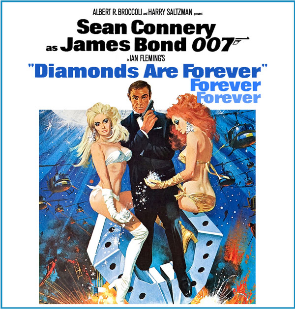

Today was the last day of YHC's 52nd year on this big blue ball, so what better way to send it out than a nice game of 52-pick up, kettle bell style!

A few PAX narrowly avoided penalty burpees by sliding into the parking lot just as we launch. As it turns out, they'd get plenty of burpees later on. #foreshadowing

**Warm up**

Take a circle of the parking lot, the long way, stopping at the flag for the Pledge of Allegiance.

- Back to the start and circle up for:
- Good Mornings x 10 IC
- Sir Fazio forward x 10 IC
- Overhead claps x 10 IC
- Sir Fazio backward x 10 IC
- Seal claps x 10 IC
- Standard Merkins x 10 OMD
- Plank hold for 10 count around the circle. There were 18 of us, and some PAX forgot how to count mid-stream, so this took a while.

Shoulders properly warmed up, gather for...

**The Thang**

- Partner up (that's 2 PAX, Frisco), 1 kettlebell per pair
- Each team takes turn drawing card from center of circle
- Suit determines kb exercise and additional exercise to be done at flag.
    - Hearts: curls / merkins
    - Clubs: upright rows/ lbcs
    - Spades: lawnmowers / sumo squats
    - **Diamonds: triceps extensions / burpees**
- P1 does kb exercise AMRAP while P2 runs to flag, performs exercise and runs back
- Flip flop
- Rotate until each team has picked card once

YHC thought this would be a nice balance of exercises, but who knew that something like 4 out of the 9 cards drawn were diamonds, and high cards at that. The distribution was something like 4 diamonds, 2 hearts, 2 clubs and 1 spade. As it turns out, this took the entire workout to complete.

**Mary**

Collect some additional bells from Earhardt's car and circle up for the following, all with your bell:

- American Hammers x 10 IC
- Hello Dolly x 10 IC
- Freddy Mercuries x 10 IC
- Finish up with Have a Nice Day

**Announcements**

- The Mule (F3 Raleigh CSAUP) is coming up Saturday, March 9
- Soft Launch of Lion's Den February 27, 5:30 @ St. Mary Magdalene; standard boot
- camp

**Prayers**

- Crimson and his family as his FIL faces stage 4 brain cancer.
- Continued recovery for Sooey (back surgery) and Ausfhart (motorcycle accident)
- All other prayers unspoken

**NMS**

- Been meaning to Q Hell's Bells for a while. Glad to finally check the box!
- YHC liked the randomness of using the deck of cards.
- Actually had a second round on the other side of the sheet, but didn't anticipate it taking as long as it did.
- Diamonds were a double-whammy: not only did you have to do the burpees, but it can take a while to do them, so the partner doing tricep extensions is feeling it by the time the other one returns!
- Always a privilege to lead. Can't wait to see what year 53 has in store for YHC!
