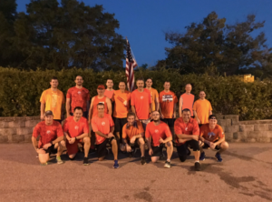

Thanks to Term Paper for swapping Q's with me this week, I've been looking forward to leading a downtown Cary workout in the morning for a change.

Another beautiful morning in downtown Cary, three PAX (Chipper, Lite-Brite, Yoga Mat) for the Meow Mile EC run, zero PAX drinking EC milk, lots of guys in orange shirts. Thanks to Burt for bringing a bag of extra orange shirts #OrangeForDarth

Some of the PAX noticed a TV news crew at the corner of Academy and Chatham, so let's head that way.

**Warm-Up**

Mosey over to the bank, no news crew, but we'll put on a show anyway. Circle up for hillbillies, copperhead merkins, copperhead squats, imperial walkers.

**The Thang**

Mosey down Academy Street to the library for sevens. Run to the back of the library for six world's worst squats (prisoner squat, goblet squat, sumo squat, that's one), back around to the front for one world's worst merkin (wide grip merkin, standard merkin, diamond merkin, that's one), repeato dropping one at the back and adding one to the front until we get to one and six.

Mosey to the fountain and partner up for Dora 400, partners combine for 100 irkins, 100 dips, 100 step-ups, 100 derkins, one partner does exercises while the other runs around the fountain park.

Mosey back down Academy Street to Chatham, stopping for monkey humpers a couple of times along the way. Notice the TV camera is set up at the corner, but the crew is in the van looking at their phones. Give them a monkey humpers show anyway, then back the Billy run line and back to the flag.

**Mary**

Circle up for LBCs, American hammers, one legged Homer-to-Marge and Have A Nice Day.

**COT**

**Count-a-rama**:  20 **Name-a-rama**:  6 RESPECT, 10 meh, 4 HATE **Prayers / Praises**:  Prayers for Wallaby's friend Emma recently diagnosed with aggressive cancer, prayers for improved health for Captain Kirk's mother, prayers for the family and friends of Darth Visor in Alpharetta. **BOM**:  YHC took us out

**NMS**

It was another great morning with my brothers in the gloom. There was a lot of laughter, a lot of encouragement, a lot of effort and sweat. But my heart was heavy thinking about our brothers in F3Alpharetta and the loss of Darth Visor earlier this week. I'm sure the Alpharetta PAX are as tight as we are, and their hearts are broken over this. My takeaway from this tragedy is that we all need to take care of ourselves, take care of our brothers, and treasure every day we get to spend with our loved ones.

I love you men, I appreciate all that you've done for me, and I thank you for letting me lead this morning.
