My official personal #DES Journey came to an end October 17, 2020 with the completion of The Quest for the Crest 50K \[[Q4TC](https://www.runbumtours.com/quest-for-the-crest-50k)\], a year-long adventure, really it just started, that included two ultra trail runs, as required and for training. Huge thanks go out to the ultimate, always ready, up for anything CSAUPish, Classic Rock loving, down to earth, ever caring, Mr. Bad Ass, my training partner Bart Filipiak \[Build a Bear\] and my sister Helen Anderson \[Moosh\]. Their support, accountability, and participation were critical to this success, as were many others.

 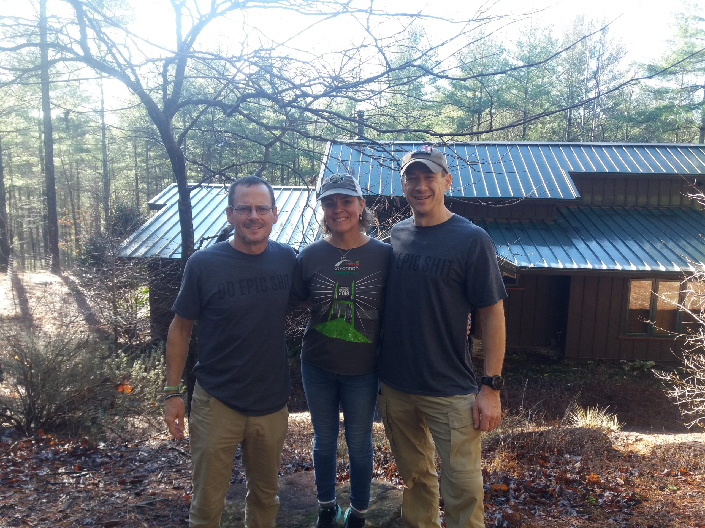

My #DES was physically uncomfortable, grueling, painful and stressful. It was also strangely satisfying, always having to adapt to the changing landscape, much like what happens to us in life isn't nearly as important as what we do about it.

**Unknowing Mission of Discovery:** 

Why have I not done this before? Why not, why can't I? Sometime when I was growing up I stopped asking myself why I couldn’t do something. Hell, when I was young, I just DID IT. But somewhere along the way, challenging dreams were diminished, put on the backburner to career, financial success, marital bliss. These dreams of personal challenges became only a pinprick of light if not just a distant memory. Those endless possibilities had become elusive and died a slow death. Maybe it was my adult and responsible rational brain telling me I couldn't or maybe the group I was hanging around propelled and guided me down a different path. Those childhood guardrails propelling me down the path of exploration eroded with time, age and the fulfilling of adult responsibilities. The adult life of promise led to a loss of hope. But isn’t that just an excuse or a lazy approach to life, to let the lens of my current situation drive my tomorrow? Why not? But if you are ever curious, you have to ask why your current situation forsakes you of those dreams, opportunities, of life’s journey and adventure. What was stopping me. Are my assumptions flawed? Are there biases I am anchored to that are shutting down this thinking? Why can’t I do something EPIC?

**Unwitting Ignorance drives Complacency?**

But I didn’t know what I was doing. Prior to a year ago I had never run more than 18 miles, and that was on a relatively flat surface. Now double that distance wearing a pack holding everything necessary for 14 hours, or more of sustained idiocy, pending getting lost, injured, or hypothermic. I have no idea what I'm doing. 

There are issues of distance, elevation, nutrition, and physical limitations, wet socks, and freezing temperatures. To push past these unknowns, risks had to be taken. I had to try, to plan, to embrace the ambiguity and my imperfect knowledge and test the possibilities. It took action, creating a picture, trying, and moving forward. I became my own guinea pig. I had to learn and build endurance, knowledge, and ability. It came down to good problem solving with a lot of trial and error. It took leaning in on those of you with prior knowledge on nutrition, technique, and the suggested do's and don'ts. It took asking questions, being open minded to changes. It was nothing more than crowdsourcing information and being open to try, test, experiment, learn, adapt, and adopt.

**Failure, No that Can’t be an Option:** 

I constantly reminded myself I’m not in it to win it, I’m in it to finish within the allowed time. There is strength in trusting the training, my ability, knowledge, planning, determination, and laying aside the exceptional and focusing on the committed task. I realized how thankful I am to have this opportunity, surrounded by great friends, beautiful scenery, undertaking something amazing. And the task would be completed focusing on staying in the moment, one foot in front of the other, and repeat…... I don’t know how I’m going to win it, but I know I’m not going to lose. 

[BaB and I dreamt up this idiocy a year ago following the Pumpkin Ruck over coffee at New York bagels](https://f3carpex.com/epic/). ([_BaB DES BB)._](https://f3carpex.com/2020/10/28/you-get-one-life-make-it-epic/)

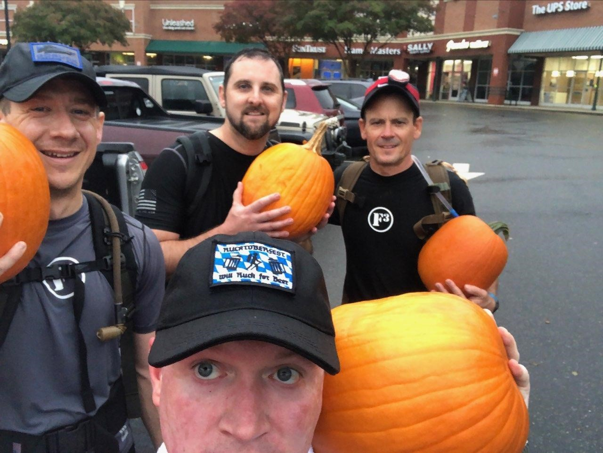

And we no sooner commit to this lunacy, which was quickly followed by [Grow Ruck 17](https://photos.google.com/share/AF1QipN3wzhoE-njlHtKADEKil9aLlsvBXF1-xZRbgU5X2nc0reLHU5CwH8IGtJvmBhEWw?key=Ti1oZUlqekRRenVWTU82SEJnLXlDaXB6MXgwQWR3), when Frey Daddy hears of our shenanigans and somehow ropes me into running Raleigh's I-440 beltline, the day after Thanksgiving. Hey, it’s training and you’ll love it. Sure.... And it so happened to be on this cold rain spitting miserable weather Saturday. WTH did I get myself into? 34 miles? That's twice my max distance, and that was like, a really long time ago. Fast forward…..That really sucked. Shoes muddy around mile 5, slogging through the city’s attempt to fix the ITB sewer problem. Throwing caution tape to the wind, at mile 10 ish we find ourselves crossing some wooden bridge that the city should have taken down long before we arrived. Mile 12 and I’m already feeling despair, it’s going to be a long day. Mile 21 and we stop by [Healing Transitions](http://www.healingtransitions.org) to say Hi. Totally ready to quit, obvious from all that walking, but Frey is still holding my hand, which continues off and on till we are done. Lake Johnson was the blessing with a couple single track miles of roots and dirt to soothe the soul and push away the unwanted thoughts. But then, back to the streets and walking hills. Frey did shame me into finishing the last mile + from Meredith back to NCMA  without walking, those were the hardest miles I’ve done up to that point. Frey and Michelob told me there would be a mental war going on during these Ultra’s. Yep. I later more fully understand that at [Oakwood 24,](https://healing-transitions.org/oakwood24) the battle gets tougher with the stacking of miles. Yet I also understand that those that support you will need support in return. Misery loves company, and someone else’s misery will often mask yours. Giving support and encouragement is rewarding and fulfilling. Maintaining a positive outlook for others reveals untapped strength not seen before, the feet keep shuffling. Yet when the target of 50 miles rolls at the Oakwood24, my resolve collapses, the body won’t budge. Sadly I leave Red Card and Slim Jim hanging with two laps to go. I’m such a putz. 

**Prerequisite, I have to complete a 50K trail run to run a 50K trail. WTH?:**

To run our #[DES](https://f3carpex.com/epic/) [Q4TC](https://www.runbumtours.com/quest-for-the-crest-50k), we had to complete a 50K trail run as a qualifier. We decided on the [South Mountains 50 \[SOMO](https://www.tanawhaadventures.com/southmountainsmarathons)\] on January 11. We had around 2 months to train following [Sandhills GrowRuck](https://photos.google.com/share/AF1QipN3wzhoE-njlHtKADEKil9aLlsvBXF1-xZRbgU5X2nc0reLHU5CwH8IGtJvmBhEWw?key=Ti1oZUlqekRRenVWTU82SEJnLXlDaXB6MXgwQWR3). Going into SOMO I felt woefully unprepared following a week long hiatus from a sore achilles. Yet at the start, I’m in a reasonable frame of mind. That lack of preparation was overwritten with adrenaline and the excitement of the crowd. After dropping a deuce, BaB, Moosh and I gather at the start, the banjo plays, and we’re off. WOW! Feeling pretty good out of the gate. It’s early January, reasonable temperature, spitting rain, and wearing Ma Bell approved sleeveless shirt. Moosh thinks we’re crazy. Me: all those other runners are crazy wearing two layers and a rain jacket. WTH? 

In the beginning of [SOMO](https://www.tanawhaadventures.com/southmountainsmarathons) I was rewarded with some really good times, times better than my plan, those times completely overwrote my plan, a plan that was a total SWAG, being that I had never done anything like this before. But as the race progressed, fatigue set in, fueling the voices in my head, questioning my ability. I watched my pace go from 11mm to 12, 13, 14, 15, to 16mm. The demons set in, 16 minute mile, hell I can ruck that on a bad day, and here I’m running. It’s hard to keep your brain from doing the math and realizing you have 20-15-10-5 miles to go. Doing math while running is bad, really really bad. If I keep this pace up, I'll…… Fail. I was facing a shattered dream. Somewhere around mile 19, my legs were done, and by done, I mean legs seized up, locked up. I found myself firmly holding both legs in a tight grip, looking for anything that would resemble a roller. I couldn’t move. Minutes ran by, calculations continued in my head. But instead of dread, I found strength and courage to continue, I worked out the muscles and found myself putting one foot in front of the other, walking uphill for several miles, working out the kinks. The next downhill was slow, legs were still tight. Yet after a couple of miles, I was rewarded with new strength, and found myself passing other runners, racking up several kills. I began to find more joy and relished in the views, enjoying the cold streams invigorating my feet. By the time I crossed the finish line, greeted by BaB and Moosh, she missed a cutoff and was pulled from the race, I felt both alive and exhausted. Though the donuts were gone, the Chili was amazing, the ice cold creek invigorating, and the fire warming and joyful.

**Fellowship and Accountability:**

After SOMO, there were some great training runs: [Umstead](https://www.ncparks.gov/william-b-umstead-state-park/home) became a mainstay. Falls Lake Mountain to Sea Trail was discovered once Umstead was locked down. [Harris Lake SP](https://www.alltrails.com/trail/us/north-carolina/harris-lake-peninsula-trail) made the cut, on occasion. And there was a great run at [Uwharrie](https://www.fs.usda.gov/detail/nfsnc/maps-pubs/?cid=stelprdb5193039) in 100% humidity. [Flenderson’s Hill Climb challenge](https://f3carpex.com/mafia/) fit nicely in the mix, rucking is a great hill training. 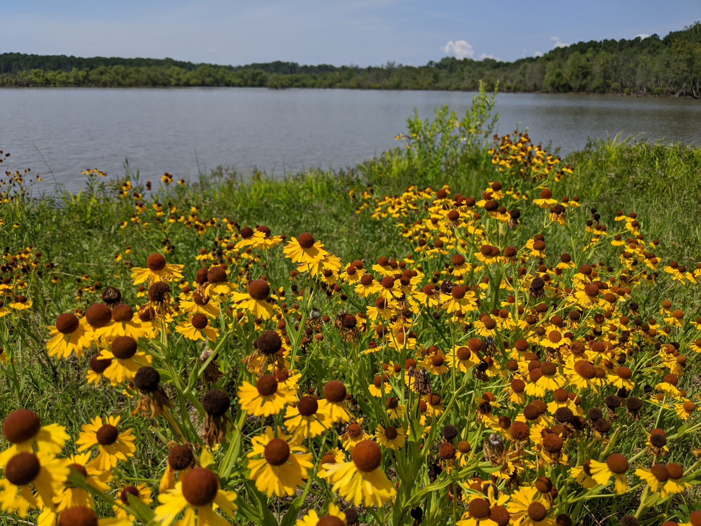

Through these excursions, there was some really great fellowship. Build a Bear, whom I quickly learned after our first meeting has the same passion for the awesome and epic and is always ready for a challenge regardless of the weather or time of day. I would not be writing this if not for him. And even through his shoulder thingy, he remained a beast, walking Lone Pine with shoulder pain, then rucking with a single strap over his good shoulder, damn he was motivating, driven and relentless in his pursuit. I am truly thankful our paths crossed in this lifetime, who else will step up to the plate and do all of this stupid shit?

.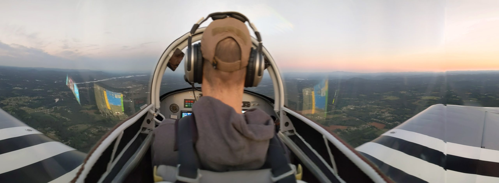

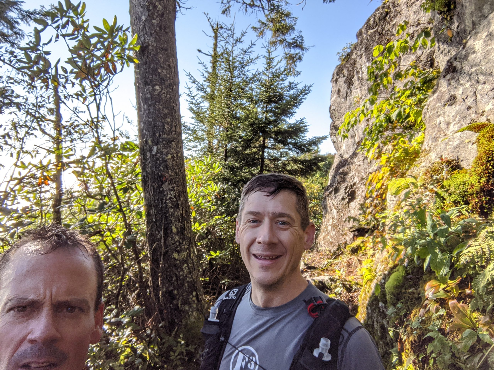

Well there are several.  My sister Moosh in Savannah GA, has been a great cheerleader this year, really for the last five years. Really longer, but that’s another story. She is an awesome human being to have around, who probably loves this stuff more than me. She shows up first at SOMO with no training, to run with BaB and YHC and then treks to Q4RC because she loves this atmosphere. Then there is Headroom and Lookout who joined in on the fun and the commitment. We had some great times, from bushwacking trails that appeared on some maps but were wholly non-existent to dealing with long runs in debilitating humidity. There was this amazing run with Parker last spring at Falls Lake, about 13 miles out and back. That had to have been one of the best early runs, there was this light steady rain in cooler weather, it was glorious. There were some great times with Torpedo, sub freezing temps. Michelob, Largemouth, and GTL reminded me that you can still do speed work on single track trails. My F3 father CK, Pierogi, Snots, and Sooner even made it out on some single track. Running the BRR with team HIDA \[High Impact Dumb Asses\]; Build a Bear, Capt Jack, Hermes, Lookout, Oofta, Shut-In, Sky Blue, and Torpedo and my teammates picking up my slack when I strained my quad. Aquaman from South Wake, jumped in later, and despite his lack of hill training, he had the Strava miles, crushing it all the way up Mt Mitchell, though there was some serious whining. There was Bayonne, the penultimate host that made all of this hard stuff easier. There were many lonely hours run in the dark with lots of missed turns. Solo long runs are some of the best times to get in your head, discover your inner strength, and learn that two cups of coffee and a Gu does not qualify as breakfast. And with all this running, there was still bike training for a 100 miler that was ultimately cancelled. Biking provided great cross training and even better fellowship with mainstays Hermes, Ma Bell, Michelob, Pierogi, Slacker, Squatter. But running became a whole new way of life, even finding a way to run Lystra between work job sites. I discovered Broga is cool. With a strained quad I learned Flip Flop knows his shit. And with some knee issues, Sosa can always lend a hand or two.  I’ve watched each of us get crushed by lack of hydration and poor fueling, have our feet brutalized, our toes turning purple from all of the kicked rocks, and ankles rolling - like a solid 90°, multiple times. In each situation, everyone continued and never gave up. And between all of these trail runs, there was all of you guys, reminding me daily that if I don’t get out, I’m going to miss a great Q, some lively mumble chatter, and much needed fellowship.

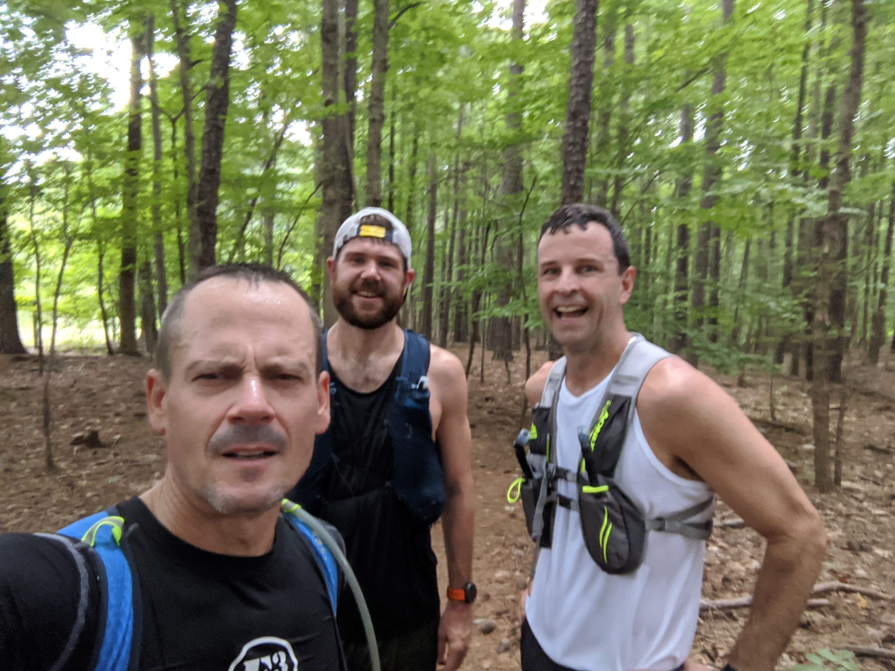

**PM2HR 50K \[Pilot Mountain to Hanging Rock\]:** Another awesome experience. 

https://www.relive.cc/view/veqzGVxjE7v

My writing is getting a bit long winded, so imma leave this here from Lookout.  [https://f3carpex.com/2020/10/20/pm2hr-2020-my-do-epic-sht-adventure/](https://f3carpex.com/2020/10/20/pm2hr-2020-my-do-epic-sht-adventure/)

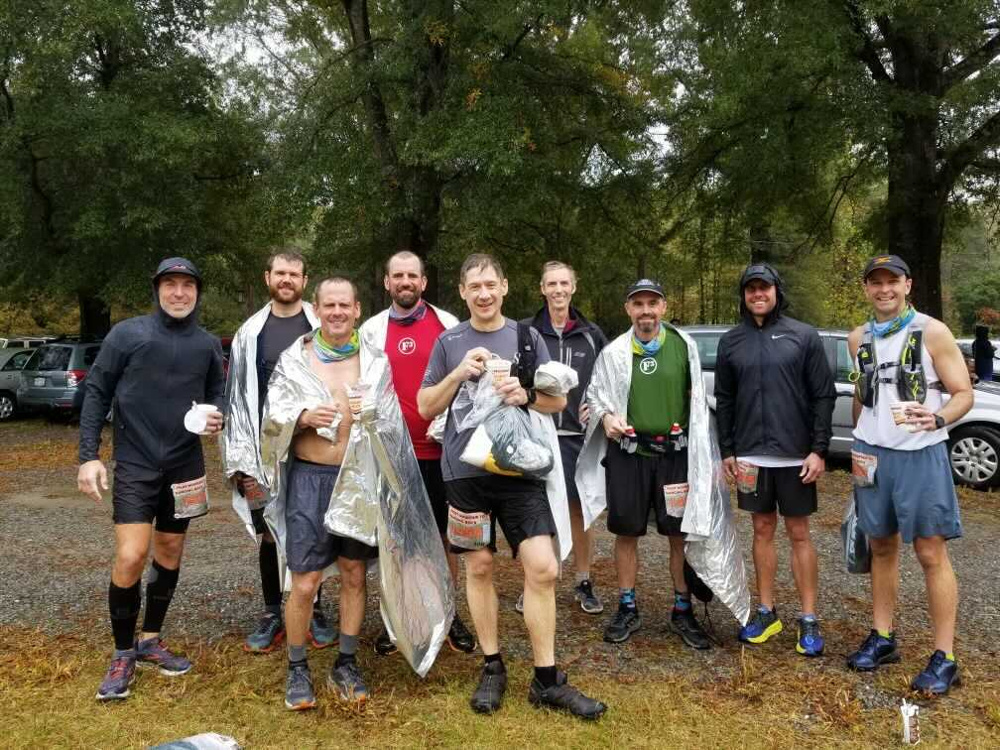

**MY DO EPIC SHIT, Quest for the Crest:** 

The year, the months, the weeks leading up to my DES were nerve racking. It started with the “Oh Shit, what did I get myself into?” to anxiety, with BaB in an arm sling, my main training partner on IR, fear set in. RONA white washed that away with a postponement till the week after our planned final 50K for the year, Pilot Mountain to Hanging Rock \[PM2HR\]. 

As the new date approached, I felt much more prepared; three ultra length runs completed in the last year, major training runs to South Mountains  [https://www.relive.cc/view/veqzGVxjE7v](https://www.relive.cc/view/veqzGVxjE7v), Uwharrie, and Mount Mitchell 

https://www.relive.cc/view/vmqXoEkoXo6

Yet the thought of 11K’ feet of total elevation gain and 3K’ elevation gain in the very first 3 miles with 70° grades was still quite unnerving. And then, weeks before the run we learned we have no place to stay and we would end up camping. And then there was a change in the course. WTF?

The day before I was giddy, nervous, excited, worried, yet confident as we set up the tent. Moosh rolls in from Savannah, hugs are shared, stories told, and dinner was enjoyed. Sleeping in that tent ended up being the best I had in weeks. The body felt great at the starting line and was glad I followed BaB’s lead at the start to get ahead of most of the pax. It proved the right decision. We hung with a group that pressed on, passing a few pax on the single track up to Mt Mitchell, a faster yet still comfortable pace, we held it for miles, uphill.

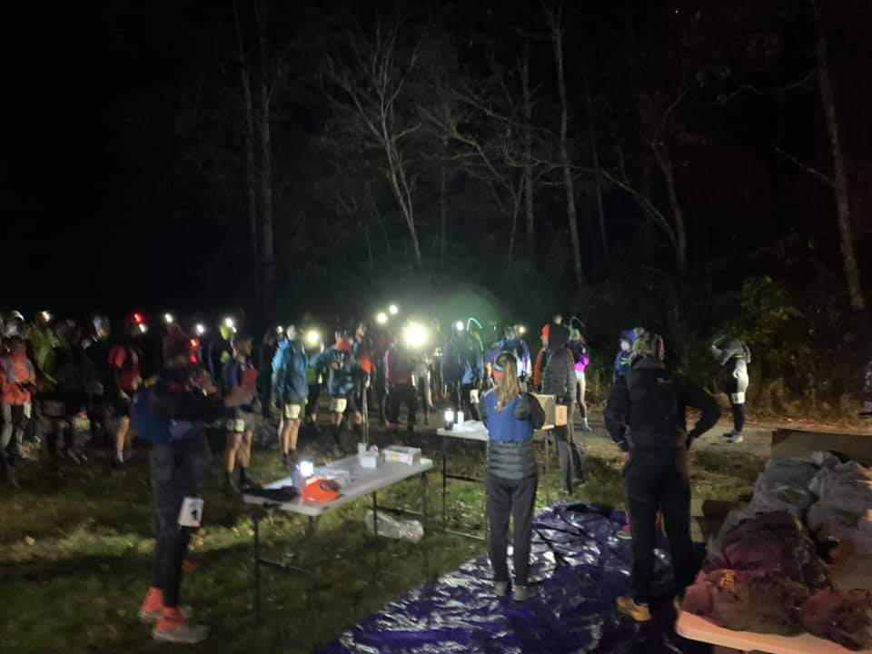

Heading up Big Tom, we quickly lost the trail in the dark with all the fresh leaves covering a slightly used trail. WTF? we were here a few weeks ago, the trail was still a fresh memory. We found ourselves bushwacking a 70° incline, slightly lost with the exception of BaB’s Garmin Fenix. Despite blazing a new trail, getting to the top seemed quicker and easier than last time. At the top, the wind picked up and the temperature dropped, further below freezing. More iced over mud and frosted rocks, the gloom was spectacular. It was worth the moments to stop and relish in the glorious view and the vastness of the heavens, the Milky Way was on full display. I will do all of this again if only for that view.

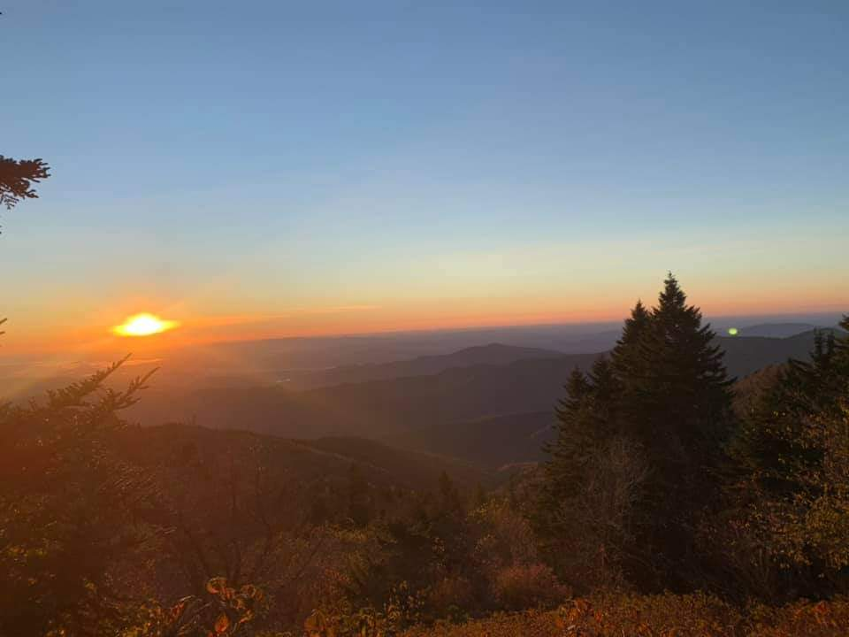

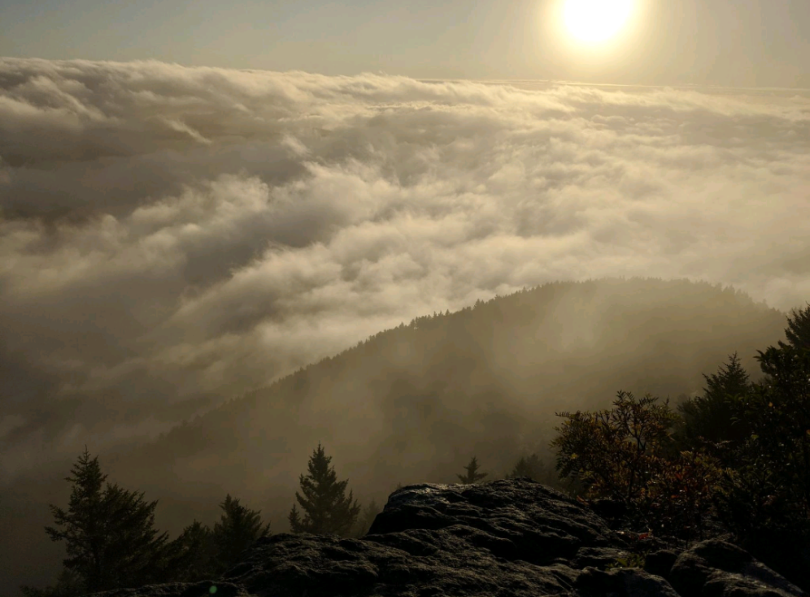

On the way to aid station #1, mile 13, the sun was rising, directly in front for a several mile downhill run. YHC finds himself in a full out superman flight to the ground. You see, or not, those rocks look just like leaves. And REPEATO!!!  With the sun now fully out, the body is starting to overheat and it was time to lose some layers. On arrival, YHC ducks behind the box truck of supplies and quickly removes the leggings below my shorts. BaB is making comments to the group about me taking a shit, to which everyone is thinking the same. It was all fun and games till I saw that BaB is long gone. I load up on supplies, taking entirely too much time, firing questions at the race director about times, cutoffs, and whatnot. All I hear from the race director is, "I don’t F’g know, Don’t F’g worry about it, you’re in the F’g top 20." 

Up till now, I had been focused on finishing before the cutoff. But the top 20. Really? I’ve been feeling good, not pressing myself too hard, passing a few people here and there, swapping positions with a few others, but now, the competitive spirit kicks in, I’m staying in the top 20 or better, I push myself a little harder, no one is in site. 

Heading up Buncombe Horse trail \[there’s no way horse’s can navigate this\], I encounter a few hikers and finally see BaB around mile 16 ish, he’s a ways away. Then around mile 18, there is a steady banter and the clamour of a cowbell. Rounding the corner, there’s BaB, Sasquatch, water, and a plate full of peanut butter sandwiches. This moment is priceless. Though I’m still good on supplies, I stop for a quick photo with Yeti,  BaB captures the moment my phone does not. Priceless. Time to keep heading up that hill.

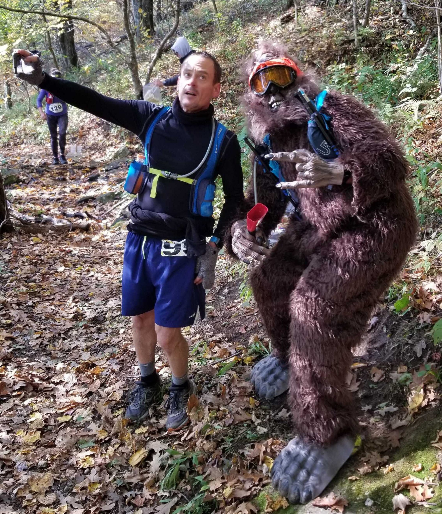

At the top of Buncombe, we are directed to an out and back to one of the most spectacular views of the mountains beyond and the valley below. A mere weeks before with BaB and Aquaman, we almost went down this trail and realized it was the wrong way. We were, like, 50 yards from this spot. Sorry Aquaman,  

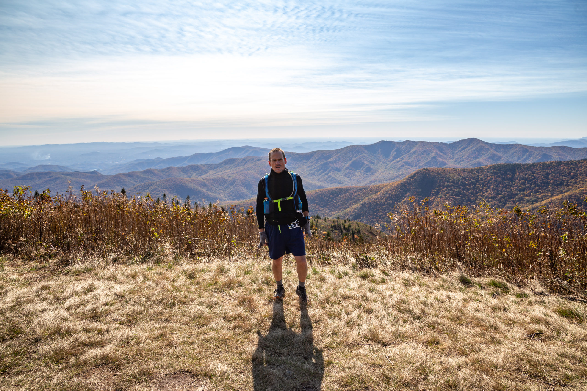

I had been flip flopping positions with this one lady from Michigan for about 20 miles now. As I head into aid station # 3 at 26 miles, she pulls in just ahead of me, I was #18. Unlike AS#1, I arrived prepared, had moved the pack to the front of my chest with the bladder open. I quickly filled with water, grabbed a coke, closed the bladder, and was out of there in minutes. Arrived at 18th, departed 17th. Feeling strong, I pushed the downhill pretty hard, it seemed to never end. Somewhere around mile-ish 28 I came up on this young man, not sure how, because when I got fairly close, he took off and there was no catching him….. Until…  I was about 20 -30 yards behind him on this switchback trail. As I rounded the turn, he was nowhere in sight. I slow to a walk and pause to look around, I see this hand reach up from a ledge behind me, grabbing a tree, and climbing up. It was like Wile E. Coyote emerging from the cliff with the cartoon flies ringing his head. Later he told me he completely missed the turn and ran straight over the edge. After a brief check that he was indeed good, I was off. The kills kept coming, 16-15-14-13, I made it to 12th, which I held till around mile 34 when some young whipper snapper, less than half my age, came trotting past. Good for him, I couldn’t push any harder. I finish...13th GTFOH. That was amazing.

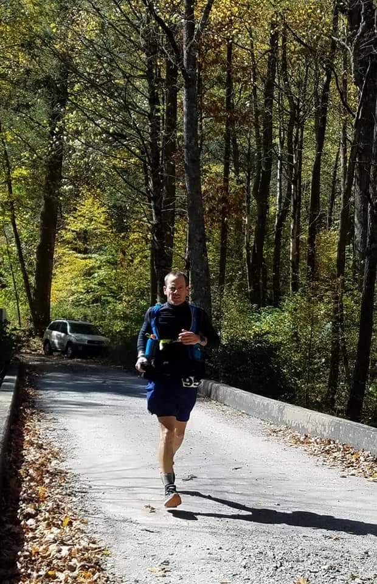

https://www.relive.cc/view/vxOQne7VPM6

And then the soles of my feet begin to scream at me.

**Looking Back:**

As I look back over the last 12 months, I witnessed some of the most incredible views around me, made only more beautiful through the effort that made them available. I will go through all of that pain and more to have another opportunity to see that clear sky, the Milky Way and later the sun emerge from the horizon. I will slog through those miles, in the cold, the heat, the rain to again have the opportunity to share such an amazing, difficult, and challenging experience with friends. At times it was like running through a fairy tale.

Through this year long journey, comfort was found in facing doubt, fear, pain, and loneliness. Things inevitably got ugly, the next step was often an exercise in discipline. Everything hurt. Before doing this, the difficulty and doubt was not something I fully understood. But nobody could do it for me, it was up to me. It came down to my attitude, to stay positive and focus on these next few steps, these rocks, that root, and let the mind wander only about the devotion to grace and forgiveness I had committed to focus on in my times of despair. I had one reason to keep going, I knew I would be disappointed in myself if I quit.  

**An Examined Unexamined Life:**

During all those runs, I had lots of time for reflection over the last 12 months, considering why I’m doing this, why I have not. And as I looked further back on my life, I realized I have lived a life dominated by fear, definitely afraid of challenges like this. Not that anyone really knew, I hid it pretty well, even from myself. Fear has stopped me from seeking many of my goals and passions. I had to learn to live a more courageous life. 

I have learned to overcome fear by exposing myself to a wide range of experiences. Taking confidence in action in the face of uncertainty. I learned that fear can be a warning system for opportunity. Learning how to get the best of fear and not letting it get the best of me. You men of F3 have kick started this, motivating me to seek larger goals.  It has been a snowball experience helping me jump in with both feet and attacking those fears and insecurities. I have learned to look at what I perceived as tragic events as life-changing and altering opportunities. For so long I was a victim to these tragic events, I had to redefine the tragic. \[See the muggo.com\] For so long I was seeking out self-esteem and self respect, though never seeking my authentic self. In many ways I was fearful of the opportunity, thinking the only way out was to modify the semblance of a comfortable lifestyle that I was trying to fabricate. I had been a total train wreck. All the while I remained somewhat afraid of not being accepted, afraid of not knowing what the future held. Before F3, I would go to the gym and sweat it out, and then once I joined F3, in the beginning I would beat it out, but the fear was still there. Regrets and failures were overwhelming, I continued making excuses not to do those difficult things. 

**You can either make decisions out of fear, or opportunity.** 

I began to learn to recognize the fear, that it was driving my decisions, influencing my thinking. And then you men were there, relentless, staring me down, helping me face myself, lifting me from my “comfort zone”. The friendship and fellowship I gained through you men, surrounding myself with men greater than me, helped me to begin changing these behaviors, to grow. The more I faced those fears, the better I became at rationally and thoughtfully facing those fears. With time and practice came understanding and experience.

**What I am learning through these runs**

_“Running is about finding your inner peace, so is a life well lived” Dean Kernazes_

We all live a high frequency life, one with ceaseless and worthless noise hitting us from many directions. Often it is buried in the message that comfort is happiness. Missing from my life was listening to my internal compass, getting away and in touch with myself, touching that internal personal drive, exploring outside, gaining a clearer view, shaking the cobwebs from inside my head. Running became therapy, a source of rejuvenation. My shortcomings became even less significant. By stepping away, reflecting on the ups and downs of life, clarity and understanding of the important things in life were earned and rejoiced.    

If any of you were like me, in your work life you're a bit like a horse, you carry the load. And then suddenly it becomes your way of understanding yourself. Do you really understand the load you are carrying? Did you really sign up to carry that load? It's not until we remove ourselves from our current situation, I mean really remove, that we often get that clarity of thought, the understanding how many of life's situations have molded us, often with a new vision. It is the separation from “this” normal life where the clarity of sight becomes visible, where we can dissect both successes and failures. When we step away, it gives us this opportunity to see regret, loss, confusion. These struggles represented and became a real life example of my / our greater ability to persevere in difficult situations. Yes we often pray over these questions: What a burden am I going to let go of? Where am I going to make that change in my life? Who am I going to forgive? But it is stepping away that brings it into focus, this is the opportunity to take action. It is an opportunity to recalibrate the mind and the heart, avoid complacency and feed the authentic you. It is our responsibility.

And going through all these difficult challenges has yielded more empathy, a calming and patience, a better ear for listening and understanding. And it seems real that the endeavors of others provided the opportunity to offer greater support and encouragement. There is strength in inspiration. I’m nowhere near perfect, but working to continually improve. 

Something like the following seems to be playing in my ears on a regular basis. “The choices we make today tee up the future opportunities.” If you want those future opportunities, you have to make the investment. If you are not going to commit to that investment today, then when? At some point, you have to trade in that comfort today for that future tomorrow. The beauty of the journey is the unknown path. What will be your path? Will it be a run, a ruck, some pullup challenge, overcoming a fear, a family journey. What will it be? And if you can’t do it alone, with whom? Decide what you really want for your future self, find someone who wants what you want, and sponsor them to get it. Years down the road, how will you reflect on this life? Will it be the time, the number completed, the dedication, effort, determination, the standing firm in the face of the unknown, the overcoming of a fear, the perseverance despite overwhelming challenges or will it be a commitment to carry a load that serves no real purpose. If it comes easy, it doesn’t require epic effort, you’re not pushing yourself hard enough. It is the courage in trying that creates the win. It’s not the passion that is important, it is the pursuit of it. You want an amazing life trip, a lifetime worth living? Push yourself, demand more from yourself, expand and learn as you go. Have the guts to resolve life’s issues and move forward. Life is live and the record button is on, the audience is watching. The human spirit is boundless, exploring the possibilities. Go do, stand back and watch the results in your own life and the lives of those you touch. The great revelation is that so many of those dreams are on the other side of that fear and uncertainty. 

_Theodore Roosevelt, “Far better is it to dare mighty things, to win glorious triumphs, even though checkered by failure….than to rank with those poor spirits who neither enjoy nor suffer much because they live in a gray twilight that knows not victory nor defeat.”_

DO EPIC SHIT!

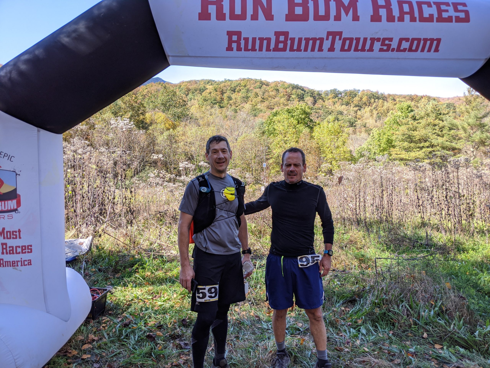

Related: Muggo interview: [Accelerating Man: Tom Hayes](https://themuggo.com/2020/08/11/accelerating-man-tom-hayes/)

https://themuggo.com/2020/08/11/accelerating-man-tom-hayes/
