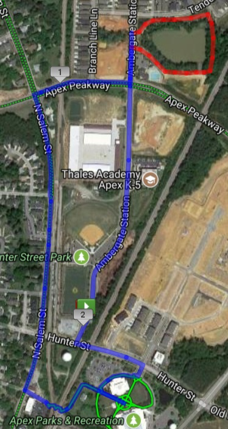

**Backstory:**  Several weeks (months?) ago, the M and I were sitting at home on our usual Wednesday night date night when the ad for “The Last Jedi” came on TV.  A few clicks of the iPhone and I had tickets for opening night, 12/14.  Asked her if she wanted to go, “Not really”.  So, 3 tickets for me and the 2.0s.

And then a week or two later, the announcement comes out about F3 Carpex Christmas Party.  At Bond Brothers. With all the PAX, and their much fairer halves.  Mind you I missed last year’s party.  And would miss this one too.  To make it worse, the closer to the premiere date, the more my M decided she wanted to join us.  But tickets for the show had sold out early.  So, unhappy M and YHC conflicted.  Zip Drive and DeNiro were excited for a movie night with Old Maid, but still…

So Sundayevening, YHC was sitting around (yeah right, who has time for that?) wondering what might be on tap for the F3 week ahead.  A quick check of the Carpex Challenge spreadsheet showed me that the one last thing I needed to do to hit the mark was post at **Slippery When Wet**.  So, Friday was all set.  Hit that and be done.  Rather than wait for the GroupMe/Twitter blast from Hotspot, I took the initiative to actually **_go look_** at the Q signup sheet.

Looky there on Thursday morning, there’s a vacancy, a void so huge it was just calling to me.  Bounty Hunter was open. I’ve never Q’d Bounty Hunter.  And it was open. On 12/14.  The very day that “The Last Jedi” was premiering.  Meant.  To.  Be.  You know, like as in Boba Fett, Jengo Fett, Greedo, all those **Bounty Hunters** from Star Wars?  (not like “Dog, the Bounty Hunter.  Not at all like that).

Super special bonus; the Geminid meteor shower was in full song, promising up to 120 meteorites per hour.

Prerun of the route by YHC confirmed a tad more than 2 miles, but not much.  4 meteorites observed, THRILLING!  McCants arrived as YHC finished the route, and we got in a BRISK out and back to get things warmed up.  Arrive back at the flag in time to see 11 more arrived and ready to launch.

**12/14/17, 0545, let's roll.**

And so it came to pass that a wise 12 Jedis in training joined their sensei on a galactic tour of central Apex.  No FNGs, YHC whipped out his lightsaber (Luke’s original colors!) and off we went.

**Endor (over in the finest part of the AO, the skate park bowl):**

- X-wing fighters (Windmills) x 10
- Master Yodas (Good mornings) x 10
- Ewok Yub Nubs (Smurfjacks) x 20

Mosey on up the way, chasing FIA.

**Tattoine**

Over by the great big tall flagpole, in eyesight of FIA…

- Pit of Carkoon (it’s from Return of the Jedi, where Luke is about to get fed to the big pit by Jabba the Hutt
    - prisoner squats x 10
    - regular plank x 10
    - plank jacks x 10
    - low plank hold x 10

FIA fly-by (hey, was that mumblechatter we heard from them about being too slow??)

Quick audible to the pax, reminder of the meteor shower, then continue a mosey until we were outta FIA’s collective earshot.

**Ice Planet Hoth** (YHC’s favorite of the saga)

- AT-AT \[All Terrain Armored Transport\] ( Bear crawl) halfway from FIA’s parking to the far curb…then realize the PAX went all the way there, so…
- AT-ST\[All Terrain Scout Transport\] (Lunge Walk) from the far curb across to Thales’ Parking lot
- Once there, partner up for Tantans (Partner carry) down and back, AT-ATs if you needed
- Some more Pit of Carkoon to wrap it up then jump to lightspeed for Endor

**Quick stop back by Endor**

- Speederbikes (Wheelbarrows) at the Galactic Supply Yard (Extra Attic Storage), then crossing the galaxy to the spice mines of Kessel

**A hot lap in the Millenium Falcon**

- Kessel run (catch me if you can then 5 merkins), then off we go back towards our home galaxy (yes Smokey, I know the cars are thataway…YHC had a plan).  We did it in 11 Parsecs, beat THAT Rey!!

**Brief battle on Naboo**

- Darth Mauls – 180 squat jumps x 10L, 10R at the corner of Apex Pkwy and Salem St., that got all our gyros out of whack, like playing Dizzy Bat!  Off we went again, towards the Death Star!

**Final Jedi training**

- Use the force (bird dogs) while the Pax recovered and prepared for battle.
- Trash compactor escape (spider walk along handrails with pax bear crawl beneath) HUGE props to Oxtail and Smokey for gettin’ after it on the rails!

Once we escaped the trash compactor, we put together our final run to destroy the Death Star.  Fellowship run to the train crossing after a good view of the Salem Street Christmas Lights.

**Death Star Destroyed**

Pax formed up for a run at the Thermal Exhaust Port

- Detonated five (Death) Star Jumps at the center of the Death Star (Circle at Town Hall) then skeedaddled outta there as we were out of time and about out of gas (follow me Earhart, it’s shorter thisaway)

**Use the Force, Luke**

Back at the Insomnia/Vesper flag (which was still UP, unlike the BH flag…)

- MTFBWY – BTTW, one-handed 10 count OYO (switching hands)

**Leia…er…Mary**

- Han to Leia “heyo!” (Homer to Marge) x 10 IC is all we had time for, then our saga ended.

 

**COT**

13 started, 13 finished.  2.4 light years covered.  Lots of wookie sounds along the way.

Announcements:  Christmas party, Hell’s Bells KB workout coming.  South Wake CSAUP this wknd.

Boxing Day Murph at FMJ.  NYD Convergence at A-Team site.

Prayers for Grease Monkey’s mom and M. Prayers for family growth.

**NMS**

Big thanks to the pax that followed me around this morning.  While I’m not a **_huge_** Star Wars fan (based on what I saw at the premiere Thursday night), I have grown nostalgic over the Star Wars of my youth.  Losing Han last film, and knowing that this would be Leia’s last movie (alive anyway) made me that much more eager to indulge a little.  My boys have never really latched on to the saga like I did, so I’m afraid the love for the films will die with me.

So thanks for playing along.  I hope you enjoyed the lightshow too, as we saw at least half-a-dozen meteorites during our tour.

Real proud of Smokey and Oxtail.  You guys soldiered on all over the place, and I was especially impressed with your willingness to attack the Trash Compactor.  YHC preran the route before y’all got there, and I must say I did consider this a pretty hard route to cover in our allotted time.  I do hope y’all enjoyed the path around the lake, and that future Q’s will use that for their days at the helm.

Oh, and go see “The Last Jedi”.  It’s an important chapter. And it has a couple of surprises that you might not see coming.  As Luke says “This is not going to end the way you think.”

I leave you with this gem from The Phantom Menace: ““Fear is the path to the dark side…fear leads to anger…anger leads to hate…hate leads to suffering.”  Let’s not let fear drive us to the dark side in anything we do.  Seek to understand, and to see the light.

Mapmyrun view of our route shows our attack on the Death Star, bottom right.  You're welcome.

****
