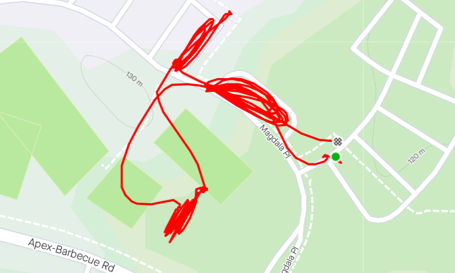

**AO:** Lion’s Den  
**Workout Date:** 07/28/21  
Last night was the end of season banquet for my kids’ Summer swim team. I went to bed as early as I could, but knew I wouldn’t be doing any sort of prerun this morning. After a few views over Google Maps and Dora in my back pocket, I showed up ready to wing it.

**Warm Up:**  
State the mission, check for FNGs(1), and give the disclaimer.  
Pledge of Allegiance  
Side Straddle Hops x20 In Cadence (IC)  
Good Mornings x5 IC  
Imperial Walkers x20 IC  
Sir Fazio Arm Circles forward x10 IC  
Sir Fazio Arm Circles reverse x10 IC

**Main Event:**  
**1)** A little mosey and partner up for **Dora 1-2-3** around the parking loop in front of the church. **Merkins x100, Little Baby Crunches x200, Squats x300**  
**2)** Mosey to ball field and line up along imaginary baseline for **partner AMRAP field work**. One partner runs to the tree line and back while the other partner performs AMRAP (AMRAP=As Many Reps As Possible) of an exercise. Flapjack on running partner’s return. Hold for the six. Repeato with a new AMRAP exercise. Carolina Dry Docks, Sumo Squats, Flutter Kicks, Wide-grip merkins, heel-tap Freddy Mercurys, Nipplers, Alternating Lunges, a couple of others  
**3)** **Jack Webbs** (merkins:hand raises 1:4)  
**4)** Sevens up the hill in the side parking lot. Switched to **Fives** when reminded of the time. Bobby Hurleys and Star Jumps.

<figure>

<figcaption>

[https://www.strava.com/activities/5700046020](https://www.strava.com/activities/5700046020)

</figcaption>

</figure>

**Mary:**  
None.

**COT:**  
14 PAX. Welcome FNG Outside Voice. First concert was The Who, but our initial response to his soft-spoken introduction stuck.  
  
Announcements: (not all of these were brought up at COT, but they are on the calendar)  
**1)** South Wake/Carpex Q Swap Week(s): This week in South Wake, First week of August in Carpex.  
**2)** F3 ENC CSAUP Sasquatch is 7/31  
**3)** New SE Raleigh AO (Brother’s Keeper) opens 7/31  
**4)** Chain Gang highway clean up 8/21  
**5)** F3 NE Wake CSAUP The Deacon is 9/18  
**6)** Carpex Cookout 10/2  
**7)** F3 10 year in Wilmington 10/7-10/9  
**8)** Odyssey 10/23  
  
Prayers unspoken.  
I believe Imp took us out.

**Naked Moleskin:**  
Strong work, everyone!  
Things worked out all right. Mumbles reminded me we did Jack Webbs back at my Q at Hot For Teacher. Once we were already wet on the grass field, they just made sense.  
I accidentally referred to "you guys in Cary" when describing the knee slap variation of Sumo squats. The POGL PAX were merciful, at least today.  
I crowd-sourced the Bobby Hurleys. As a Duke grad, I’m surprised I never called them before.  
This was my eighty-fourth #F3Q21 #2021Challenge Q (eighty-sixth overall). Next Q is Thursday (tomorrow!) back at The Judge as I repeat a Q for birthday week and earn my sticker for the month from Snowbird’s July challenge. Birthday Q #4!  
\-Pigpen

**QIC:** Pigpen  
**PAX:** Open Concept, Slim Shady, Fiddle, Rooney, Imp, Two Scoops, Flatliner, Sleeper, Outside Voice (FNG), Mumbles, Puddles, Smithers, Chiquita Banana, Pigpen  
**Workout Date:** 07/28/21
