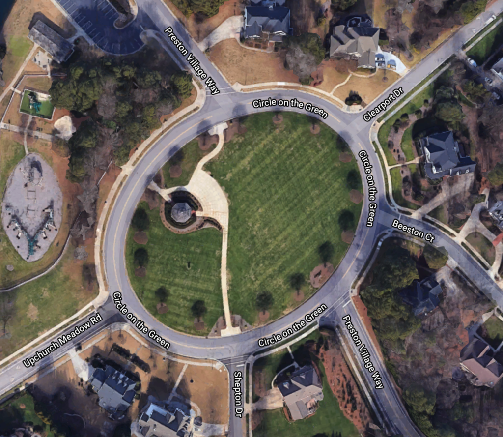

Full Throttle (Wednesdays 600-645) is a relatively new AO for F3 right in my home community, planted by a core group of local HIMs who have been working out together since last year. They were generous enough to allow their Wed AM slot to become officially part of F3 Carpex a few weeks ago, and I was humbled to be asked to Q this morning's beatdown.

Arrived 0545 for some quick cone setup, joined only by Doogie with 5 min to go and expected it to be a very light crowd. Ended up with 7 PAX including Gump, who I hadn't seen in quite awhile. Perfectly sized group. 0600, no FNGs, off we go!

**Warmup**

Mosey to the Preston Village pool lot for Good Mornings, Windmills, Sir Fazio Arm Circles > Seal Claps > Overhead Claps, Hillbillies, and SSH all IC.

**Thang 1: Dora+**

Mosey to PV gazebo to partner up and explain. I planned a modified Dora using the 'hub and spoke' model -- we have 6 streets that all converge into the traffic circle.

PAX 1 starts on core exercises in the hub:

- 100 Squats
- 200 Merkins
- 300 LBCs

PAX 2 runs to their choice of 6 cones, each placed at one of the intersections of the streets and the traffic circle. PAX 2 then does 10 reps of that exercise then comes back to flapjack w/ PAX 1.

**Cone exercises**: Sumo Squats, Burpees, Australian Snow Angels, Star Jumps, Monkey Humpers, Lunges

This overall went well, except for the fact that 1) most of the guys had never done a Dora sequence before and 2) many had not heard of some of the F3 lingo like sumo squats, ASAs, and star jumps.

Somehow everyone knew what monkey humpers were though.

Mosey over to Green Hope Elementary -

**Thang 2: Birthday Surprise**

This one's a personal favorite due to PAX contribution, randomness and also that YHC was born on the last day of the month. PAX 1 announces an exercise, then PAX 2 announces the numbered day of the month they were born.  
PAX 1 proceeds to call the exercise, then repeato around the circle.

I don't recall the exercises, but it started with 1 Merkin, included SSH's and American Hammers, and finished with 31 something.

Mosey up to the street including backwards run, and then Indigenous People's Run back to the shelter for 6.5 min of Mary.

**Mary**

PAX choice included Boxcutters, Charlie's Angels, Plank Jacks, Control Freak Merkins, and Flutter Kicks. YHC ended with the Alphabet, totally gassed and right on time

**COT**

BRR, Pig Pickin', Odyssey, encouragement to check Slack for the latest. Praises from YHC for this group.

YHC took us out and shared both hot & iced home brewed Sbux, with 100% participation. Even got a Starsky by 40-Love (FNG last week with Geek Squad Q).

**NMS**

- Great fun today, appreciated the support from all my fellow Preston Village crew and am honored to join you. Hope you all consider taking advantage of some of the 2ndF and 3rdF opportunities -- so much more than a workout.
- YHC is participating in the #onehundredmerkins challenge; today was 81 - you have to do them straight through without other exercises. Fortunately with a odd # of PAX I was able to knock them out during the Dora instead of the typical 11:45pm "oh $@#! slot.
- Left knee felt OK to start but now what seems to be my old injury is flaring up again; prayers for healing
- Check out Full Throttle if you haven't yet!  
    \--Schroeder
