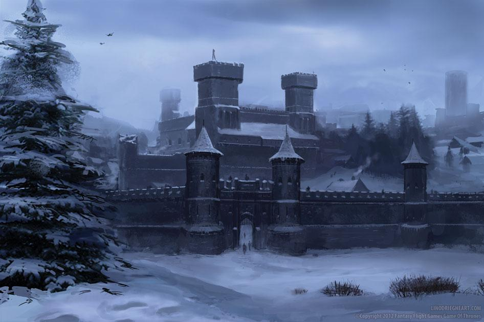

Here is a confession - I didn't actually watch Game of Thrones until 2020.  So I didn't even know what Winterfell meant for a long time.  I just knew it was somewhere near Virginia.  But I am fired up to be Warden of the North for 45 minutes.  My initial observation upon arrival is that it is actually colder here than when I departed South Cary.  

9 are on time for the 0530 start.  No new faces, so on to the pledge.    

Mosey to the track for a lap to start and circle up:

- 7 GM IC, so Nature Boy can do his thing
- 15 IW IC
- 25 SSH IC
- Calf Stretch
- 15 Merkins OMD

Mosey over to the area where the coupons are stashed and partner up for Doras.

- Coupon Dora -  100 Curls, 200 Overhead Press, 300 Rows / Pickle Run
- Regular Dora -  100 Merkins, 200 Squats, 300 LBCs / Pickle Run + 10 Coupon Swings

We seem to be dodging a lot of traffic for this time of the morning.  Rooney must be cracking the whip pretty hard to have his staff showing up at this hour.

Mosey over to the school for alternating one minute segments of People's Chair and Chilcutt.  There is some constructive criticism regarding Chilcutt form, even though we aren't officially a part of Form Week.

Mosey back to the flag for LSF and H2M.  Prayers for Nature Boy's FIL and family.  YHC took us out.
