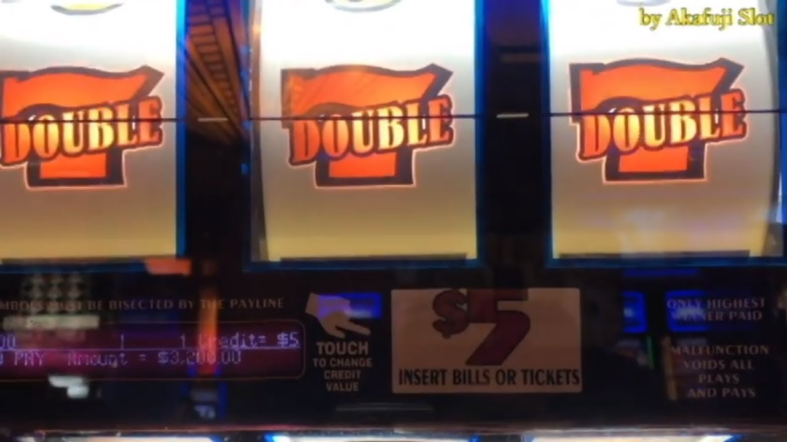

So YHC made the mistake of asking earlier in the week who had the Q for Piranha Park on Saturday. Well, site Q Peeping Tom replied no one and asked if I wanted to take it. I said maybe, so naturally he just went ahead and put my name on the sheet. Fair enough, let's see what I can do with an hour...

**Warmup:** Pledge of allegiance to the flag and mission statement and off we head out of the park towards the road. Turn left and mosey all the way to the basketball court. Circle up for:  
SSH x 15 IC  
Good Mornings x 5 IC  
Sir Fazio Arm Circles x 10 IC  
Seal Claps x 10 IC  
Imperial Walkers x 10 IC  
Plank Jacks x 10 IC  
Calf Stretch L/R x 10 silent count each side  
Bolton had messaged YHC the day before with many questions regarding the amount of running planned as well as whether or not we'd get an opportunity to use the beautiful soccer fields at Apex Nature Park. Well, Bolton didn't show up but YHC decided to check in on them anyway.

**Thang 1:** There was a soccer game going on on half of one of the fields (no Hamm to be found?) so we used half a field for 4 corners. 4 rounds starting at 5 reps, increasing by 5 each round to 20 each. Exercises were Merkins, LBCs (IC), Sumo Squats and Leg Lifts. Everyone is good covered with rubber pellets so time to move on. Head to the bottom of the hill near where DP plants their flag.

**Thang 2:** Double sevens. 1 (L/R=1) Steve Earle at the bottom of the hill, 6 burpees at the top, then 1 worlds worst merkin at the driveway to the soccer field park side. 6 burpees back at the top and mosey back to the bottom for 2 Steve Earles. RInse and repeat in that fashion until we run out of time. Mosey back to the flag through the park and across Bear Crawl Bridge (YHC did not call, but some Pax felt lead to respect the name) and back to the flag.

**COT:** No time for Mary, as I believe most Pax covered 4 miles. Quite proud of that feat. Not sure everyone felt the same however? YHC took us out.
