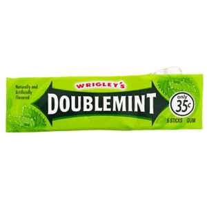
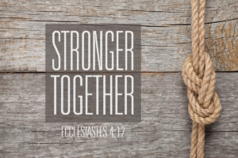

**DATE:** SEPTEMBER 8TH, 2018 **QIC:** SOOEY & LIVERPOOL **AO:** PHOENIX **PAX:** BAYONNE, CALLAHAN, DISCO DUCK, EARHART, FORTRAN, HI-LITER, KERMIT, LIVERPOOL, MA BELL, ROONEY, SCARECROW (FNG), SMOKEY, SOOEY, TEXAS RANGER, THEISMANN, TRAFFIC CONE, WWW, YOGI

It was an exciting day when YHC found out about the opportunity to Co-Q with Sooey and bring double the Q pleasure to the PAX at Phoenix.

**Warm-up** Pledge Run to the lower lot and circle up SSH x 20 Good Mornings x 10 Windmills (forward/backward) x10 Merkins x 15 Mountain Climbers x 10

Mosey over to the little shelter nearby

**Thang 1** Never let a perfectly good set of benches go to waste and Sooey did not let that happen this morning. We each found a spot and did 20 step-ups, dips, urchins and then wash and repeat but doing 15 then, 10 and wrap it up with 5 more.

**Thang 2** After a short mosey through the woods we ended up at the rock-pile by the dam. This time YHC paired the PAX up for a little bit of rock Dora with 100 tricep extensions, 200 bicep curls, 300 overhead presses and 400 rock rows. Partner 1 ran to the top of the stairs and back while Partner 2 attacked the rock and then would switch on the return. Great progress was made and all the partners worked feverishly to get through the count but the morning had a few more exercises to go so an executive decision was made to move on after 6 rounds.

**Thang 2** A little more mosey brought us to the kiosk at the bottom of the hill. Sooey took the reigns back and informed us we would do split 7s (a new one for YHC). Each PAX would start at the Kiosk with a single squat and then run down the trail to the posts and do 6 star jumps, run back to the kiosk and do another squat and then run up the hill and do 6 burpees at the top. This process would be repeated till each PAX had reached 6 squats and 1 of each of the other exercises.

We once again had to drop stop a little early before the clock ran out. Hi-liter managed to get through the whole count so all the PAX joined him on the final run up the hill and last burpee. Once all had arrived we did a mosey over to the flag in the parking lot for a few minutes Mary.

**Mary**

LBCs x 10 American Hammers x 15 Box-cutters x 10 Low Slow Flutters x 10 Side Crunch Left/Right x 10 Have a Nice Day x 1

**COT**

Count-a-rama: 18 Name-a-rama: 4 RESPECT, 12 meh, 2 HATE Announcements:

- 9/11 Stair Climb
- FMJ will be the open AO on 9/11 with an hour workout
- 9/16 Carpex Picnic at Apex Community Park

Prayers/Praises:

- Lots of reminders to take care of ourselves, not just at F3 but seeing our doctors to make sure the inner equipment is in good operating order. WWW shared about his brothers boss having a heart attack and dying. YHC mentioned Shut-in’s subcontractor they had a close relationship with also died suddenly of a heart attack. All were reminded if you are not seeing a doctor to go and get an annual checkup.
- Earhart reminded us to be there for one another and that a lot of us are going through heavy times and mentioned both Parker and Grease Monkey.
- Hi-liter and Yogi shared about the importance of also knowing how you stand eternally before the Lord. Hi-liter shared he is happy to meet and share what the Bible says about eternity and Yogi shared about how his personal relationship with Christ changed his life.

YHC took us out in prayer.

NMS: Being a Co-Q with Sooey was awesome! He motivated YHC to work harder and do a good job and had a blast the whole time. If you are looking to mix it up, find someone to Co-Q with and make it happen, you will not regret it.

Secondly, it is a blessing to go out in the gloom with you HIM! Seeing each of you push beyond your limits time and again was incredible and this morning and makes me excited to be out there again on Monday.
