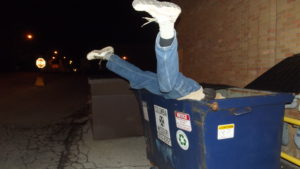

15 PAX with no FNGs. Disclaimer given regardless, although the pre-workout mumble chatter was in full force

Mozy to the middle school and circle up after I recover music set up from strategic location

SSH x 15

Hillbillies x 15

Fazios, overhead claps, reverse Fazios x 12

Yogurkins x10 with a low plank hold on the last one (exercise performed with a 10 count)

 

Thang 1

Dumpster Dive

20 each **D**iamond-merkins, **I**mperial-walkers, **V**\-ups, **E**lbows-to-knees

**Dumpster** BTTW for 10-count after each exercise, backwards run to and fro

Repeato with **V** and **E** reduced to 10 reps and **Dumpster** BTTW up to a 20 count

 

Thang 2

Partner up for laps around the pickle, with partner 1 doing slow moving exercise and partner 2 running until he reconnects with partner for a flap jack. Switch exercise every half lap

Bear Crawl

Side Shuffle Squat

Double Broad Jump Burpees

Lt. Dans

 

Double applesauce Indian run back to the shovel flag

Have a Nice Day until the 6 arrives

 

Announcements

Sasquatch this Saturday

Banjo with PSA regarding Man Hands situation at Whiplash. Reminder to consider having Gatorade or similar. This led to Khakis bringing up how we ideally need to have enhanced 1st aid kit available for each workout. Approx cost $50 each. Need to be able to fund it. We could start with 3 or 6 or 9 and work our way up.

 

Prayer Concerns

Yoga Mat and recovery from snake bite

Disco Duck’s M

Grease Monkey in South Africa

Ma Bell on ASP

Anyone else who may be traveling on mission trips

I apologize if missed some

NMS

Khakis took a hunk out of his foot in Dumpster BTTW. Water hoses were strategically located behind the dumpsters and his medical training took over. Praying for no gangrene

Went to bed thinking thunderstorms/rain were 90%, but weather held off. This allowed me to add last minute non-themed music.

Petty’s Last Dance with Mary Jane remains a Carpex F3 favorite. Most of us are like 10-year old’s as we focus on one particular line “she’s standin in her underwear”. Pretty sure I heard Crimson giggling

Snots is back full force as far as I can tell. It’s like he never lost a beat (not intended to be a tasteless pun)

Nice to finally get one of the coveted F3 coozies for Qing FMJ

Coffee talk was groupme worthy, with vaginal anatomy and authentic merkins taking up a lot of the conversation. I will say that it was all done in a generally _tasteful_ manner

Finally, when doing Dumpster Diving – F3 style, the hands are placed on the ground outside of the dumpster and the feet rest against metal siding. Notice the improper form below.

 

 

