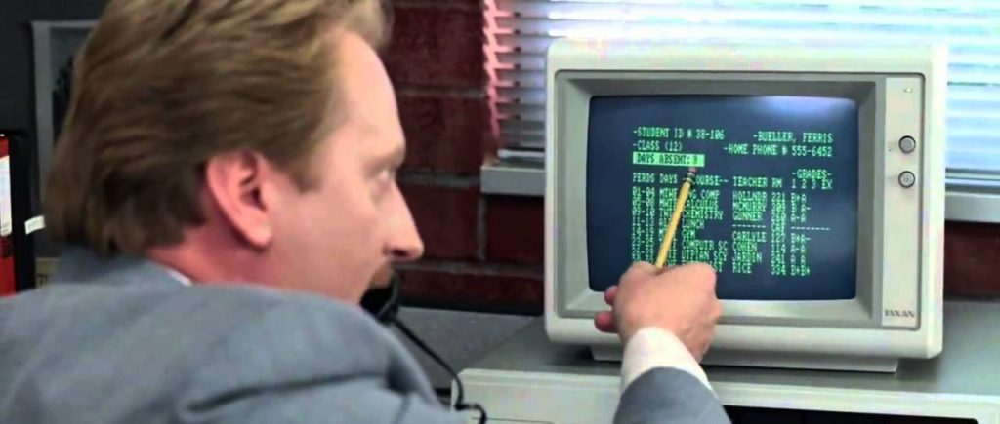

 

YHC was definitely a little anxious (yet confident) leading up to the VQ at F3 Carpex’s finest AO in downtown Apex, Bounty Hunters.  Woke up extra early to mentally prepare and to make sure I knew how to use my wife’s watch (I hate watches) for the workout.  I then headed to the skate park early only to find out Disco Duck beat me there.  After a great pep talk, I moseyed around to ensure my plan would work while Disco Duck went to take a leak in the woods.  The PAX started showing up with about five minutes to launch and the adrenaline started pumping.  It said 5:30am on the watch, YHC introduced self, and with no FNGs, we pledged our allegiance at the flag.  And off we went…

 

**Warm-Up**

Moseyed to the softball field parking lot where YHC gave a Principal Ed Rooney refresher.  Rooney believed Ferris Bueller didn’t have an exemplary attendance record, he was absent 9 times.  NINE TIMES! So…

- Burpees OYO x9
- Good Mornings IC x9
- Sir Fazio Arm Circles IC x9
- Sir Fazio Arm Circles Reverse IC x9
- Seal Claps IC x9
- Overhead Claps IC x9 (enter Freebird who jogged in late, or maybe we started early)
- Good Mornings IC x9
- Burpees OYO x9

 

**Thang 1**

Moseyed to the Thales Parking Lot

As a benevolent leader, YHC gave up the Wolverine VQ (to Geek Squad) but still felt an affinity for the AO.  So…

Penalty Wolverines OYO x5 (for Freebird’s tardiness)

PAX needed to partner-up for a DORA 1-2-3-4

- 50 Alternating One-Armed Turkish Get Ups
- 100 Standard Merkins
- 200 Squats
- 300 LBCs
- Partner runs (hang a right) to the stop sign at Peakway & back

 

**Thang 2**

Mosey to the top of the driveway and form two lines

Prisoner Indian Run back toward the flag

YHC called an audible since there were early morning skate boarders and didn’t want to interrupt their shredding.  PAX halted at the trees next to the soccer field for a quick 2x4.

- 20 Diamond Merkins OMD, 20 American Hammers IC
    - Bear Crawl to next tree
- 20 Scorpion Dry Docks OMD, 20 Box Cutters OYO
    - Bear Crawl to next tree
- 20 Wide Grip Merkins OMD, 20 Dying Cockroaches OYO
    - Bear Crawl to next tree
- 20 Jump Squats OYO, 20 Homer-to-Marge OYO

 

**Mary**

Moseyed to the flag.  YHC asked Squatter if he would lead:

- 100s (I call them Squatter 100s…in canoe position with arms pulsating up/down, Squatter counts to 100 and the PAX counts when he gets to 10, 20, 30, etc).
- Have a Nice Day

 

**COT**

18 PAX, no FNGs, 1 Hate, 1 Respect

_Announcements:_  F3 Picnic Sunday 10/14 @ Slippery When Wet, Odyssey 10/20 at 5:45am at St. Mary Magdalene’s.  Check Slack and F3 website for more details

My first F3 post was an invite by Khakis and involved a partner carry with Freebird at FMJ in the first week of March.  Since then I’ve grown both physically and mentally and F3 has been a much needed experience for me.  At Davis Drive Middle School our motto is Effort Drives Excellence (my parents know this: OneFour, Liverpool, Hi-Liter, Loom) and I’m constantly trying to instill this life-long skill in my students & staff.  I truly feel like the F3 experience each day helps to model this behavior: mentally, physically, and spiritually.  And for that I am grateful to put forth the effort and walk alongside the HIMs toward a path of excellence.

_Prayers:_  Apologize for forgetting to ask for prayers after my effort drives excellence speech. YHC led us out in prayer to tackle the day.

 

**NMS**

- About the Odyssey, Saban says “Only 7 miles this year? If you can do the picnic, you can do the Odyssey!”
- OneFour is not an 8th grader at my school who I held-back several years in a row (he is a parent)
- The jogging/sprinting stretch from Thales to Peakway was a lot further than expected
- Originally said “walk” to the top of Thales parking lot and Biner gave me a dirty look (and said with an angry “what?!”), so we quickly moseyed instead.
- Pro Tip: When doing 20 Scorpion Dry Docks, switch legs at 10 (Thanks Parker)
- Heard at VQ School: Always respect the site.  I really wanted to kick the skaters off the skate park so we could do 4 corner bear crawls.  But knew respecting the site takes precedence.
- It was an honor to sign the Bounty Hunters flag
