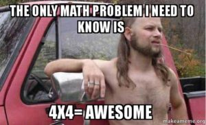

 

For those who chose the wise route of taking a language in high school that is actually USEFUL, you might not have the Latin translation for the state motto of NC on the tip of your tongue.

Much like a yuppie JEEP owner gets excited when they finally figured out that 4x4 is not a math question, but a useful tool for “creating parking spots;” I am now equally excited to have an opportunity to share what is, otherwise, useless knowledge.

“Esse Quam Videri” translates as “To be, rather than to seem” and  YHC thinks our state motto embodies what F3 is about. It is about a bunch of fellas that have decided we want to do more than just go through the motions. We want to do more than just talk about it or make excuses for why we can’t do it. We know we can **be better** the more we work. We get up and **push ourselves**. We challenge, encourage, and grow together both in the darkness and in the light. We make an **IMPACT** on each other, our families, and our communities – because we want to **_be_** HIM, not **_seem like_** HIM.

This starts by simply showing up, it progresses by contributing, it thrives with leadership, and it endures with an impactful legacy.

Hi-Liter and Biner doing their good SiteQ leadership duties, encouraged some of us rookies to do more than just show up and maybe try ringing that 2nd bell. To contribute. To step up and Q.

It is easy to fall into the trap of wanting to be better/faster/stronger before making such a commitment... but leading a PAX is part of the growth.

**The** **PAX always has your back**. Just put yourself out there, know you might fall down, and know everyone starts somewhere.  So, what the heck!  Here’s what we did.

The Q

It may be the darkest and gloomiest AO in the Carpex Tribe, but 20 HIM brought all they had and lit Wolverine up for a VQ Butterscotch birthday blowout. Burt brought some Werthers to honor the moment. How sweet.... (Yep) After a few disclaimers, we ran south down Davis to the lower parking lot for a little warmup in the darkness. Fellowship pace.

Warmup

A little “do as I say not as I do” when cadence and rhythm didn’t match, but we did:

- Hillbillies, IC??? (debatable)
- Merkin, OMD
- Sir Fazio, IC
- Reverse Sir Fazio, IC

Not saying YHC had some jitters and lost track of count/cadence, but _not_ **NOT** saying it either. Note: Important to make time in your cadence to actually breathe...

Either way, lots of chatter. Clearly YHC needs to step it up.

Thang 1

Head south with ALL YOU GOT to furthest light pole at Pleasant Grove Church. Then, bear crawl back to the first light pole. **Alllll** the way back. (75 yards)

Red Bull Smurf Jacks, aka Burtjacks.  IC x 30. No chatter now. Not even Burt. Must be doing something right.

Four Corners , hour-glass formation (no short runs)

- Sweat Angels x 10 OYO
- Plank Jacks x 10 OYO
- Squat Jumps x 10 OYO
- Wolverines x 10 OYO.

Wash, Rinse, Repeat x 3. PAX grumbling about the Wolverines, so dropped to x5 on round two. On second thought – need to save those arms….Star jumps replaced Wolverines round three.

Thang 2

Indian run back to the shelter. Two lines. Kind of.

Head to the basketball courts for a quick 5 minute workout to “[Thunderstruck](https://www.youtube.com/watch?v=v2AC41dglnM).”

Get the AC/DC pumping on the speaker

SSH OYO while Angus Young shreds the guitar intro, half burpee every time you hear  “Thunder” (12) Switch to plank. Merkins down on “Thunder” (11) Switch to High Knees. Squats on “Thunder” (10) Recover

Mary

Asked for a tight circle. HIM calls exercise and bearcrawls around the circle while everyone else does it. Circle got a little tighter after everyone caught on.

American Hammer, Freddy Mercuries, LBC, LSF, Burpees, etc. Hi-liter gave us some final punishment with boat/canoes to send us out.

COT

Count-o-rama, Name-o-rama.

Announcements

- The Bull is at Churham this weekend.
- Healing Transitions event
- Banjo is selling BBQ at Cary UMC on 4/20 4pm-7pm. $10pp or $40/family. All are welcome – especially hungry stoners. Venmo/Paypal accepted.

Prayers

- Water Wings – M has flue and Nanny recovering from torn ACL.
- Burt – BIL John going for another round of treatment.
- HiLiter – Dad going for another round of chemo.
- Praise for Disco Duck M - good report

NMS

- Werthers are actually caramels, not butterscotch. My entire life is a lie!
- HiLiter and Biner were vested.
- It is possible for Hermes to workout without telling a Dad Joke.
- Biner does not run through puddles. They always move out of his way...

<!--more-->
