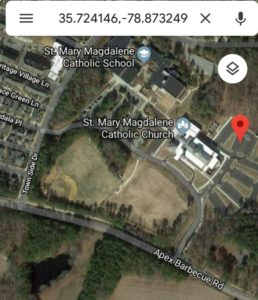

_“This peril too shall be something that we remember...” - **Homer**, The Odyssey_

On Saturday, October 20th at the **St. Mary Magdalene** (Very back parking lot, look for the Flags - see screenshot) the Journey begins promptly at 6:00 AM and travels less than 7 miles across the heart of Apex where PAX will encounter multiple beat downs by legendary monster Qs.

There will be regular water breaks and we will also have support vehicles if anyone needs to hitch a ride to the next stopping point. Expect to be back to the starting point and completed by 10:00 AM.

For the newer PAX, a CSAUP (completely stupid and utterly pointless) is an extended beatdown intended to push you to your limits both mentally and physically. The beautiful part is, you can do it. All 3Fs are there. No matter your fitness level, you can do this. If you can get through a workout on a random Tuesday morning, you can do a CSAUP. No one is left behind. No one is left unchanged.

Signup link: (look for the Red Button) [https://f3carpex.com](https://f3carpex.com)

Location: St Mary Magdalene Church 725 Magdala Place, Apex NC. 27502

_"If they ever tell my story, let them say I walked with giants...Let them say I lived in the time of F3. And let men say with pride that they lived in the time of me...” - **Odysseus** (paraphrased slightly)_
