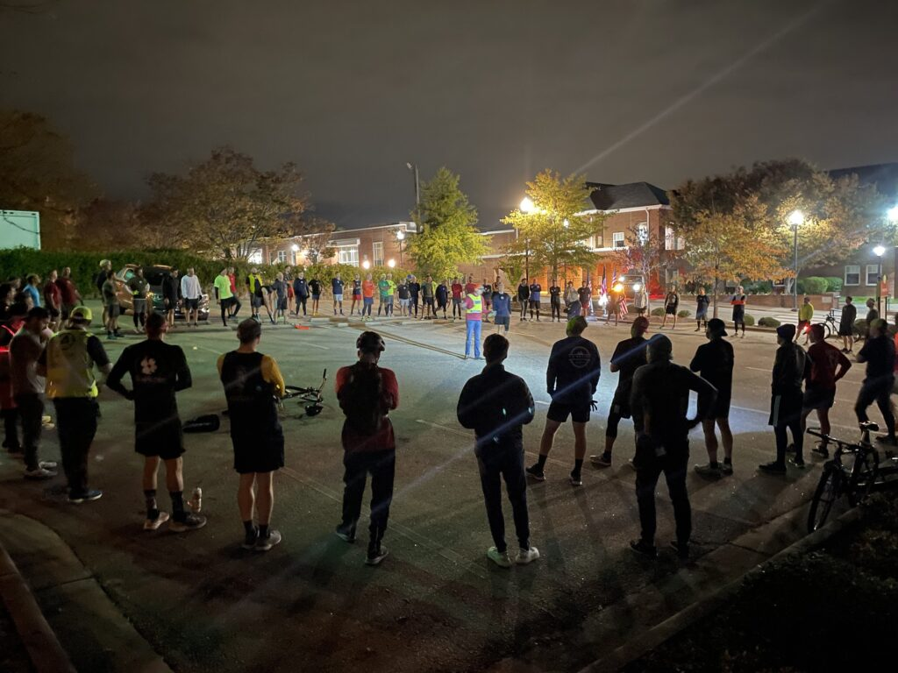
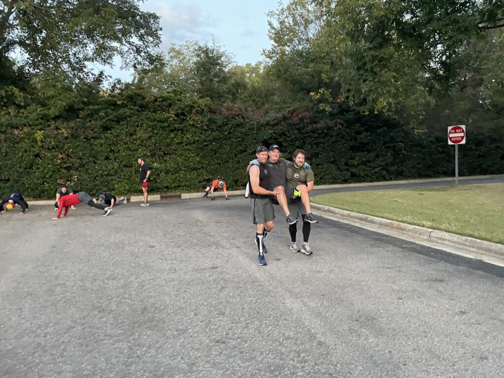
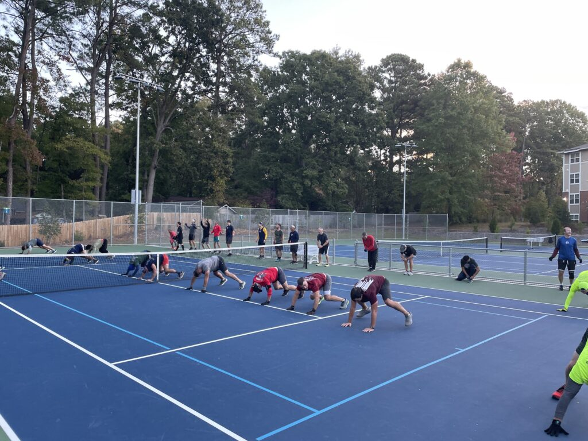
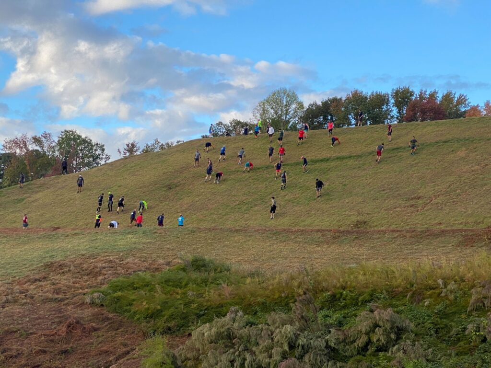
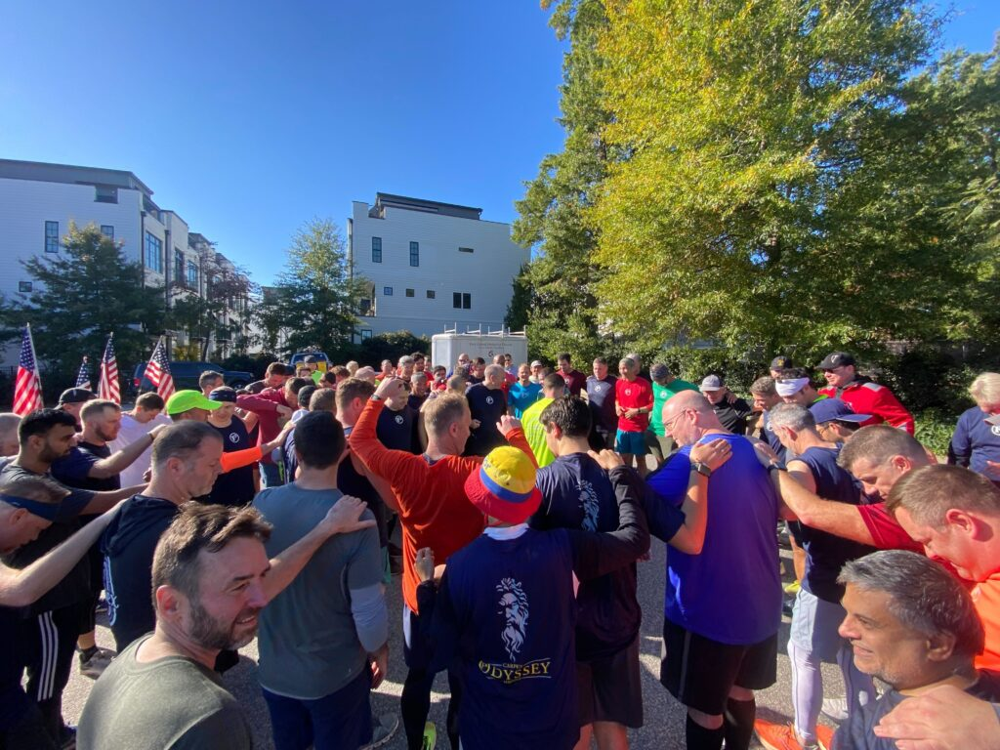

93 PAX and 2.0's descended on Downtown Cary for the 6th annual CARPEX Odyssey.

Special thanks to **Bogo** and **Badlands** for doing the heavy lifting on the Q for this event, and to **PetSounds** for crushing the SAG Q and post-race 2nd F. Also thanks to all of the SAG support volunteers, Site Q's, shirt designers, and inspirational musical selections.

On to the workout...Rooney kicked us off with an opening prayer and then handed it off to Badlands for the warmup at the home of BO.  

<figure>

<figcaption>

Safety talk before heading out.

</figcaption>

</figure>

The PAX then headed off to Rush Hour for:

**Beatdown #1**

Ma Bell and Happy Gilmore started things off with a few motivator springs up the parking deck to help get some heart rates up.  Then it was off to Lexie Lane Park with a flyby of Pure Gold (16 Steves noted it was still open) for the next workout.

**Beatdown #2**

Hi-Liter and Red Ryder took over in the gloom for Baseball field burpees and bear crawl 7's at the basketball court.  And while Hi-Liter was imploring Bogo for a few extra minutes on the clock, we had a schedule to keep so 17 minutes and it was off to Site #3.

**Beatdown #3**

After a nice pre-dawn stroll along S. Dixon Avenue and a slight hill on Dry Avenue, Parker and Schroeder brought the PAX a few lessons from the latest GTE at Old Library Park.  The Banjo and Build-a-bear supply wagon was a welcome site after this beatdown of partner carries, merkins, and mary.  Grab a drink and bite to eat and it's off to Site #4.

<figure>

<figcaption>

Partner carries.

</figcaption>

</figure>

**Beatdown #4**

Dunham Park on Walnut was our gracious host for the next workout.  And while 7:30am is the middle of the day for many of our PAX, Earhart was reminded that some local residents still appreciate some peace and quiet on a Saturday morning.  Undeterred Earhart and Cauliflower unleased a series of gorilla hops, pull-ups, merkins, and pickle grinders for a double respect beatdown.  Over halfway complete, let's keep it going.

<figure>

<figcaption>

Gorilla hops suck!

</figcaption>

</figure>

**Beatdown #5**

Special thanks to SAG for expertly navigating traffic control at the Maynard intersection on the way to Fenton Place.  Badlands and YHC envisioned possibly utilizing the pedestrian bridge over to Wake Med soccer park or maybe one of the parking decks for the next workout, but One Direction and Clementine were thinking bigger, much bigger...  7's on the Fenton Hill was the call with some bear crawls and crawl bears.  Fortunately for the PAX aid station 2 was set up and ready after the beatdown for some hydration and refreshments.  With the end it sight, the PAX were ready to move on to Site 6.

<figure>

<figcaption>

The now-notorious Fenton hill.

</figcaption>

</figure>

**Beatdown #6**

Thanks again to SAG for the Maynard Traffic Control and the PAX were off to Lions Park for fellowship 7's with Geek Squad and Overflow.  Thanks to Badlands Saturday morning scouting reports, the Site Q's were well prepared for the possibility of fall baseball and utilized the CTK parking lot.  Leg work and Mary was the call on the 7's and then it was time for the last long run along the rolling hills on Cornwall Road.  While the temptation was strong for some monkey humpers in Liverpools front yard, time was ticking so it was time to wrap things up at Site 7.

**Beatdown #7**

Who better to stretch the PAX out at the end of our journey than Pivot and Clockwork with some running yoga and asymmetrical hold partner work at Cary Elementary. 

Finally, led by the Carpex OG's carrying the flags, the PAX moseyed together up Academy Street to the tune of Eye of the Tiger courtesy of Bronx Bomber.Some PAX had to leave early and some arrived late, but hopefully all enjoyed some of the best CARPEX has to offer.

75ish PAX and 2.0's gathered for COT as Hi-Liter took us out reminding us how much we need our brothers for support and encouragement.Post event 2nd F was lit with pizza (Thanks PetSounds!) beverages and fellowship.

**Who has it better than us??**

<figure>

<figcaption>

COT

</figcaption>

</figure>
