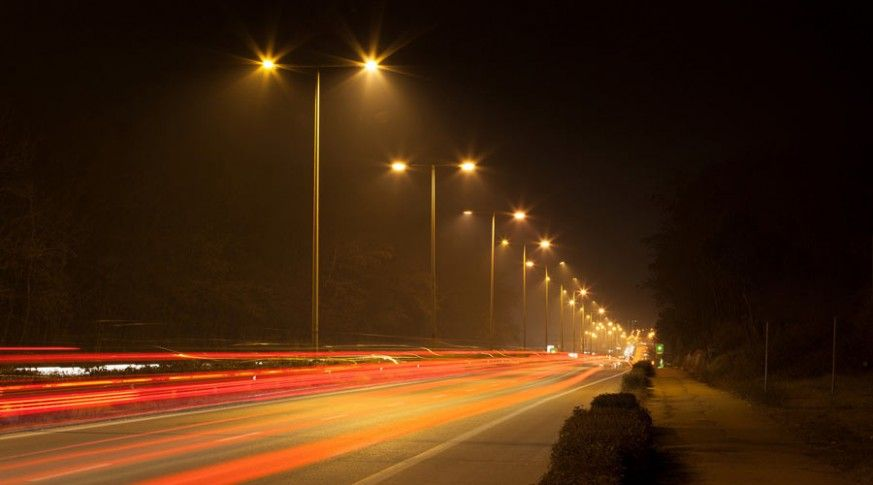

One year ago I showed up at Full Metal Jacket not knowing what to expect.  Callahan was the Q that memorable day and the first exercise was a partner-carry with Freebird.  There was running on the baseball field, BTTW, and bear crawl 7s on a hill.  I never thought I’d last another beatdown, let along a full year.  In an effort to make a memorable year anniversary Q, here we go…

## Warm-Up

Fellowship mosey around the Salem Park pond then circle-up by the flag:

Good Mornings IC x10

Side Straddle Hops IC x20

Mountain Climbers IC x10

Cotton Pickers IC x10

Sir Fazio Arm Circles IC x10

Sir Fazio Arm Circles Reverse IC x10

## Thang 1 - Fellowship Light Poles

Fellowship mosey to the first light pole to complete exercises together…which is why Shut-In showed up this morning.  To exercise.  Together.  We completed the following for each light pole heading toward the baseball field:

1. Merkins OMD x20, WW2s OMU x20
2. Scorpion Drydocks OMD x20, WW2s OMU x20
3. Squat Jumps OYO x20, WW2s OMU x20
4. Wide Grip Merkins OMD x20, WW2s OMU x20
5. Calf Raises OMU x20, WW2s OMU x20
6. Turkish Get Ups OYO x20, WW2s OMU x20
7. Diamond Merkins OMU x20, WW2s OMU x20

## Thang 2 - Concession Stand

Moseyed to the concession stand by the baseball field.  YHC threw an audible due to time (and because I was starting to suck-wind).  On the concession stand, with each PAX giving a 5-count:

\-BTTW

\-People’s Chair

\-PAX circled up for MonkeyHumpers IC x20

## Thang 3 - 7s on the Hill

From the baseball field we moseyed toward the flag.  Stopping at the first light pole….just kidding.  We kept the moseyed pace while the PAX thought I was thinking of the next thang.  7s on the hill was always the plan:

\-Starjumps at the top

\-Burpees at the bottom

\-TClaps to Red Ryder for leading a variety of plank exercises for the six (including me, I was gassed!).

## Mary

\-Dying Cockroaches IC x10

\-Hello Dolly IC x20 (called by Callahan who asked Sour Mash to count)

\-WW2s OMU x20 (requested by PAX)

\-Have a Nice Day

## COT

15 PAX: Butt Fumble, Callahan, Chanticleer, Earhart, GTL, McCants, Michelob, Red Ryder, Rooney, Sabre, Shut-In, Sour Mash, Sub, Triple Lindy, Two Factor

Announcements: The Mule, The Muggo, Rooney gets FMJ koozie

Prayers/Praises: Crimson and his FIL, Term Paper and his daughter, McCants participated in first full workout in 7 months, Rooney daughter for having “just mono” after a scare last week.

My one year anniversary was special.  I can’t imagine how life would be different without F3 this past year. Praise God.
