As we all search for the meaning of life and our purpose and all that serious stuff, sometimes, it's nice to just have a little fun. Ferris knows this for sure...so let's have some fun on our day off.

We start the day with the pledge and a quick warm up jog to the neighborhood clubhouse parking lot for the warm-up. Let's start the day by saying Good Morning to Ferris and then meet some of our other favorites.

After a rousing set of good mornings, we move onto some Sloane Straddle Hops (yowza...don't blame me for that name...i'm just here for the alliteration)

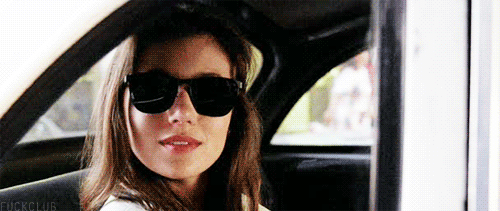

Next we do a set of Cameron's Carolina Dry Docks

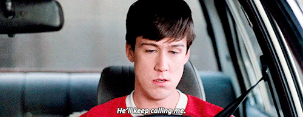

Finally, the PAX are introduced to Abe Froman, The Sausage King of Chicago...interestingly enough he is friends with Abe Vigoda

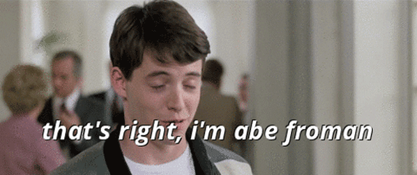

Thoroughly warmed up, we head down the path to find @rooney calling Ferris's mom to let her know that Ferris has been sick niiiine times this semester. Luckily Ferris has a sweet computer and hacks into the school's system to bring his absences down to two...so we do 9's or 11's or bastardized 11's ....no one really knows, but we start with 9 Wolverines at the top and 2 jump squats at the bottom and you know where it goes from there.

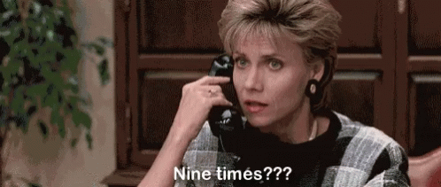

There was a lot of chatter around Kent State's mascot for some reason.

With Ferris, Cameron, and Sloane out of school we leave the burbs and head to downtown Chicago for some fun.

We climb the stairs of the Sears Tower (Left/Right Step-Ups)

Then go to the Cub's Game (Bear Crawl around the Circle)

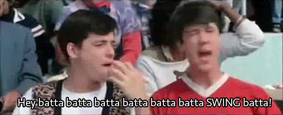

And for some culture we hit the Art Institute of Chicago where we take in the famous Suerat painting 'A Sunday Afternoon on the Island of La Grand Jatte. Biner wins the prize for knowing this painting. How do you get to an island...you take a Boat or Canoe!

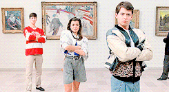

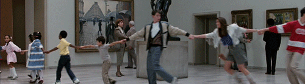

Well that was fun...let's do it again, more L/R step ups at the Sears Tower, and a double header of bear crawl around the circle, and back to the Art Institute to check out 'American Gothic'. American Gothic Hammers were performed with a steely gaze

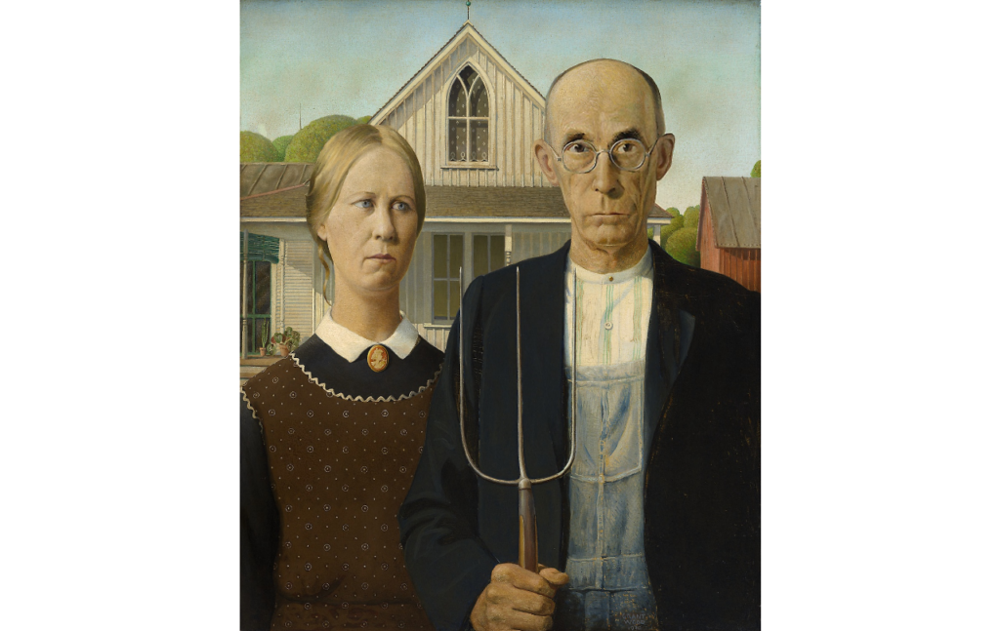

What's that...I think I hear the Von Steuben day parade. We learn a move called a twist and shout (Imperial Walker with Jump Squat in between). 10 of these at each corner of the pickle, and Carioca in between. Kitty killed it with his cover of Twist & Shout. Actual footage of Franklin performing this exercise is below...ps. the pax do not like to learn new exercises that involve any sort of coordination

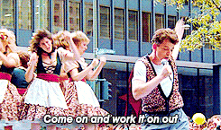

Oh no...there are a ton of miles on the Ferrari. No problem, we'll just go in reverse to take the miles off. Two backwards laps around the pickle.

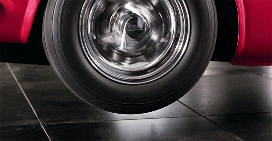

That didn't work, but whatever, now it's time to get home before our parents and Jeannie....Billy run around the pickle to the flag!

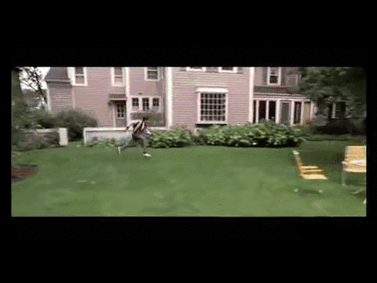

Circle up for a bit of mary....Jeannie kicking rooney led us to flutter kicks

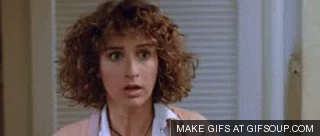

and then to kill some time a couple of dying cockroaches and have a nice day. To my dismay there was no theme tie-in for these. :(

You guys are all the best!
