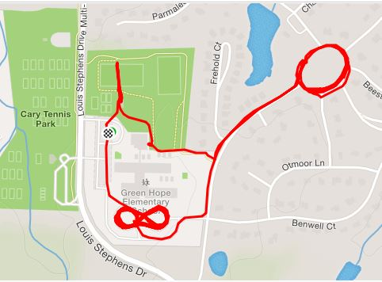

**Q DATE:** November 2, 2018

23 HIM for the inaugural Gran Torino Q on a fantastic November morning. The workout plan was stolen from inspired by Freydaddy's Catalyst Q YHC posted at last week. Since Gran Torino is hi-tempo it needed to be tighten up a bit. We covered 3.7 to 3.9 miles and did some other stuff.

**Warmup** • Pledge allegiance • Jog over to the front of the school • Take a lap around the figure 8 formed by the carpool and bus loops • SSH x 30 • Frog hoppers - like a squat jump but just using feet and calfs for jumping - Hi-liter commented that they were a bit effeminate - next time we'll do kegels

**Thang 1** • 5 burpees, one lap around the figure 8, frog hoppers waiting for the six • 5 burpees, 10 merkins, two laps around the figure 8, frog hoppers waiting for the six • 5 burpees, 10 merkins, 15 squats, three laps around the figure 8, frog hoppers waiting for the six • 5 burpees, 10 merkins, 15 squats, 20 mountain climbers, frog hoppers waiting for the six

**Thang 2** Jog up to the Preston Village round-about. PAX were instructed to run half way around the circle, do 20 American hammers L/R, run back one quarter of the circle, do 20 LBCs, and keep repeating that pattern. Some of the PAX were dimensionally challenged so the forward one half, back one quarter pattern didn't quite work as planned. We eventually made it around the round-about, though. Pressed for time, we headed back to the school with an extra lap around because YHC was disoriented.

**Thang 3** Back at the school, line up against a wall for two sets of: • 5 wall crawls (from plank position work your way up the wall to BTTW and then back down) • 5 burpees

**Thang 4** Mosey over to the picnic shelter for two sets of: • 20 dips • sprint across the pitch • mosey back to the shelter

**COT** **Count-a-rama**: 23 **Name-a-rama**: 5 respect, 18 meh, 0 hate **Prayers & Praises**: Michelob's and Hotspot's 4 year anniversary... with F3. Carpex AO growth over the past 18 months **BOM**: Hi-liter took us out **Refreshments**: PBRs and Gatorade

**NMS** Thank you all for being part of the Gran Torino launch. It was an honor to lead.

