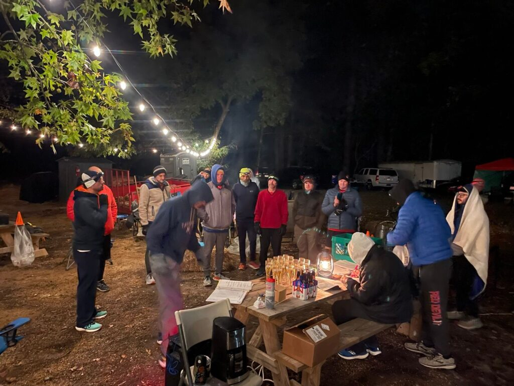
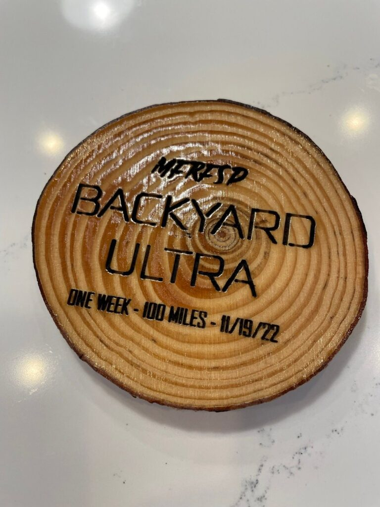
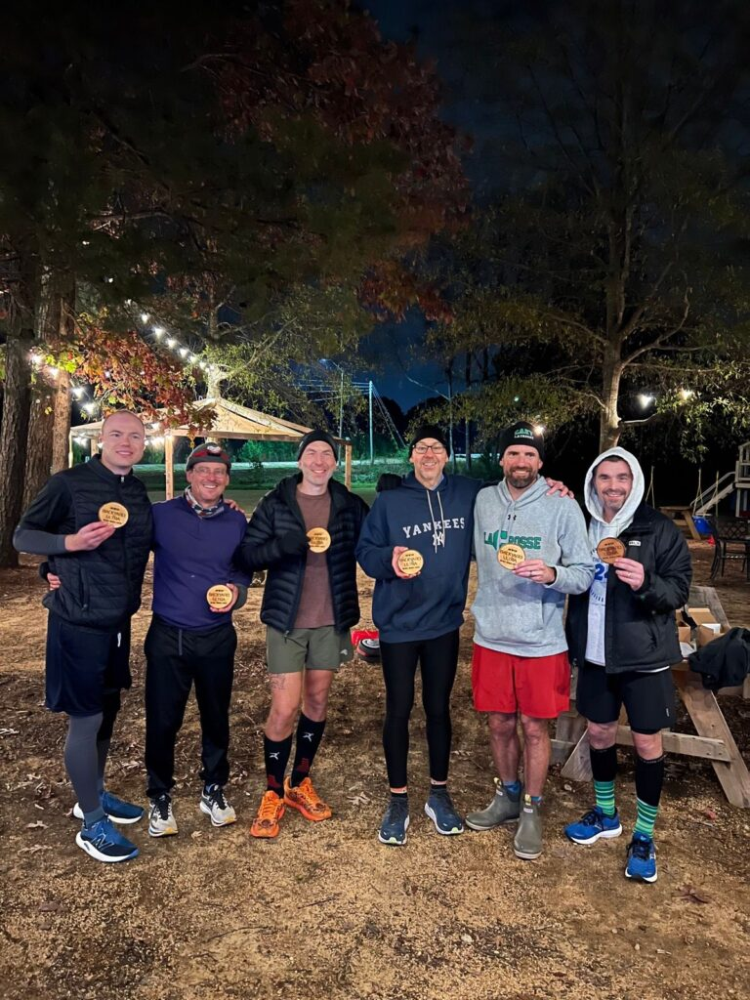
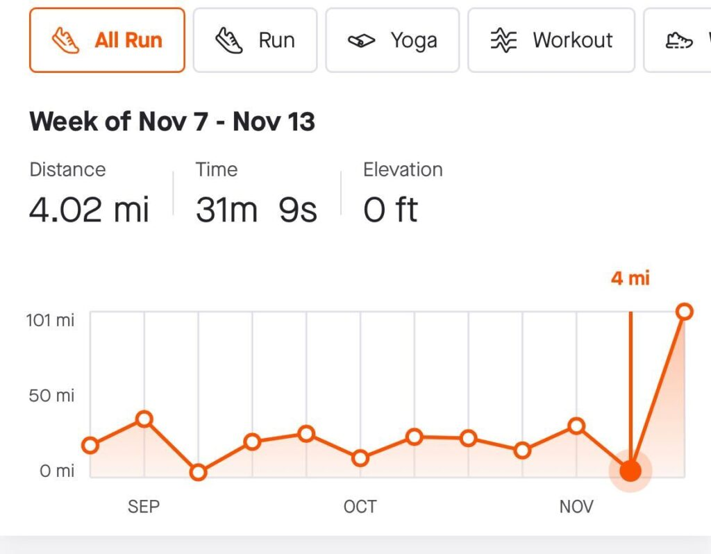

The Mike Fiorito Race for Second Place (MFRFSP) is a backyard ultra brought to you by Carpex's finest ultra running shield lock, the Beige Bros. The goal is to reach 100 miles in 1 week by completing:

- 5 miles per day for 5 days Monday-Friday leading up to the main event
- 75 miles in a single day, Saturday, by completing a 5k at the start of each hour for 24 hours (0000-2300)

You can run, ruck, or walk. Any remaining time that you have after completing the 5k for the hour is yours to clean up, change, eat, shit, shittalk, fellowship, dry your gloves by the fire, prepare, and otherwise convince yourself that you can run one more lap, or "yard." In practice for runners, this typically means about half an hour of downtime between yards. If you're a rucker or walker, however, this might only mean 10 minutes. It is a pretty challenging format, but, as the slogan of the event goes,

> If it doesn't challenge you, it doesn't change you.

This being my second year of participating and first of completing the race, I wanted to share some highlights, event takeaways, and, of course, the results.

## Routes

On the American Tobacco Trail, we had slightly less elevation and fewer twists and turns than previous years. But of course we still had a super secret route sprung on us during the daylit hours!

- ⬆️ North Route, [Strava link](https://www.strava.com/segments/33317869), 79 ft gain
- ⬇️ South Route, [Strava link](https://www.strava.com/segments/33317879), 67 ft gain
- 🤫 Alternate route, [Strava link](https://www.strava.com/segments/33317900), 212 ft gain

## Results

The official race results from Race Director Squatter:

**Race Day participants**

- Ramsay - 18.75 miles
- Overflow - 25 miles
- Chops - 28.125 miles
- Trike & Gump - 31.25 miles
- Hobbit (walking), Badlands, Jiggly Puff & Steaks - 34.375 miles
- Soft Serve (rucking) & Old Maid - 37.5 miles

**Podium finishers**

- 🥉Tied for 3rd place: Skipper (rucking) & The Super - 50 miles
- 🥈Tied for 2nd place: Squatter, Clockwork, GTL, Largemouth & Banjo - 75 miles
- 🥇And your three-time 1st place finisher: Michelob - 75 miles

## Photo Album

<figure>

<figure>

<figcaption>

Opening toast of Michelob Ultra

</figcaption>

</figure>

<figure>

<figcaption>

2nd place prizes

</figcaption>

</figure>

<figure>

<figcaption>

The final finishers

</figcaption>

</figure>

</figure>

## Videos

Hello Kitty put together a montage video.

The Commish took a video in the morning around 9:30am.

Old Maid took a video in the afternoon around 4pm.

## Highlights

As we all know in F3, it is all about the people who show up for you. It was really cool seeing how much this event has grown year-over-year. After two year's at Riptide's place, the event was held a little closer to Cary at Northwest Community Church. Special thanks to Swag and other church members like Hobbit (who was there the whole time with us, walking laps and setting a new normal), One Direction (who grilled burgers!), Road Rash, and Pearl Buck.

19 people began the race at midnight, which was way up from maybe 9 last year. Our first lap was trumpeted by a howling pack of coyotes!

I'm not sure how many people came throughout the day, but I wouldn't be surprised if we saw 50 different people throughout. Pax from all of the Greater Carpex Super Region were represented, family, friends, kids who enjoyed the playground, even Bronx Bomber catching me unawares walking his two dogs while I was running in. Chipper came with donuts, God bless HIM!

Besides all the goodies people brought, we also had onsite physical therapy support from Pauly D who brought decompression boots and even a PT table. Lee and Erin better watch out!

Speaking of support, how about all of the many runners who joined us for a lap or two or eight? Hello Kitty and Happy Gilmore even came, left (I think to Riptide's shootin' event?!), and returned later at night. Nabisco and Denali came early afternoon and proceeded to smoke us yard after yard, but we'll chalk that up to us having already run 30+ miles, right? Chanticleer came with some much needed pep for the final laps, and Wonderbread was our finish-line photographer.

I also enjoy the conversations you get to have while running all day. Not only do you get to speak with a lot of different people, you get to speak about a lot of different things. From ruck recommendations to Huma gels, black-and-white T.V. shows to 80s bombshells, the conversations provide their own sort of fire when you're chattering your teeth off in 28-degree weather.

Some of those conversations also revolved around future events, so keep your eyes peeled for such completely stupid and utterly pointless extravaganzas as:

- MFRFSP 2024
- Return of the Maynard 100
- TriSprint 10x10x10
- Travelling Odyssey
- Carpex spin on a GTE

Because yes, while we're in the midst of doing something insane, we're already plotting the next insane thing.

## Event takeaways and tips

In general, see Old Maid's awesome "How-to" [doc here](https://docs.google.com/document/d/1kI8-0R_Uofaz0-yMxc19MtNw2Z02VHxg/edit). For packing lists, there is also a [spreadsheet here](https://docs.google.com/spreadsheets/d/1ITC9H0BdA9z2Dx74mZ8Mu9UaytzwhdRqyXhnYHqALZU/edit#gid=176644083) that I keep for all the events, so there's a **MFRFSP** tab (and also for BRR relay race, rucking, etc.).

**Packing tips**:

- Pack things in lots of bags to help you grab-n-go and clean up.
- Arrive early to set up by the fire, or else you'll find yourself shivering a few rows back...at least until the day thins out the ranks.
- Bring charrable hats and gloves...you'll want to put them out to dry by the fire, but they will also probably catch fire at some point!
- If you don't like chill vibes, acoustic covers, and Bieber, BYO playlist.

**While you're running tips**:

- Take it one lap at a time. It's much easier to think you can do one more 5k than to think about 25 more miles ahead.
- Come up with a "process," especially later in the day. Some examples include:
    - Picking landmarks and running until you reach one, then walk to the next.
    - Run three-quarters of a mile, then walk a quarter, and repeat.
    - Count in your head, such as in cadence, by prime numbers, backwards by 7s from 1,000, or whatever. Wouldn't recommend counting aloud unless you want to make mortal enemies.
    - Don't let Chanticleer distract you from the process.
- Speak up and share how you're doing with others who are running. You never know, they might have something that can help!

**While you're resting tips**: You won't have time to do everything, so you have to think, shall I eat this round, use the bathroom, change, wear decompression boots that our personal F3 PT brought, etc. so:

- Prioritize what you'll do when you get back while you're running each yard (and also a good talking point on the run).
- Stretch out and use a massage gun, especially as the day goes on.
- Change your clothes to bring fresh life back into you...I think GTL changed his shirt each lap! I changed pants/shoes four times, but shirts more often. I rotated two pairs of hats/gloves and had lots of bandanas.

**Training plan**: Didn't really have one. I was already preparing for a 50k in January, but I would say just keep up your BRR weekend runs. And yes, it's a second place finisher-approved strategy to taper down to only 4 miles the week before race week! But seriously, I was in Miami, so I just swam and did yoga on the beach, which I think actually helped my body get ready for a very non-zen week.

<figure>

<figcaption>

(Pierogi pointed this out to me, btw.)

</figcaption>

</figure>

## On pain

Everybody is different and brings his own thresholds, past injuries, and training strengths/weaknesses with him. But I thought it might be helpful to share some of my experiences with pain in this race as a way to help set expectations (or maybe hear from you all if these seem way out of whack!).

🕛 Going into the race, I felt pretty good. Most of my aches from previous races and rucks this year (achilles, hip impingement, and some weird foot numbness all on right side) had died down to minor annoyances. I did unfortunately stub my right index toe the day before the race, so that actually bothered me quite a bit.

🕘 Based on my experiences these past two years, I would say if you run a lot of bootcamps and have done the BRR, you will probably feel pretty good at least until the sun comes up. And then the sun itself helps you for a few laps. Then, let's say by 9am, you will feel pretty tired and your muscles will be tight or dull. My right toe and foot felt pretty sore, and my knees felt like they had too much wait resting on them.

🕑 Past noon, you've made it halfway and might feel more or less the same as you did several hours ago, but you might suddenly hit a wall, especially if the temperature rises. It's probably a good indication you haven't been drinking or eating enough.

🕓 50 miles in, I was pretty convinced that I would be done. My left side IT band (not my right side and not a muscle group I've ever felt sore before, which surprised me) was aching and felt pretty tight. However, two unexpected things happened:

- You might notice other pains just go away. I no longer felt any pain in my right leg or knees. It was just my IT band.
- You might notice your body actively trying to alleviate the pain. I could sort of feel the blood flow into my IT band. I have no clue what the medical explanation is, and hadn't experienced something like this before (though would have been nice at the GTE, lol)

🕕 That, plus I followed Squatter's advice to wait to ring the bell until the beginning of the next lap, changed clothes, and by that point, thought, eff it, what's another 5k? So I kept going. Also, I figured that at least I didn't have a ruck on like my last event, so I wasn't as concerned about lasting injury.

🗓️ Now, three days after the event, it's pretty much just my IT band that's still sore. But it's bad enough that I haven't tried running yet, though I've been doing yoga and walking. Hoping it recovers quick, because I have a 50k in ~6 weeks.

I'll end this section by saying, I don't believe in that illusive phenomenon called the runner's high. By the last two laps, I was sort of seeing things in the shadows, but it was more just a depth-perception and tiredness setting in sort of thing. Bit disappointed. I will say, however, that I think it's a great purge technique...when I ate candy the next day, I literally wanted to vomit it back out because my body had finally flushed all that post-Halloween junk out.

## Shield Locks, expansion, and acceleration

Maybe because expansion has been the hot topic of Carpex Culture Month, but this event had me reflecting on group dynamics and acceleration. The MFRFSP is a Beige Bros production, who I believe are also Carpex's first shield lock zero (SL0)? Squatter masterfully directs it from start to finish; GTL and Largemouth run effortlessly and help lead the yards; Denali, Chanticleer, and Wonderbread show up at all hours of the day to encourage everyone; and Michelob, it goes without saying, wins it.

Of course it is cool that this group of HIMs accelerate each other, run ridiculously tough races like this or Rim-to-Rim-to-Rim multiple times a year, avoid bootcamps by concocting increasingly complex running routes (often with movie themes), wear matching beige socks, plan team meets in hottubs, etc. But I actually think something cooler about them is that they also use their own shield lock energy to bring others along with them. My participation last year was my first ultra and most miles in a week, and then this year also set new PRs for most miles in a day and week. And I know I'm not the only one. And what's a bit crazy is that it's not a one-time thing with this race. They do this sort of thing all the time with things like the Maynard 100 or Umstead trail running or whatever it might be.

I'm not saying this to flatter or embarrass them. I'm also not suggesting every shield lock should sponsor 100-mile backyard ultras. I'm bringing it up because we are in a time of expansion and many people are wondering, "How do we keep the Carpex magic? How do we make sure this is a growth opportunity?"

I don't think Shield Locks are the only answer, but I think they are a big part of it.

- 🏃‍♂️ Things like this MFRFSP couldn't be pulled off without a shield lock.
- 🍻 Most Carpex 2nd F events are run behind the scenes by shield locks like SL1.
- 🤝 3rd F service projects often get done because one guy in a shield lock makes the others help him, and then the next project rotates to the next shield lock.
- 💥 I doubt the Peak City or Green Level expansions would be happening without the momentum thrown behind it by the POGL or Amberly shield locks.

When you're part of a group like F3, you accelerate because you see other guys doing a bunch of cool things and you want to (and are welcomed/encouraged to) join in. But when you're in a Shield Lock, I feel like you have 10x that motivation and accountability. And just like this MFRFSP event drew people from a bunch of regions and shield locks, I think the things we do collectively in the future will have a similar capacity not only for growth, but also for reunion.

Anyways, this was a really long tangent to say 1) thank you to the Beige Bros and 2) we'll all be fine sorting through this expansion mess. It's also a good example of the sort of random threads of thoughts that will cross your mind when you run for 24 hours.

## How it changed me

Because the slogan of the event mentions this, I thought I'd reflect on ways the event changed me. If you aren't into philosophical tangents, you wouldn't have read this far, so I'll press my luck and go on.

I asked Largemouth whether you can prepare for an event like this, and he said no, but it can prepare you for other events. I think he just meant for other races, but it seemed a bit profound. I am much more confident in my abilities to tackle upcoming races like a 50k.

However, this event, coupled with the GTE from last month ([backblast here](https://f3carpex.com/growruck-32-neptunes-adventure/)), also had me thinking about endurance and suffering. I've heard others in the group talk about how you can endure more than you think, but it doesn't really come to life until you do something like this. You almost learn how to give up on giving up, like you just resign yourself to completing something and after the decision is made, you can bear it. I think this has implications for a lot of areas in life, but I'll have to see how it plays out. The hardest thing for me is that these events are self-imposed, so sometimes I wonder whether that's actually a good thing to do to myself. I still don't think I have a "why."

Besides that question, some other things it's made me want to work on include:

- Quietness, introversion, and in-my-headedness. I think I could do a better job at checking in with others like a lot of the guys on the race did.
- Applying my ability to self-motivate to other areas in my life.
- On a more practical level, more consistent and visible "prehab" and recovery techniques.

## Conclusion

There's a little saying in our group that I'm sure you're acquainted with:

> If you can do this, you can do the BRR.

I think that sort of logic holds true for this race, too. If you can do a bootcamp, you can _definitely_ do at least 1 yard in the MFRFSP. And to be honest, if you can do the BRR, I think you could probably do the whole MFRFSP, as long as you're willing to suffer a bit. Only one way to find out.
