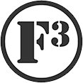

DATE: September 27, 2018

QIC: Sabre

AO: Bradford's Ordinary

PAX: (including Bruisers)  29 total gathered in Gloom of DTC (23 boot camp, 6 Bruisers, including a 1-legged Kitty, or is it Das Boot?!)

8 respects , 6 hates, 0 FNGs

 

So I learned what "shock & awe" pre-blast means to Flacco -- it means that he is going to hype an epic beatdown, then scoot out-of-state, give the ole neighbor a call to say .... hey, help a brother out & take my Q??

It's ok, he introduced me to F3 & I'm very grateful!  Also, the predicted rain held off & we had a lovely morning!

 

**Warm Up:**

Mozy to bank plaza -- why do we do that?  I couldn't see a thing!  (even though I thought I spotted a @Red Ryder

SSH x 20

Standard Merkins x20

Imperial Walkers x 15

Standard Merkins x20

Hill Billies x25

Standard Merkins x20

Calf stretch left

Calf stretch right (heard about all those calf raises earlier in week)

Mountain climbers x15

**Thang:**

Mozy to the Baptist church lot & partner up.

Round 1:  partner 1 runs to bottom of lot & does 5 burpies, partner 2 bear crawls the pickle until he returns -- flip flop

Round 2:  partner 1 runs to bottom of lot & does 15 sumo squats, partner 2 crawl bears the pickle until he returns -- flip flop

Round 3:  partner 1 runs to bottom of lot & does 20 CDDs, partner 2 lunge walks the pickle until he returns -- flip flop

Round 4:  partner 1 runs to bottom of lot & does 40 LBCs, partner 2 Berrie Sanders up to Academy Street & forward jogs back until he returns -- flip flop

Mozy to fountain

Stay with your partner on benches for:

Irkins 20, Dips 20, Irkins 15, Dips 15, Irkins 10, Dips 10

Dirkins 15, Sumo Squats 15, Dirkins 10, SS 10, Dirkins 5, SS 5

Mozy to Mayton Inn for world's worst merkins (by request of somebody in a tank top)  -- did 4 in cadence poorly as I was out of juice

Partner sprints to the flag & meet up with Bruisers

**Mary:**

Dying cockroach -- courtesy of Kermit

Freddy Mercuries -- courtesy of Angry Elf

Have a nice day -- yours truly

**Announcements/COT:**

New Thrusday AO -- Back in Black at Koka Booth -- starts in 2 weeks, I hear its early in the morning

Odyssey Oct 20

Haven House donations are still needed -- links are on Slack or connect with @burt, @coney

**Praises/Prayers:**

Red Lobster has a new job leading as Youth Pastor

Prayers to Chinese Downhill for answering the 2:30 am call from a young man who needs help at NC State.

Callahan family getting close to delivering a bundle of joy sometime over the next 2 weeks -- hang in there M!

Thank you gentlemen – I heard quite a bit of grumbling in the mumble chatter, so I'll take that as a complement!  I got a ton of energy from you this morning & sincerely appreciate it!

Sabre
