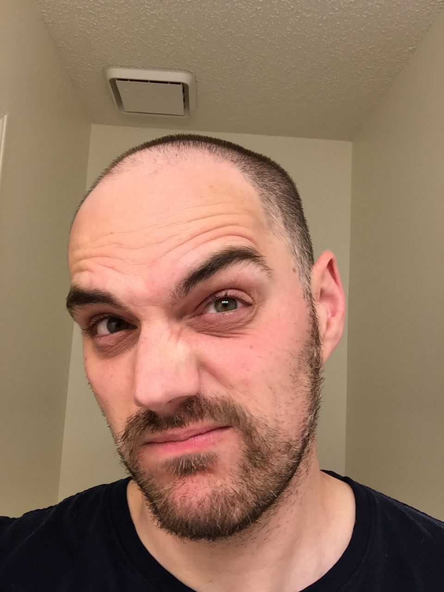

Lots of PAX got together this morning at SNS. By COT, the count was 22.

Even more went elsewhere. Air Brooks was holding Court down at Point Break, Geek Squad pretended to have a birthday, Headroom continued checking boxes on the CARPEx Challenge and, hell, even Flenderson accidentally clicked into the Q sheet to sign up.

But only eight were man enough to take to the diamond though.

Having expertly introduced myself to the two PAX I had not previously met (and then promptly forgetting their names until basically COT), it was time for the Pledge as those with muscles only below their waist took off for an advertised 45 minute jog.

\[Note: they were back reaallly early\]

But before we can truly depart, let us all take a minute and admire the parking greatness that is Hi-Liter's pickup straddling 2 1/2 spots.

## Warm-up:

Enjoy a few minutes of Flacco regaling us with tales of avoiding venomous snakes between the flag and the first intersection. Apparently they were 6' long and of a girth that even Riptide would appreciate. Luckily for all of us, Flacco was able to avoid these wiley beasts and we shortly circled up for:

Copperhead Merkins x20; Plank Jacks; MCs; Sir Fazios F+B

## Thang 1:

Mosey to New Hampshire. Take in the sunrise just past those impenetrable clouds. Three rounds of 5 Burpees - 10 Merkins - 20 LBSs. OYO.

## Thang 2:

Mosey to the baseball fields for Diamond Doras. Traditional 1-2-3 on P1; P2 lunge walks to 1st... bear crawls to second... moseys home.

Word is Cally slid into home, beating the tag.

Word is also that Cally thinks he's part Dutch. Probably because he can't throw anything away and because he owns one of those weird spoons that everyone in Holland has that lets you scrape the very last bit of jam from the bottom of your jar. Don't laugh -- it's true. Don't laugh some more -- because it's a tradition born from being starved by the Germans during WWII. Yup, the Dutch have had some issues. But the name is hilarious. See title.

Turns out Cally's not Dutch. Have you ever seen a Dutch guy look like this?

Me neither.

Seen lots of Polish guys look like that though.

We then caught some Willy Mays style pop-flys in the outfield, The Commish got dizzy, Saban yelled a lot and we figured out running to a target bcakwards is not that hard.

Mosey back to the flag. Passed the beast that contributed to the little brown spot in Flacco's underwear. It was clearly 'resting'. Or pining for fjords.

## Mary:

7 minutest to spare and Prodigal and his 'running' crew have changed into polos and docksiders. No amount of shaming got them to join in the LBCs, FKs, H2Heaven, etc. so we moved the circle over to them. Denali looked at me like I was loco.

"Can't you see I'm stretching over here in this seated position on the curb" said his smirk.

At any rate, it was time.

## COT:

Count: 8 + 7 + 2 ruckers + the rest = 22

Announcements: YHC is planning a virtual Sasquatch. Details are lost somewhere on the 1st Channel. 10+ miles, beatdown stations, etc. Start at the Green Mile and end at Godbolt.

Prayers: Barbara and Jim

## NMS:

Got nothing.
