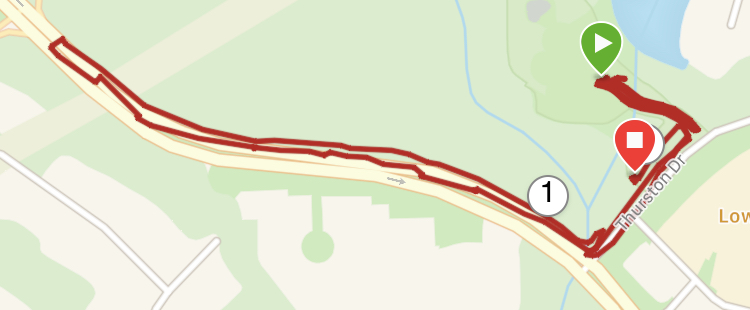

Eleven (+1 Runner) PAX made it out to Flirtin' with Disaster last Tuesday morning for a "Choose your Q" kind of Tuesday. Hermes offered up his Fall Semester of HQS and I offered up the summary below. At 530 AM, PAX made their picks, said the Pledge, and off we went.

### Warm up

Jog over the parking lot near the rock pile

- Side Straddle Hops
- Good Morning
- Calf stretches
- Arm Circles (Front/Back, Big/Small)

### First >> Rock Pile

Grab a partner and a rock....

- One partner runs to the stop sign at the entrance to Marla Dorrel
- One partner works on:
    - Arm Curls (50)
    - Chest Press (50)
    - Behind the Necks (50)
    - Squats (50)

### Second >> Cary Parkway Hill Climb

Mozy to Cary Parkway and run to the top. At each light pole, alternating and incrementing:

- 3x Burpees
- 3x Star Jumps
- 6x Burpees
- 6x Star Jumps
- Etc...until the top

### Third >> Mozy back to MARY

Back down to the basketball court, join the Q School, and finish off with PAX-led MARY:

- LBC's
- American Hammers
- Low-Slow-Flutters
- WW2's
- etc...

### COT

Lookout joined us after his final BRR long training run. Mentions for BRR, Family, Friends and serving our community. Thank you fellas for the opportunity to lead. My BB is one week late.
