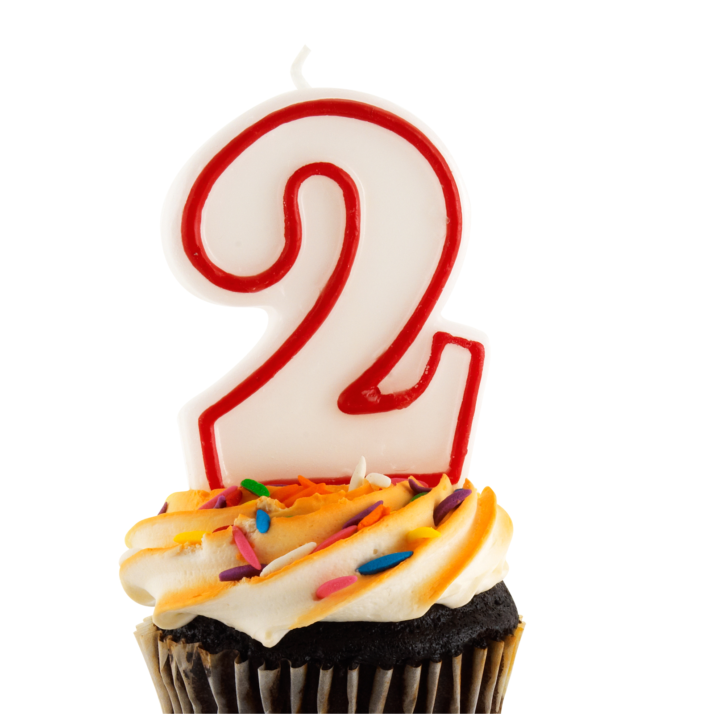

  
  
So 2 years ago on this date, worked out at Rush Hour I followed that up with posting at BO and SWW, so I almost did the same to Celebrate, and adding Q'ing to finish out the week.

We had 16 Pax so Hermes took the new pax off for a Q school and the remaining 9 Mosey’d to the lot by the shelter for Warm-up  
**FNGs:** None  
**EC:** Lookout, Chipper, Oofta, Staubach, Bluewater and Captian Jack  
**Warm Up:** 15 SSH, 15 Imperial Walkers, 15 Hillbillys, 10 Sir Fazio forward and backward, 10 Good Mornings ( the south wake way)  
**The Workout:** Mosey’d the Base ballfield  
       **Thang 1:** Escalating 4 corners using the bases, Dimond Merkins, Jump Squats, Burpees, and Lunges starting at 5 going to 10 and back to 5  
Mosey over to the Shelter for  
**Thang 2:** Dora 1,2,3 50 L/R Step-ups. 100 Dips, 150 LBC's  
After that, we headed to the flag for Mary  
**Mary**: Popcorn Mary with Homer to Marge, Freddie Mercrios, Hellow Dollies, Merkins, and others  
**Announcements**: TCP Sawgrass this Sunday at 2 pm 10k at Green Level Tomorrow, Bike Ride with Hermes, 10-year f3 anniversary - Check slack for details  
Prayer: Term Paper  
**TClaps:** Hermes for taking 6 men to keep our social distancing the backblast here for what they did  
**NMS:** Men it has been an honor to be a part of F3 for the last 2 years, I am appreciative of everything I get from workouts and know that I have a group of men behind me If I need it. It is more than a workout, it feels like being part of teams like I was in high school but without ego's getting in the way of greatness.
