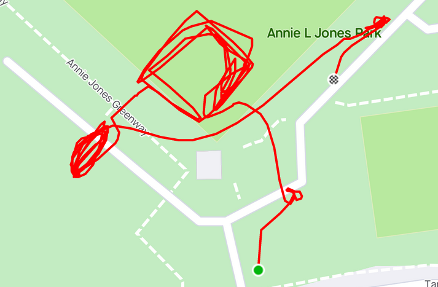
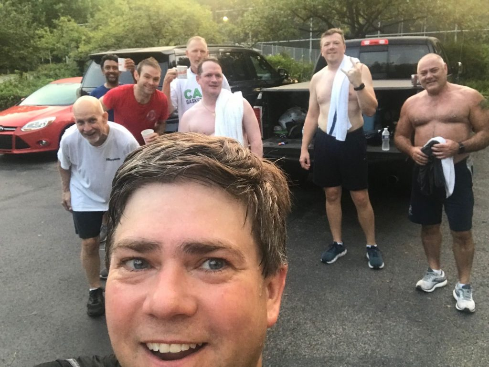

**AO:** Claymore  
**Workout Date:** 08/10/21  
I scoped out the park on the internet, but arrived too late to scout. With only a couple of minutes to spare, I peppered site Q Skipper with multiple AO-related questions. Hopefully this did not worry him too much.

**Warm Up:**  
State the mission, check for FNGs(0), and give the disclaimer.  
Side Straddle Hops x20 In Cadence (IC)  
Good Mornings x5 IC  
Sir Fazio Arm Circles forward x10 IC  
Sir Fazio Arm Circles reverse x10 IC

**Main Event:**  
**1)** **Rack Em Stack Em** around the baseball diamond. Corners and exercises: (1) Burpees x5 (2) Merkins x10 (3) Squats x15 (4) American Hammerx x20 IC  
**2)** **Bear crawl/Lunge Walk Sevens** in the parking lot. Squats/StarJumps.  
**3)** **Group Rock work** Grab a rock, YHC starts, then go around the circle with each PAX calling and leading another exercise. Curls x10, Overhead Press x10, Triceps Extenstion x10, Bent Over Row x10, Shoulder Taps x10, etc.

<figure>

<figcaption>

[https://www.strava.com/activities/5769625784](https://www.strava.com/activities/5769625784)

</figcaption>

</figure>

**Mary:**  
Mixed in with rocks, I think. I don’t remember.

**COT:**  
8 PAX  
Announcements and Prayers

**Naked Moleskin:**  
My favorite part was the rock work. Sharing the lead with the PAX raised the 2nd F factor, and I learned a couple of new moves to boot!  
Pinto is tough! Guy was modifying with pull ups on a tree while we were doing sevens.  
I know on-site coffeeteria is a whole ‘nother level of Site Q effort, but it’s always so nice to have the convenience and the high attendance numbers!  
This was my eighty-ninth #F3Q21 #2021Challenge Q (ninety-third overall). Next Q is Wednesday (tomorrow) at To Be Determined in South Wake.  
\-Pigpen

**QIC:** Pigpen  
**PAX:** Repeato, Pinto, Foie Gras, Bronx Bomber, Deuce, Press On, Skipper, Pigpen  
**Workout Date:** 08/10/21

<figure>

<figcaption>

Claymore Crew 8/10/21

</figcaption>

</figure>
