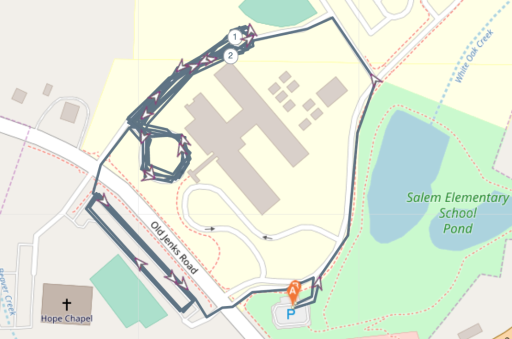

Twenty-one PAX made it out to Full Metal Jacket Tuesday morning for an Election Day workout. It was my 1-year F3 anniversary and South Cary came to support. At 530 AM, we said the Pledge, and off we went.

### Warm up

Jog over to the parking lot near the baseball field

- Good Morning
- Arm Circles (Front/Back)
- SSH
- Calf Stretches
- Merkins

### First >> Two-circle DORA

Mozy up to the main circle off the second entrance. Grab a partner and...

- One partner runs a "figure 8-ish" around the two circles.
- One partner works on:
    - Star Jumps (100)
    - Squats (200)
    - Calf Raises (300)
    - E2K Crunches (400)

### Second >> Hope Chapel Poles

Mozy across street to Hope Chapel parking lot. Run the five light poles and at each one do incrementing burpees

- 1x Burpees
- 2x Burpees
- 3x Burpees
- 4x Burpees
- 5x Burpees
- and mozy back to the beginning 3x.

### Third >> Mozy back for PAX-led MARY

Back to the parking lot and finish off with PAX-led MARY:

- American Hammers
- Low-Slow-Flutters
- Hello Dollies
- Diamond Copperhead Merkins
- etc...

### COT

Mentions for the election, our country, family, and friends. Thank you fellas for the opportunity to lead. F3 has changed my life for the better. Hat tip to Tubeless and Ham Sandwich for the initial invite 1-year ago. Grateful for all of you.
