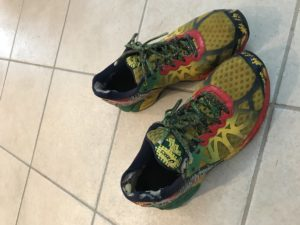

After traveling throughout the greater Cary/Apex metropolitan region for much of July, it was good to get back to some home turf and get 10 more minutes of sleep.  Apparently Hi-Liter got 10 more minutes of sleep as well.  One year ago, Parker dragged me out before daybreak to FOD and I haven't looked back.  So it was time to bring the original Bogo shoes out of retirement for the 1-year Bogoversary.

 

**Warm-up**

Mosey across the parking lot and before we made it 5 steps YHC was gently reminded by the PAX to provide the disclaimer to our 2 FNG's.  Continue the mosey across the parking lot with Franklin briefly leading the PAX before missing the turn on the greenway.  Continue up the hill to the upper parking lot and circle up for

- SSH
- Sir Fazio forward and backward
- Overhead Claps
- Calf Stretch
- Plank Jacks
- Std Merkins

**Thang 1**

7's up the hill with burpees at the mailbox and starjumps at the bottom.  During the course of Franklin's explanation of 7's to Paddle, it was somehow determined that 6+1 could sometimes equal 8.  Since our math was a little fuzzy, the PAX decided to take one more run up the hill at the end and finish with 7 burpees.

Mosey back to the rock pile with a few pearls along the way with 20 prisoner squats OMD and 20 merkins OMD.

**Thang 2**

Rock Dora.  Partner up and grab 1 rock per pair for 100 skull crushers, 200 overhead press, and 300 curls.  Partner 2 runs the pickle and flip flop.

The PAX crushed the rock exercises, but YHC's timing was a bit off, so we had to cut Dora a little short to head back to the flag for Mary.

**Mary**

Circle up at the flag for 30 IC Freddie Mercury's.

**COT**

**Count-a-rama:**  21

**Name-a-rama:**  6 RESPECTS, 12 meh, 3 HATEs

**Announcements:**  9/11 stairclimb, DZ convergence end of August, coffee at White Oak

**Prayers/Praises:**  Ascot's M with high blood pressure, Trike traveling to India for next 2 weeks, Mission group in Lebanon including House and others

**NMS**

Thanks to Parker for bringing YHC out last year.  It's truly a blessing to be surrounded and encouraged by all of the HIM in this group.

It was good to see Hi-Liter this morning.  FWD's loss was FOD's gain.  On the way out, YHC noticed Hi-Liter grabbing the shovel flag noting that he was picked up this morning and he was passing it forward.  or backward?

YHC can picture Badlands standing on the side of the road patiently waiting for his ride as Franklin drives right by.  Fortunately Badlands was able to regroup and still make it on time.

T-Claps to Term Paper for the Tour de Carpex plan.  It was great to get out and see some different AO's, but it's always nice to come back open.  I do still owe BO and Tortoises a visit.
