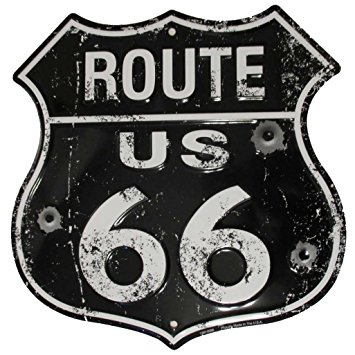

YHC was questionable Tuesday night as a chronically painful achilles tendon was joined by a strained hamstring courtesy of some lunch-time ultimate on Tuesday. To leave my fellow Tortoises without a Q on such short notice just wouldn't do. Luckily, a night of sleeping with a heat wrap on the hammy and a handful of ibuprophen had YHC feeling much better once the alarm went off. Off to Apex for some _limited running_!

Nine PAX emerge from the gloom on a brisk, damp morning. Don't worry boys, we'll have you warmed up in no time. No FNG's, but welcome to Brown Bag up from South Wake. Over to the front pickle and after a quick lap, circle up for:

- Good Morning x 10 IC
- Hillbillies x 20 IC
- Abe Vigodas x 10 IC
- SSH x 20 IC
- Sir Fazio Arm Circles x 10 each direction IC

### Thang 1

Time for some elevens! Starting at one end of the front parking lot, stop every 2 spaces for increasing number of:

- **B**urpees, jogging between the spaces
- **O**verhead, claps bear-crawl between spaces
- **M**erkins, lunge walk between spaces
- **B**ig-boy sit-ups, lunge walk again
- **S**umo-squats, paint the lines

Because, #respectWeek, for each of the exercises, there were 1+2+3+4+5+6+7+8+9+10+11=66 reps. Coincidentally, (or not), YHC was born in 19**66**. So, there's that!

### Thang 2

Jog over to the picnic tables behind the church. Thang 1 took a bit longer than anticipated, so only time for 1 round of:

- Dirkins x 10
- ALRSU x 20
- Inclined Merkins x 20
- Monkey Humpers x 20

Spartan tells me it's 6:11, so back to the main lot for abbreviated Mary:

- Freddy Mercury's x 20
- Shakira x 5 each side

### COT

- Count-a-rama: 10 PAX

Announcements

- Monkey Nut with a plug for Dante's Peak on Fridays
- Ma Bell collecting toys for tots. Catch up with him or a site AO to donate
- Thanksgiving Day convergence; 7 AM at BO (downtown Cary) (Note: YHC forgot to mention this in COT, so dropping it in after the fact.)

Prayer requests:

- Ascot's friend recently diagnosed with prostate cancer
- 3-Dub's co-worker, Tina, who recently lost her mother
- Texas Ranger and his family are awaiting word on next steps for adopting a child
- Today is the day when Leprachaun's cousin Edward gets his scan to see if chemotherapy got rid of the cancer completely.
- Prayers for Leprachaun as he takes drivers' ed this week

NMS

- Great work picking up the six today guys, and encouraging each other!
- Thank you men for the honor of leading you this morning!
