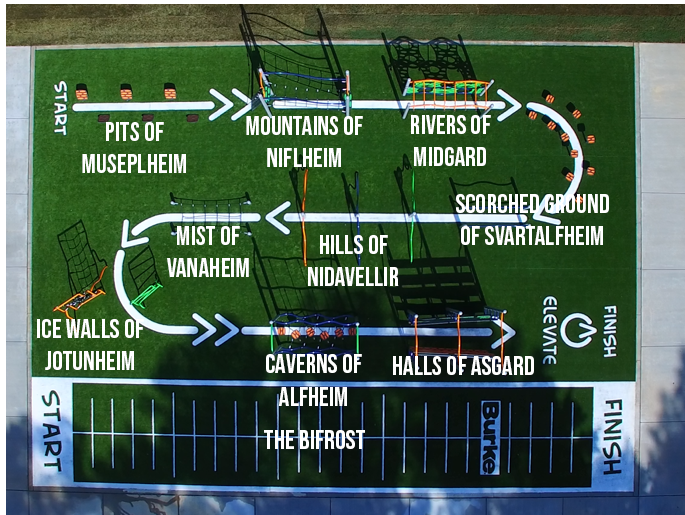

I was pretty excited for this workout. It was the first true Spring evening workout (in my opinion) - the weather was perfect. I decided to grab some weapons for the thang and utilize the Asgardian Warrior Training Grounds.

My goal for this workout was to push everyone for 45 straight minutes. Workout together but against yourself. 

No FNGs. We Pledged to the good ‘ole US of A and moseyed to the Asgardian Warrior Training Grounds (Elevate Course at the park) for a quick warm-up. 

**Warm-Up**  
Circle up for Sir Fazios, Seal Claps, and Threading the Needle. 

**The Thang** **\[Cue Marvel Movie Music - literally\]  
**  
Grab a weapon (a kettlebell) and line-up. 

As one person wielding Mjölnir transversed the Asgardian Warrior Training Grounds and ending with a 30 count on a battle rope, the rest of the PAX will be using their weapons to get SWOLE. 

The Asgardian Warrior Training Grounds consisted taking the BIFROST (25 yard sprint and a 25 yard agility cone work) then traveling across the NINE REALMS testing one’s strength and character. See map below:

At the same time each HIM got the chance to call a workout using their weapons for the PAX that were not on the Asgardian Warrior Training Grounds. These included: Chest Presses, Curls for Girls, WWIIs, Rock Your Bodies, Overhead Tricep Curls, Skull Crushers, Weighted Homer to Marges, Weighted LBCs, Kettle Bell Swings, Snatches, and Kettlebell Merkins. 

Each HIM ran the training grounds 4 times and each weapon workout was repeated 3-4 times with anywhere of 10 - 40 reps. 

Stretched out for 3 minutes. 

**COT**  
  
**Count-a-rama**: 8  
  
**Name-a-rama**:  1 RESPECT, 6 meh, 1 HATE

**Announcements**: 

- Little Drummer Boy (Hate) is up for Q for 4/15.
- Carying Place - Sunday - Check Slack
- Murph May 
- Soccer 7 am every Sunday at Mills Park
- Bible Study Tuesday (6:30) and Wednesday (7:00)
- Slack Channels getting cleaned

**Prayers / Praises**:  

Kwik Stop got a job. 

Non-praise Kwik Stop and SuckUp for not showing up tonight. 

Michelob, PetSounds, HowHow on their recoveries from injury. 

Think of that one guy that you haven’t seen in a while and reach out.  
  
**BOM**:  YHC took us out  
  
**NMS** 

I have been really trying to push myself lately to get better in every aspect of my life. Today I pushed myself so hard I Merlot’d at my own Q (is that a first?). 

The Thorsday night workout ‘Ragnarok’ is my favorite day of the week. I look forward to it. If you haven’t come…you need to. It is a different type of Gloom. 

> “The thing that scares you the most is your obstacle. Find it… Smash it! - Thor the God of Thunder
