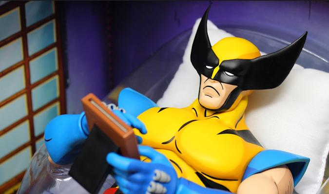

Several weeks ago Loom sent a DM asking if I'd like to return to my old stomping grounds at gloomy Wolverine and I happily obliged. Even better, our ShieldLock meets weekly at Wolverine so I know the landscape well. Hell, I even planned to recycle the Q workout from the Shieldlock last week. Pax started slowly rolling in: a few Travelling Circus acrobats (Clementine, PomPom, Overflow), the dynamic duo of Franklin/Badlands, the glorious return of Nature Boy (donning a full red sweatsuit with the bottoms tucked into his socks), Big Red wondering why there was another big red present, and several other HIMs for this great morning. Disclaimer and pledge were said, then we moseyed across the street to the Park Village neighborhood.

## Warm-Up

Circle up in the pool parking lot. YHC mentions that I don't really care about college football and offered apologies to PomPom for not fully recognizing the big Michigan Wolverines win. But we did celebrate the huge Steelers win over the Ravens (amirite Bogo! #HereWeGo). As we wait for the walkers to arrive, PAX completed:

Standard Merkins OMD x20

Calf Stretches

Sir Fazio Arm Circles IC x10 (and reverse)

Nature Boy walking finally arrived we did:

Good Mornings IC x5

Cherry Pickers IC x10

Good Morning IC x5

It was a Great Day to have Big Red & Nature Boy doing Good Mornings together!

## Thang 1

The PAX moseyed to the secret rock pile behind the pool (with many surprised there were even rocks).

Circling-up in the parking lot with a rock, we did:

Curls for Gurls OMU x20

Overhead Press OMU x20

Tricep Extensions OMU x20

Rows OMU x20

Put rocks down and run down the giant hill to the Park Village playground. Upon arrival, we get on our six for:

LBCs IC x20

Flutterkicks IC x20

Dying Cockroaches IC x20

Homer to Marge IC x20

Run back up the giant, stupid Park Village hill.

REPEATO

## Thang 2

After we return our rocks, mosey from Park Village back to Wolverine. We run around the left to the new big stairs.

Calf Raises OYO x30

Mosey to the basketball court. YHC forgets how to do Wolverines so Build-A-Bear demonstrates. In honor of PomPom & all other Michigan fans, we do:

Wolverines OYO x5

Mosey to the Flag

## Mary

Next exercise: Have A Nice Day

Count-o-rama

Name-o-rama

Announcements: Lots of Cardinal Gibbons events this weekend like the state football championship and wrestling matches, Cary Xmas Parade, Oakwood 24, Xmas Party, and 24 hour Prayer Vigil

Prayers/Praises - injured Saints football players from Sunday (or maybe Thursday or maybe they were 49ers players....who knows), unspoken prayers. YHC took us out.

## NMS

\*Awesome group of HIMs this morning. I had an absolute blast. When I first started F3 I was a regular at Wolverine, it's great to be back. And we didn't even go to Davis Drive MS despite YHC wearing a DDMS Panthers shirt.

\*Callahan really hates flutter kicks.

\*Clementine is debating the Michigan +7.5 vs. Georgia. And he loves Mac Jones.

\*Build-A-Bear & Loom are looking for new Site Qs. Someone should step up for this awesome AO. Very soon.

\*Thanks again for a great morning!
