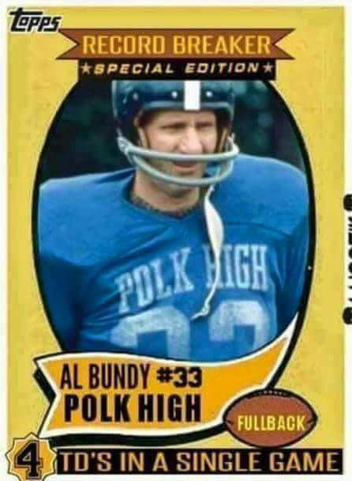
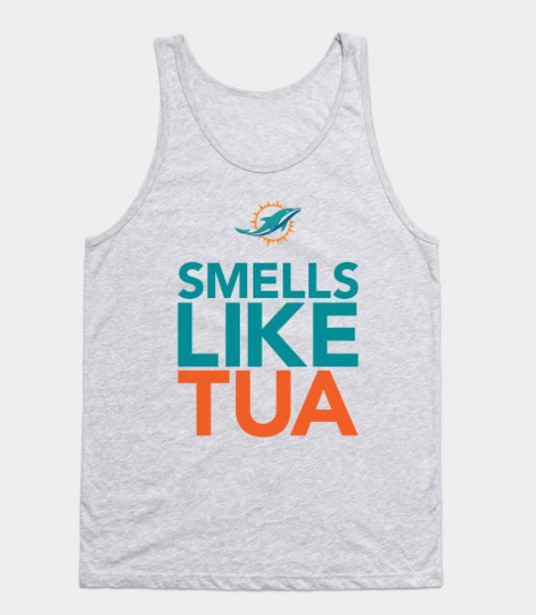

Mission: Revisit Al Bundy’s legendary four touchdown game for the Polk High Panthers with a football practice style workout

**Warm Up:** Mosey around the outside of the park back to the end of the parking lot at a \*medium\* pace, stretch a little (good mornings / calf stretches) then pay the piper (59 SSHs (with a break for half time), one for every point the Dolphins allowed in Week 1, plank for a 43 count, one for every point allowed in Week 2, and 23 merkins for the spread in Week 3) - Tanking for Tua has a price, people!

**Thang 1:** Agility Drills... ~50 yards x 2 reps of 1/2 speed, 3/4 speed, full speed, back pedal & turn, shuffle right, shuffle left, karaoke right, karaoke left, high knees, kickers, drum majors, lunge walk, bear crawl (13 x 2 x 50 = 1,300 yards = 3/4th of a mile)

**Thang 2:** Blocking Sled Sevens... Partner up and drive the blocking sled (aka your partner) down the field 25 yards and reverse it on the way back... mountain climbers on one end and plank jacks on the other

**Thang 3:** Stations... Split into four groups and spread to the four corners of the field, each corner with its own exercise (merkins, prisoner squats, LBCs, PAX choice)... complete one rotation

**Thang 4:** Chase Mary... PAX circle up at midfield for crowd-sourced Mary with one-on-one circle chase challenges in the middle/smaller circle

Mosey back to the flag, the long-ish way and Have A Nice Day!

<figure>

<figcaption>

Note: No action Monkey Rolls were done

</figcaption>

</figure>

Announcements: (a) Garner High School 50/50 Raffle, (b) Odyssey w/ Pig Pickin' to follow on 10/5, (c) endorsement for new PAX to read Freed to Lead

PAX Count: 24 / 0 FNGs

COT: (a) thoughts for Pearl's mother-in-law's health, (b) thoughts for Water Wings' brother's heart surgery, (c) praises for all the VQs ("best week of the year")

Q Shout Outs: (a) Roasters for lending me his watch, (b) Hello Kitty for bringing "a" football helmet, (c) Captain Jack for the moral support
