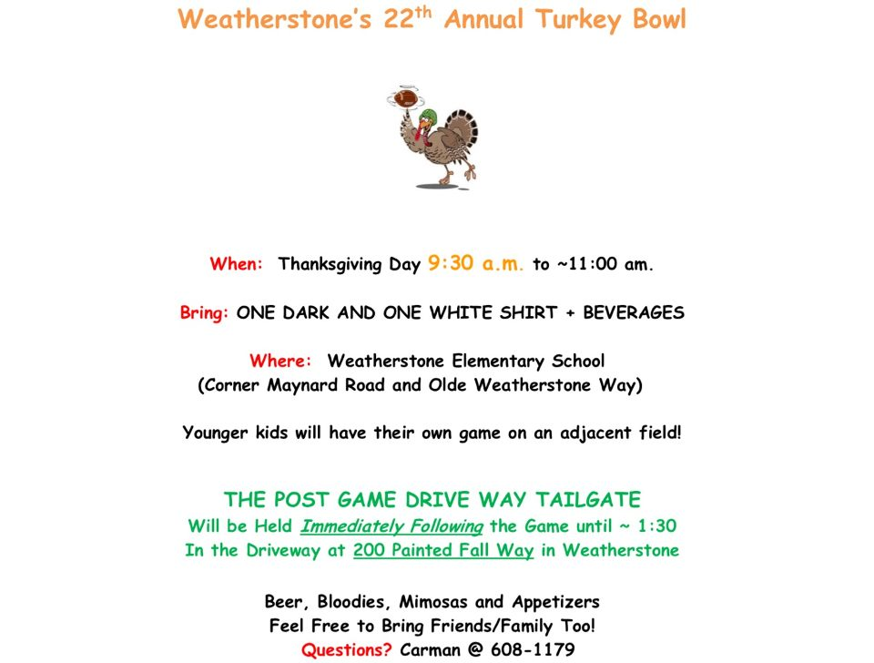

Yo, fellas!

To ensure all PAX are dialed in and tight and right for Thanksgiving morning, consider this your official pre-blast. Here's the schedule of events so that you're all up to speed:

**0600 - 0658:** Thomas J. Hayes (aka Banjo) will be taking any interested HIM out for an EC stroll leaving from BO.

**0700 - 0800:** Carpex Convergence at BO. Come ready to experience the I'm 3rd Thankful Post and the Inaugural Feline 5k... stay for the pie. Now that's a tease. For those looking for the #MeowMile, post at 0700, we'll get to it.

**0930 - 1100:** "Touch" Football at Weatherstone Elementary School. BYO-Cleats/Beers

**Post-game - 1330:** Tailgate at Case de Burt. Full details for the Charlie Brown Bowl and Overtime Chow-down (trademark pending) are here:

 

**Friday, 1900:** Banjo is planning a Ruck that will leave from DZ. Check with Banjo for details, but plan to cover roughly 7-8 miles, ending at Tecumseh's house.

Finally, as it's the season for family and friends, EH a sad clown and/or your brother-in-law who is in town for the holiday and bring them out. YHC promises they'll get pushed to the limit and that all PAX will have burned the necessary calories to fully get after it come Turkey-time. Also, for you 2nd F'ers this will be a good chance to burn off some of that hooch from Wednesday night (looking in your directions WKRP and Burt).

Aye!

SYITG,

Brian Jodice, 36, "Hello Kitty"
