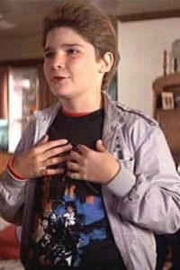
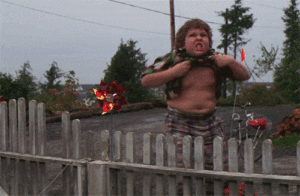
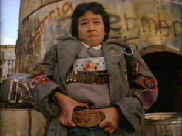
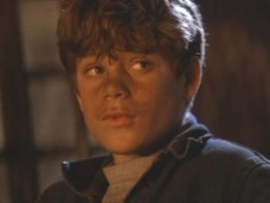
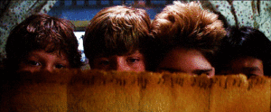
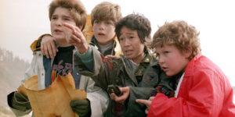
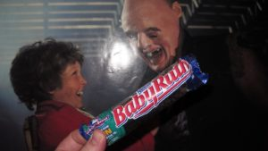
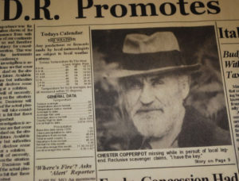
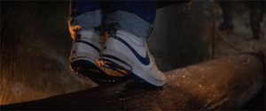

24 PAX gathered at their friennd Mikey's house on Monday morning for the usual hang out, but that's when everything changed.  We got the news that evil fat cat developers were buying land and planning on tearing down our houses to build a golf course...bummer.  This group of misfits started the day with the pledge and a quick jaunt around the pickle.

Circled up on the basketball courts.  The Walsh family is always so accommodating and polite, so of course we start with Good Mornings.  Now we meet the crew:

Mouth's Monkey Humpers

The Truffle Shuffle (Hillbillies while holding your shirt up)

Data's Dancing Bears

Mike's Merkins

Saban broke the statue and after gluing the unmentionable part on upside down we went to the attic (picnic shelter) where we had to 'Step Up' to the attic.  Chunk was supposed to break the frame with some Break Dance Merkins, but with 24 of us crammed into the attic there was no room, luckily we still found the treasure map

We hopped on our rides and headed to the beach to try and find the treasure.  On the way, mean teen-agers started to mess with us, luckily we thwarted their attack with 10 OYO burpees.

Finally we found the abandoned restaurant on the beach.

We searched the four corners of the restaurant and eventually found:

**S**quats

**L**unge Walks

**O**verhead Claps

**T**ony **H**awk Burpees

After the first of a few wrong turns we entered an elaborate and confusing network of tunnels with a tunnel of love bear crawl.

We ran into the skeleton of Chester Copperpot and honored him with copperhead merkins

The Fratellis were gaining on us, but luckily Data had a trick up his shoes (Slick Shoe - Side Straddle Hops) slowed them down

Unfortunately the map was proving trickier than expected to read, but randomly there was a nice uber driver stuck in the caves with us who knew the way out.

out of time and exhausted the PAX never found Willie's ship or gold, but if they had they would've done a really nice plank walk and then be saved by Superman Merkins from Sloth.

As always it was great getting out there with this group of HIM.

Announcements:

- Convergence at Danger Zone on Friday for 5 yr Carpex anniversary
- 9/11 Stair climb at 5:30 at Carter Finley. Specific location around stadium is apparently not needed ;)
- Q-School this Wednesday at Bond Park Kiosk @ 6:30PM (yhc probably needs to attend)

COT:

Prayers for Franklin's son having surgery, Saban's sister suffering a miscarriage, Loom's daughter, and all the kids going back to school.  As well as any unsaid prayers and concerns.

Welcome FNG @Sloth
