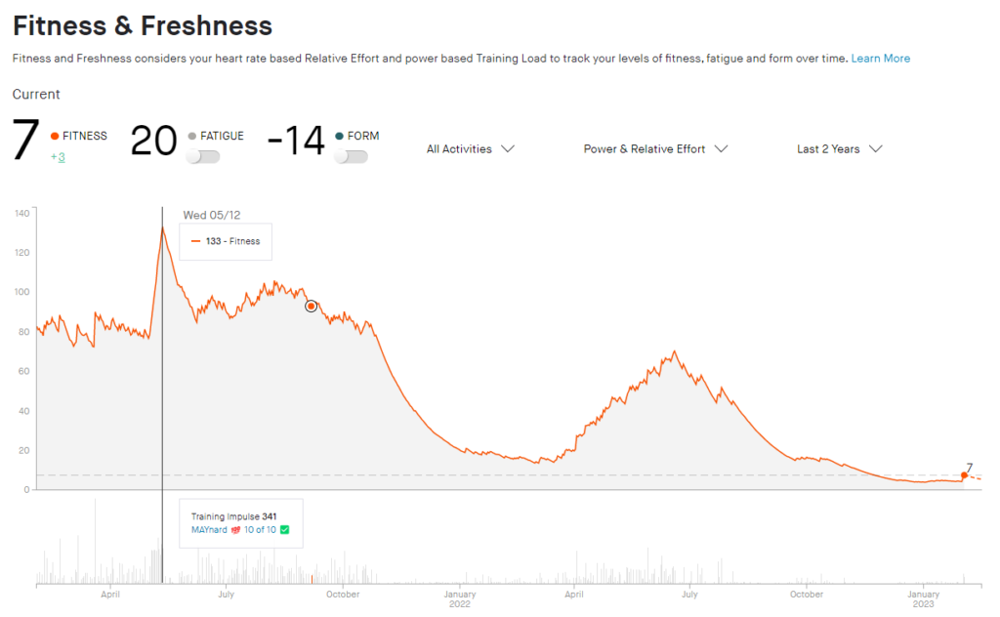
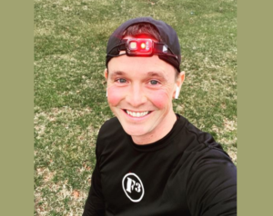

Yesterday was my first "run" since probably November at Dollywood (where I hurt my shoulder and had to stop _any_ bootcamping at all and just stick to walking.)

**Rewind to 2 years ago.** I was just coming off an EPIC Maynard 100, my first 50K, and tallying up 1200 miles for the 10yr #EndIt mission.

My Strava was amazing. I was in "Peak Fitness"! 133! ...Then due to me overusing my body, and lack of stretching and self-care, my hip flexors gave way and I was sidelined all last winter (and turned 40!). It sucked. It was the first time I sat out of F3 for an extended period...ever.

After some costly Running PTs, Erin needled me back to good health :) I was BACK! Oh man was I happy to be back! Everything was awesome again! I was so very thankful to be out there getting after it! I was banging out some six packs a week and in June even think I hit 10 or so in a row if we count the Slowzy (we count the Slowzy!). I was signed up for the Rim to Rim to Rim run ON my Birthday in October!! So glad I made it past that injury. Whew! Hated being away from running.

And then it happened again. Knee pain. Hamstring pain. Sidelined again... I tried to fight it off a bit over the summer but had to pull out of the epic R2R2R run and go back to walking. What. the. heck!?

## Waves

Look at this image below! Check out those highs and lows. They say in church a lot that you're either going in to a storm or you're just coming out of a storm. I've definitely felt the highs and lows of these two storms. So I want to share a few of my lessons learned.

- **I ain't as good as I once was.** Being 40 now I realize I need to watch it more. Take the extra time to stretch and warm up and cool down.

- **Be open-minded to the situation.** Don't just sulk and be mad or sad the whole time. Seek to learn from it.

- **Sulk and be mad.** It's ok to let it out. It's actually better to let it out and not try and bury it. It's ok to not answer "Yeah, I'm good, how are you?". Feel your feelings then keep moving.

- **Look Up.** For me my greatest lesson was to look up instead of try and look ahead. When you're in between big waves you can't see the land. You can actually feel how low you are and it's hard. You have people who are there with you trying to support you (and that's awesome) but even what they say seems to fall short sometimes.  
      
    Looking Up, to me, means turning to God and using that time to seek wisdom and guidance. It also means just get more connected, have more intimacy with Him. We don't have to wait for these bad times to hit but , going back to the wave analogy, when you're high up on a wave there's more to look at that distracts us...

- **I'm not very good at pulling myself up.** I honestly thought I'd be better at being injured! I thought I'd have more mental fortitude to fight off the depression and some dark days. I wasn't haha! I fell right in to it with the best of them. Gained about 15 pounds in the process. It wasn't pretty--isn't pretty, I'm not out yet..  
      
    Lots of support and encouragement poured in though. It was a massive help. I walked many times when I didn't want to. I tried hiding and was found. I told myself people don't really care about me, then they called or texted me and proved me wrong.

## Looking Up

So yesterday, Feb 1st 2023, I went on my first "run" since that November workout. I've joked that I haven't sweat in 3 months but that could very well be true! My doctor's appointment this week may have found and corrected what was wrong with my knee so they told me I could go test it these next 4 weeks!

So there I was ready to take on a 2 mile 'jog'! It was 42 degrees, very gloomy, and I was shaking. Half cold but also half filled with just complete excitement! I can't even describe how much anticipation there's been to get to this point. How many highs and lows. MAN I WAS READY!!!

I popped in my headphones and hit shuffle play. First song to come on was **"Gratitude" by Brandon Lake**. Man, how Perfect is that!

_"So I throw up my hands  
and praise you again and again.  
'Cause all that I have is a hallelujah"_

My fitness level as it stands now is a 7. I can't go back and think of where my mind was when I was a "133" (well I sorta can, 10miles a day for 10 days was haaard!!). **But did I have gratitude?** Or were my eyes set towards the horizon too much to really soak in what abundance I have to be thankful for it?

**Sometimes you have to be a 7 to see what you actually have. The thing that you're holding on to too tightly might have to be dropped so you can pause and look up.**

_"_And I know it's not much  
But I've nothing else fit for a King  
Except for a heart singing _hallelujah_  
H_allelujah"_

No matter where you are **there is always gratitude** to be found. And it comes **when you Look Up** because when you look up it doesn't matter what wave cycle you're in. **He is constant** and whether I'm a 133 or a 7 I've got nothing else fit for My King except gratitude!

And boy am I a joyful 7 right now!!

~ Shut-In
