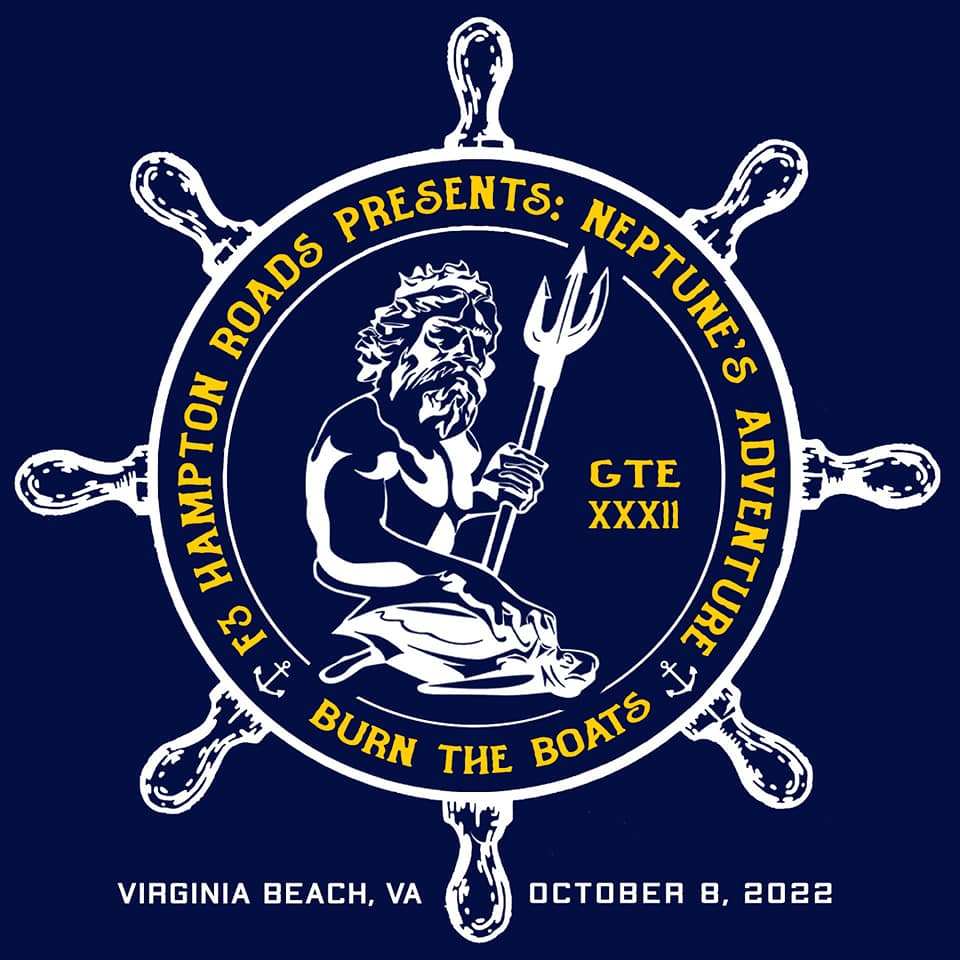
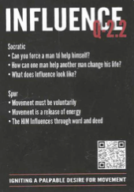
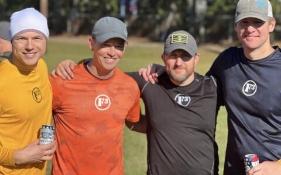
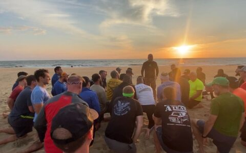
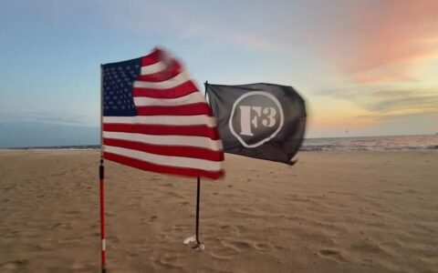
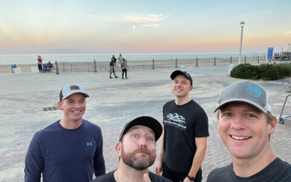
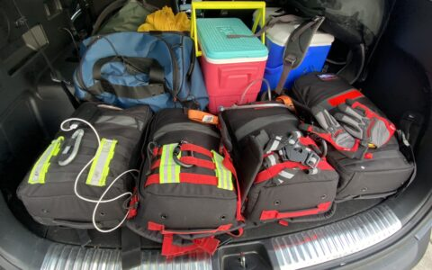

Four pax from Carpex attended GrowRuck Training Event (GTE) 32 this past weekend, dubbed _Neptune's Adventure_, hosted by F3 Hampton Roads. For three of us, this was our first GTE.

GTEs are F3 leadership development events that are run by a cadre of volunteer pax at the national level who have gone through specific training programs (and are often former military and/or medical personnel) that help them design an experience meant to push men to the point of failure so that they can learn more about how to accelerate themselves, others, and the Pax, people, and regions back home. For more info about how rucking relates to F3 Q Source and leadership principles, see the [GrowRuck site](https://growruck.com/).

These events are divided into two main portions: a GrowSchool where you learn about leadership principles, and then the GrowRuck where in theory you put these into practice in a physically- and mentally-demanding environment.

In this blog post, I'll cover the following topics. Feel free to skip around.

- **Preparation**: Has some resources if you're curious about getting started with rucking.
- **GrowSchool**: Links out to Q Source information about the F3 principles behind GrowRuck.
- **GrowRuck**: Details all the dumb stuff we did, including photos and links to the Facebook Live videos.
- **Takeaways**: Summarizes my take on the event, including the existential questions I've been left wrestling ever since.

## Preparation

One of the things that gets stressed all the time in F3 is to start with your "why." I've never had a deep answer for this, but I'll share mine here since it's pretty simple: several people whom I respect in Carpex suggested doing a GTE. After doing the F3 10-year End It Ruck, I wasn't entirely convinced I wanted to do another pain fest, but everyone said that GTEs were way better than a ruck marathon on the beach. Then, Parker specifically asked me about two months out. Plus, I can usually be talked into doing anything. So there you go, EH'ing works!

In terms of personal preparation, I started rucking around July/August on rest days during Blue Ridge Relay (BRR) training, usually just while walking with the family. The last month, my Shield Lock started doing strength training, and I'd wear a 50lb ruck for that. In retrospect, I should have done way more upper-body work. In terms of gear, I already had most of the stuff, but if you don't, it can get pretty expensive pretty quick. I'd recommend trying before buying, and posting in the #rucking channel on Slack to borrow stuff.

- For a Carpex-specific take on preparing, read [Bartman's Rucking 101 post.](http://f3carpex.com/rucking-101)
- For several different training plans, see the [GrowRuck site](https://growruck.com/training/).
- For the official _Neptune's Adventure_ pre-blast, which included the packing list and PT test details, see the F3 Hampton Roads blog post.
- "How to pack a ruck" [video](https://youtu.be/b_yTuKtQuks).

## GrowSchool

I wasn't very familiar with the F3 Q Source before GrowSchool. I had a vague notion that it was a podcast or something. The GrowSchool focused on much of the content from the [Q Source Index](https://f3nation.com/q-source-index/) about, "Get right, Live right, Lead right, Leave right."

If you want my notes about it, I'm happy to share, but I'm an overnoter, so they're long and I won't share them exhaustively here.

Again, so much of it focused on your "ultimate life purpose" and your "why." As I mentioned, I haven't really ever tried to "personalize" this in the way that many of the other leaders and guys there had. A lot of it was talking about "living third," as in placing God and others before yourself, which has been something I remember memorizing since Lutheran grade school. Some of the guys had specific "mission statements" though, that touched upon what they wanted to achieve as it relates to their particular family, occupations, etc. which I thought was interesting and "something worth trying."

Other key takeaways that I had from GrowSchool revolved around:

- Shield Locks and how to be a better contributor to mine in terms of both accountability and celebrating accomplishments.
- Carpex and trying out new AO styles, like the F3 Katy, TX neighborhood model of the same AO everyday or every other day to improve consistency, ease EH'ing/onboarding Pax, and better branding. This resonated with me because one thing I thought was odd upon moving into the "beltline" of Cary (inside the Cary Parkway circle around Maynard and downtown last year) was how few AOs there were compared to how many neighborhoods.
- Regional growth, whether that looks like launch of Apex into _F3 Peak City,_ and how its "Vision-Articulation-Persuasion-Exhortation" would look like.

## GrowRuck

Alright, so if you've already read this far, my apologies for burying the most interesting parts so far down in this post. The GrowRuck event itself is divided into what they call "evolutions," which in true F3 fashion have their own semi-ridiculous names: Admin, PT Test, Welcome Party, FormEx training, Slick, Apparatus, Slog, Heavy, Hero WOD, Sunriser, Casualty Exfil.

### Admin

This is the roll call, safety talk, and gear check. Don't talk when a cadre is talking, have _exactly_ what the required items list says (no substitutes), and you'll be fine. Otherwise, your "battle buddy" will have to do penalty burpees while everyone else plankholds (which is called "resting" for some reason).

One interesting thing, the head Cadre, Major Payne, gave each of us a Q Source card that had a particular point. Mine was [2.2 Influence](https://f3nation.com/influence-q2-2-2/), which helps you think through ways that you can influence yourself and others to make a positive change. He asked us to reflect on our card throughout the evening.

### PT Test

A basic test where you have to do something like 15 pushups in 2 minutes, 15 situps in 2 minutes, and 2 miles in 20 or minutes. Everyone passed. I was 1 pushup away from a perfect score and also set what I'm pretty sure was a PR for 2 miles (12:54), but I wasn't wearing my Strava, so does it count???

### Welcome Party

A warmup up bootcamp that consisted of burpees, bearcrawls, and suicides. Helps teach guys how to count in cadence (remember to count on the movement, not before or too fast).

### FormEx Training

You get divided into platoons, then further into two squads, and learn how to march and take orders from the cadre and pax-filled platoon leader (PL) and assistant platoon leader (APL) roles that get alternated throughout the night.

From my understanding, platoons are typically 20-30 or so Pax, but this was a smaller GTE so each platoon had 16 guys. Mine actually already lost one to a rolled ankle, so we were down to 15.

### Slick

You're given a task to reach a certain point within a certain timeframe. We were told to get to the Neptune statue on the beach, about 2.5 miles away, within 35 minutes. It seems _just_ within the realm of possibility, but then as you go through town with all the traffic crossings, it becomes more and more apparent that you'll never make it.

I was actually the PL for this portion. I think the best thing I did was give clear instructions and objectives, but I was not a great motivator...fortunately the APL, Uno from PA and formerly of Cape Fear, was. We were already getting guys saying they were slightly injured and had to move them upfront at the flag, which meant they were setting the pace. So it becomes difficult to "motivate" people to a quicker pace, although the locals on the boardwalk certainly tried their best. I actually thought it was kind of sweet that kids and young adults were jogging with us towards the end.

We ended up making it in 42 minutes, which was actually better than I thought we'd do. I think the cadres must have been a bit distracted by all the people coming out to greet us, because we only got something like 10 penalty burpees.

### Apparatus

At this point, we're on the beach. Several pax have to pee, so they're directed to a sort of sandwall mound. Then, we discover that the next activity is actually buried under there, and we have to dig up pieces of a raft and construct it. This part was pretty fun, although you might want to brush up on how to properly affix nuts, bolts, and washers.

The next part was less than fun. We loaded up the raft with a bunch of sandbags and heavy shipping chains, and then carried it northwards up the beach, against the wind, for...I have no clue, something like 40 blocks. For me, this was the most miserable part of the night and the only point where I felt like I would physically collapse soon as my quads & hamstrings started to lock up.

It was a beautiful night, bright stars and the moonglow, crisp temperatures with the lightest breeze to tickle your face, the sound of rolling waves reassuring you that the world goes on...but you don't really experience much if any of that. You are just suffering.

Finally the torture ends. We have to clean up the rafts in the ocean before ending our beach trek, but I actually don't mind the water. I was one of the pax encouraging our platoon to take the raft in deeper. I don't even remember being wet afterwards, maybe the wind was strong enough to dry you out quick.

### Slog

Next was a turn into the woods. While we no longer had the raft, we still had to share the weights from the raft: two 60-lb sandbags, one 80-lb, and chains that weighed maybe 50-lb if I had to guess? The 60-lbs were always carried by just one pax...sometimes the 80-lb and chains were split between 2, sometimes not. That, plus the flag bearer, meant from 15 pax, we in theory had 8, possibly up to 10, pax able to "rest" with only their rucks at a time. Even if you subtract the PL and APL who sometimes didn't help out, that's 6-8 available to rotate in and out. Sounds manageable, right?

Well, we made a few wrong turns in the woods, and I genuinely thought for a moment that we'd have to just find our way back out until the Cadre pulled out a cell phone (oh yeah, I guess those exist). Then, people started dropping. I don't even know how many people rolled their ankle or something. The APL went down, so Shut-In backfilled him. Another pax, then another, then another. I think we were down to 10 guys at one time who were actually able to carry the weight (along with the downed pax's extra rucks). So that 6-8 available to rotate become more like 2. And it felt like we were wandering in the woods forever. 

On the bright side, this was the part of the night where you got the most opportunity to chat with your fellow pax. I will also give Shut-In a hugely well-deserved shout-out in that he was our best leader of the platoon the entire night--it's not even up for debate in my mind. He was everywhere, getting alternates, stepping in, encouraging, taking charge. He made Carpex proud.

### Heavy

After the woods, even the sight of the streetlight poles didn't quite dampen my happiness to be done and have a break. At this point, we even had time to change socks and shirts!

I got a bit nervous, though, when I discovered that we had not one, but two, poles to carry. As I said, we were pretty low on guys, and still had the sandbags, though they might have let us drop one the chains, I'm honestly not sure. The poles took 3 men each to carry (they told us we were lucky, they were letting us put 3 men on each because of all our injuries whereas the other platoon only got 2, but we found out afterwards they were taking some "creative liberties" with that form of "motivation"). I got a bit more confused when the PL put me on flag duty, since I was one of the relatively healthier guys left. 

While I respect our flag, I respectfully say that flag duty was my least favorite assignment of the night. I didn't feel like I was doing enough. I didn't like having everyone behind me. I didn't like being told to slow the pace, when we weren't moving fast enough already for the guys with the logs (who were able to keep up, it was the other people who weren't in log rotation usually). I didn't like that I wasn't able to call out "clear" at each crossroads, but instead the PL came up and made us stop at each...it seemed like a wasted opportunity to get someone to fulfill a dual-role and free up a guy to help out more where it was needed. I assumed I would be rotated out, but we kept going and going, until finally I just rotated myself out of it. Maybe that was the mindtrick they were playing, how long until you would just be like, "I'm needed elsewhere; I don't care if it's perceived as defying orders," I have no clue. Of course, I somewhat regretted my choice because the log was miserable and I was on it for the entire rest of the march with no relief, so there's that. We at least learned a little from the raft, in that we rotated the side the weight rested on much more smoothly and regularly than before.

### Hero WOD

By the time we gave up the logs, the sky was lightening up, which was almost an out-of-body experience to think that morning was coming. The next evolution took place at the [Navy Seals memorial](https://www.navysealmuseum.org/extortion17), where they shared some of the history behind the sacrifices the men made during "Extortion 17" on August 6, 2011. 

Then, we participated in a Hero "workout of the day" with our battle buddy, which felt very Iron Pax-y. We had to lift the ruck plates and run a few blocks and back while our partner did 5 ruck thrusters, 7 burpees, and 11 ruck jumps. It was pretty brutal. My buddy had a medicine ball in his ruck, so the ruck thrusters in particular was so disorienting, the Cadre took pity on me and let me switch out to my own ruck. When they let us put back the sandbags afterwards, there was a palpable wave of relief.

To learn more about Extortion 17, Hello Kitty has two _Pick up the Six_ podcasts about the event.

Eddie Penny discusses his experiences as well as book, _Unafraid_.

This Gold Star Wife who lost her husband on Extortion 17 speaks about how to ensure that heroes are never forgotten.

### Sunriser

They timed the evolutions just right so that we could do a Circle of Trust on the beach as the sunrise broke. They had several local Hampton Roads Pax share a bit about their own journeys in F3, fitness, acceleration, and leadership. Then, they asked for people to share any reflections they had about their Q Source cards, and it was a surprisingly moving experience (at least for one of the "frozen chosen" who isn't really used to hearing people's testimonies).

I actually did find that my Q Source card of "Influence" spoke to me. At first, I related it to some things going on moreso in my professional life, but during the COT, I realized that there were also some deeper personal layers to it that I hadn't thought of (and perhaps didn't want to). From Carpex, Parker shared his about how, when you're going through suffering, we usually just think and care about ourselves, and is that leadership?

### Casualty Exfil

At this point, it's probably around 7:30am, we've been doing this event for 14 hours, and we just have a 2-3 mile return march back to the start. Not a problem. I had the flag again, and set a brisk pace...even one of our injured guys, Boonfarmer, who was a young kid of maybe 20 whose brother was also there and injured, was put next to me and gave it his all to double-time down the boardwalk.

It was all fine until they started "killing" people. Watching exhausted men, r(f)ucked up, try to figure out how to team-carry the biggest guys in the platoon could almost be a comedy of errors, if you're a sadist. The cadres vacillated between encouragement and what I'll dub "aggressive exhortation." 

We got to "revive" our fallen guys in the healing waters of the ocean at once point, where we were lucky to be wearing rucks so that this one particular wave didn't sweep us all out to sea. But after that, the kills still kept coming. I believe I had the privilege of carrying every casualty we had at some point. Boon even offered to carry my ruck while I was doing that, which was very touching.

The other platoon I think was way ahead of us, but they had them circle back or gave them something dumb like burpees to slow them down for a bit, so that we would all "race" to the finish. Towards the end, I was carrying Shutty and we got ahead quite a bit, so of course there was "enemy gunfire" or something and we all had to get down, do burpees, and then something else. Eventually they said screw it and just told us to sprint down to the field, which in retrospect, you do NOT want to do, because then you get the privilege of leading the bearcrawl circle until every single one of the 30 or so pax are back.

But now, standing up, rucks off, sun almost blinding, you are done. The cadres lead the closing ceremonies, bestow patches, and reveal a "sandbag" full of Budweiser's unique take on liquid _freedom_.Previous Next

## Takeaways

One thing that they say at the beginning is:

> You can be humble, or be humbled.
> 
> It's up to you. [Tweet](https://twitter.com/intent/tweet?text=You+can+be+humble%2C+or+be+humbled.+%E2%80%94+It%27s+up+to+you.&url=https%3A%2F%2Ff3carpex.com%2Fwp-admin%2Fadmin-ajax.php)

I definitely feel humbled, and I mean that with all the conflicting emotions it entails. I do feel like I endured a lot, and learned a lot, but I don't feel exactly proud or accomplished. I feel a bit chagrined, almost like I did something wrong and endured a corrective that I'm still processing.

It reinforced things that I already thought of myself, such as that I don't think I'm a good leader and would prefer to be a doer. Or it retaught me things that I thought I might have changed from, such as I know I used to be an introvert, but for a while (especially working in software development), I thought that maybe I am an extrovert; however, I'm back in the introvert camp now.

Instead of writing the next post-modern masterpieces examining the role of suffering in man's existence, I thought I would end with the questions that I'm still processing. Happy to chat with anyone about the answers or not-yet answers these led me to.

### On relationships

- How do experiences like this form a culture? 
- And what sort of culture is that?
- What can that sort of culture achieve?
- How to bring back these leadership and fitness principles to Carpex? What would work and what wouldn't?
- Do you tell people how much their actions meant to you?

### On suffering

- When or do you ever take yourself out if you don't have the strength to carry your own burden, let alone share another's?
- What is the point of suffering?
- When we say that we "learn" from failure or suffering, what does that mean?

- Can physical suffering better prepare us for emotional, mental, and spiritual suffering, which we seem likelier to encounter on a daily basis?
- Should or do those who suffer more or carry more have more influence than others?
- How selfish am I?

### On purpose

- If you can't win, why try?
- Why do rules matter? Are there times when they don't?
- Is it valuable to ask these questions?
- Do I need to do this sort of stuff to myself?
- Am I inventing justifications and "lessons learned" to explain away what I just willingly participated in?

### Was it good? Would you do it again?

These are the questions most people have asked me, so I will answer them. 

- I think that a GTE is a worthwhile event for everyone able to do, and you are abler than you think. (I would not, however, use the word "good.")
- I think the only way I would do it again would be if a region I cared deeply about accelerating, like Carpex, hosted the GTE, and I would be doing it as a way to get many more guys to participate. 

To be honest, I don't think that we have a rucking culture in the Carpex area for a lot of reasons, so I think it is unlikely that I will do another GTE any time soon. That said, several of us are thinking through what an Acceleration event could look like here in Carpex. 

I would love to see many of the aspects of GrowRuck percolate throughout the region, such as consistently giving your best not just for your own growth but to motivate those around you, and doing hard things to figure out what your limits are. And I don't mean to embarrass him (or myself) again, but I cannot describe the upwelling of love and respect I had for Shut-In throughout this event. It brings to mind the expression, "surprised by joy," in that I did not expect to feel something like that under such miserable circumstances. 

Another guy who was the most motivated one on our Platoon, Uno, described it as, he thought that he would be the one giving the motivation (which he was), but it was nothing compared to how motivated he felt because of being around others (and he was even by himself from his region, not with someone he already knew and loved). The only thing that could have been better was if all us Carpex guys were platooned together. If we could all feel even half of that for each other here, we would be the glueyest region in F3 Nation (and I think we already are pretty damn close).

So if you're interested in accelerating Carpex, please let me know! We already have a doc of ideas going.

### Concluding things to know

If you're interested in doing one for the first time, I would summarize as:

- You will suffer, but you will live
- You should prepare, but you won't be prepared
- You will think things and learn things you would rather not

Finally, I didn't talk a ton about the interpersonal aspects of the ruck, but I can't end this backblast without thanking by name my battle buddies Catniss from Hampton Roads; Coffeebreak from Cape Fear; and Uno who's Nantan of his own new region in PA...insanely strong men in mind, body, and spirit. And to our platoon's cadre Full House, the support team (whom I unfortunately, or rather I should say fortunately, didn't interact with much), the other cadres Akron, Olaf, Flight Nurse, and Major Payne. And of course to my fellow Carpex pax: Shut In, Parker, and Hello Kitty (who also advised and coordinated a lot for us). MIAGD!
