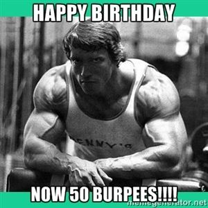

Rolling down the road to Tortoises I get a message alert, “Where is everybody? Is Tortoises closed today?” I got to thinking, should’ve I pre-blasted my birthday celebration at Tortoises? I didn’t want to make people choose between a birthday celebration or the soft launch of Lion’s Den. I wanted to ensure the soft launch was a success for Red Ryder and Sour Mash, but did I underestimate the draw that the Lion’s Den would have? Turns out Ascot arrived way earlier than his normal time, when you show up less than 5 minutes before start there tends to be a bunch of PAX there but not so much when you arrive 20 minutes early. PAX were flowing in when I arrived.

**Warm Up**

Announce the disclaimer and we’re off with 15 strong. Mosey around the parking lot to the front of the church for warm ups. Start off with a Nature Boy favorite, Good Mornings. Wait who’s that coming in hot? Is that my co-site Q? Finish up good morning and roll right into Windmills. Yes Intimidator comes strolling up to the PAX. I asked Intimidator to call 10 Burpees on his down maybe it will help correct his tardiness. Then some Fazio Arm circles, overhead claps, and reverse Fazio Arm circles.

**The Thang**

Count off by 4, 4 groups of 4 perfect numbers. Mosey over to the center of the side parking lot by the flag for 4 quarters in 4 corners of 10 exercises. Oh wait, that only gets us to 40, we’ll have to go to overtime and do a 5th quarter to get to the magic number of 50. 50 years ago this glorious day I was born. The world hasn't been the same since.

Corner 1: World’s Worst Merkin

Corner 2: Lunges: Left-Right is one

Corner 3: Three Count Superman’s

Corner 4: American Hammers: Left-Right is one

Run to each corner and perform 10 of the exercise and run back to the center and perform 5 burpees. 5 rounds and go!

We had time for one Mary exercise. Dying Cockroaches in cadence. Nature Boy chatter of, “if we’re going to 50 Q, you should’ve just done ups.” Almost got me to go to 50, but I had already beat the group down enough. So I stuck with my initial plan and stopped at 25.

110 Burpees and 150 Merkins total with some other stuff thrown in for good measure. We totaled about 1.7 miles all without leaving the parking lot.

**Announcements**

The Mule is coming up.

**Praise**

Nature Boy’s daughter lost her wallet at Louisville, and someone found it and returned it with all items in tack. Nice to know there are still honest people in this world.

**Prayers**

Continued for Ausfaht, Sooey, Swag’s M. Crimson and his family as they deal with the sickness of his FIL. Meatloaf’s MIL battling health issues. Quiver & M as they pack up their house of 17 years and move to another one. Props to The Joker for finding them one.

YHC took us out.

Six months ago, before I started this F3 journey, I would’ve never thought I’d be out at 5:30 am on my 50th birthday leading a men’s workout. It was truly and honor and a privilege to lead you this am. Thanks for starting off my 50th birthday with me.
