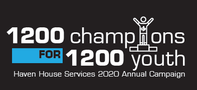
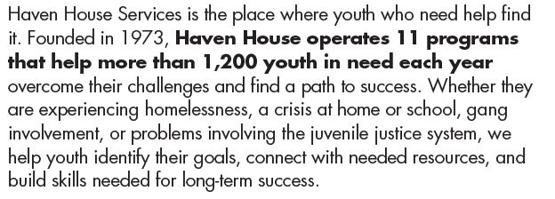

**F3** is active supporter of Haven House Services and in 2021 **F3** will be inducted into Haven House Hall of Champions in recognition of its outstanding support of organization.  

**F3Carpex** men have formed 1 of the 10 Fundraising Teams working hard to raise $200,000 for the 2020 Annual Campaign.  Our team is led by Burt, Coney and Sabre and includes Augmented, Captain Jack, Coxswain, Flacco, Pierogi, Pivot, Riptide and Viking. 

Here is how you can support Haven House Services 2020 Annual Campaign. 

- **Participate in Endure2020 on October 3rd.**
    - It’s a 3-hour team endurance challenge in connection with F3Raleigh, open to all Regions.
    - There is a suggested donation of $200 to enter a 5-person team.
    - Details, team creation and donation link: [https://havenhouse.rallybound.org/endure2020](https://havenhouse.rallybound.org/endure2020)

- **Donate to BRR Mileage Match w/ Runner’s contributions matched by Coney up to $500.**
    - Suggested $1-$2 per mile run:  Donate:  [https://havenhouse.rallybound.org/jhealy](https://havenhouse.rallybound.org/jhealy) and note BRR

- **Donate directly to one of the Carpex team members.**
    - Team page with team member links:  [https://havenhouse.rallybound.org/f3carpex](https://havenhouse.rallybound.org/f3carpex)

- **Enter the Week-End at BURTIE’s raffle.   Drawing on October 14th.   Open to F3Carpex dudes only.**   
    
    - Prizes to include:
        
        - Dudes Week-End at “Good Carma” at OIB.  A week-end at the beach complete with a “loose” workout on Saturday with local OIB Pax.   Likely a **Spring 2021** event.
            
            - First four names drawn will make the traveling squad
            
            - Prior winners of the Beach House Raffle (Chinese Downhill, RipTide and Prodigal) are invited as they have not cashed in their trips.
            
            - Dinner prepared by Prodigal.
        
        - Anheuser-Busch swag including a 12-Pack of Naturdays.
    
    - **$25** contribution = 1 “ticket” or **$100** contribution for 5 “tickets”
    
    - How to buy a “Ticket”?   Make a **$25+** donation to Burt’s [https://havenhouse.rallybound.org/cliuzzo](https://havenhouse.rallybound.org/cliuzzo)  page and note “Week-end at Burtie’s”

- **$5,000 Challenge Match!!  Ends on October 15th.**
    - Two very generous organizations, **PSA 116:12 Fund and Slotta Global Mission**, have agreed to contribute **$2 for every $1 contributed** to Haven House Services by F3Carpex up to the first **$5,000** contributed!     A $100 donation becomes a $300 donation. BOOM!
