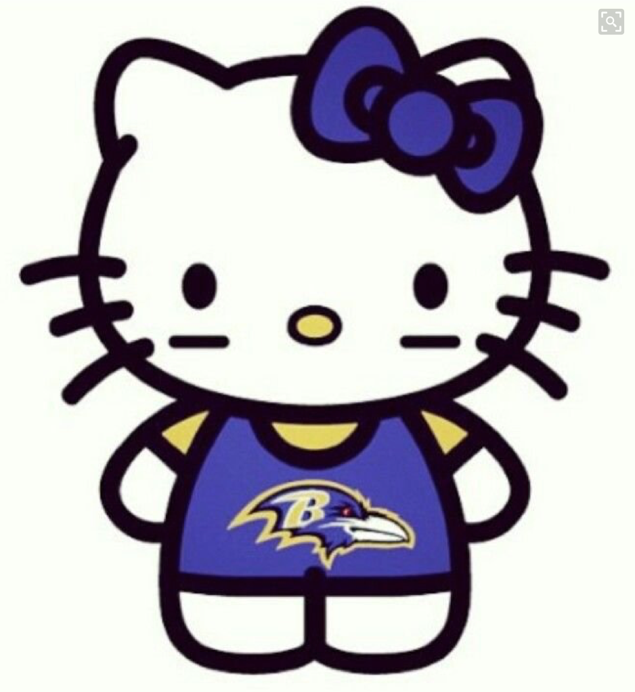

 

With a week of travel in front of many PAX, Hello Kitty alerted the Carpex region via GroupMe that there were prime Q spots open all week. A true HIM, Flacco stepped up for his VQ with Kitty close in tow to help along the journey. And with that, it was time for a Hello Flacco butt-whipping.

PAX gathered for a gloomy SNS post. Insomnias back in from their jaunt, and a small group of Vespers heading out, it’s time to get after it.

Circle up for a disclaimer for Tubeless’ brother (to be named later) and Flacco’s early morning case of logorrhea (look it up)…something about gratitude, attitude, altitude, and getting high. FINALLY, a warm up of:

- Good morning
- Cotton Pickers
- Frankensteins (with a creative cadence count that honored Flacco’s namesake – total lack of rhythm when on the field of play)
- Side Salad Hops
- Little Baby Burt Jacks

To stretch the legs out Flacco took the PAX to the gate with some high-knees and butt kickers. After a quick stretch on the gate (a uniquely awkward barre style stretch, never to be performed again), Kitty jumps in.

Thang 1: Partner for a Dora 1-2-3

- Partner runs to the stop sign by the community center and back while teams work to complete 100 merkins, 200 squats, 300 LBC.

Thang 2: In honor of the Holiday, a Pilgrim and Indian run to the rock pile.

- Grab a rock for 25 curls while your partner is BTTW.
- 25 rock triceps while your partner is in peoples’ chair.
- Partner back-to-back for rock twisting rock handoffs.
- And then some bogus idea to do “death squats” at a 50 count. Thanks Elf, love ya brother. Me-OW!

Thang 3: Flacco takes back the lead with a mosey to the front of the lot. It’s time for 7’s from #5 with Burpees and Star-jumps, down to the gate and back.

A quick Billy run to the flag for Flacco on a Mary call and then Kitty dropped the hammer with the “Green Sally Up” tunes from the plank position. Smoked and yoked and ready for hump day.

COR: 28 strong with 3 more making their way in from a longer run. 31 in total. Welcome to FNG Nickel, brother to Tubeless.

Announcements: A whole mess of them, see GroupMe/Twitter/Slack for more.

Prayers:

- All PAX traveling
- Our brother Wilbur
- Grease Monkey’s mom and her diagnosis of brain cancer

NMS:

- YHCC (your humble co-correspondent) Flacco: Many thanks to all you HIM for setting such great leadership examples in so many ways. And special super warm and fuzzy thanks to Kitty for helping me stumble through my VQ. Gratitude abounds.
- Kitty: I friggin' love you guys, that is all. SYITG mañana for the Turkey-day convergence. Pumped!
