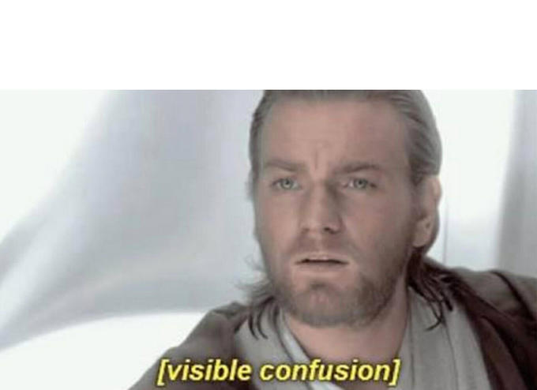

Day 2 of Tang's Return Tour resulted in sweat angels, confusion, and Bolton nearly dying. We had 10 PAX post, mostly all between 0528-0530, so I was pretty nervous for awhile about working out alone...I had a month of that in Cali and wasn't about to repeat again. Nevertheless, the PAX rolled in, and after a few intros we set off. Bolton wasn't sure at first about rucking or bootcamping, but he was persuaded to be our 9th camper...a decision he voiced many times that he regretted throughout the workout.

On to the workout:

**Wednesday - 2 Sept - Whoville - UPPER BODY**

**0530 - Welcome** - FNG disclaimer (No FNGs)

**0531 - Pledge**

**0532 - Mosey around parking lot for 5 minutes**

**0537 - Circle Time**

- Long good morning
- 25 4-count side straddle hops
- 10 Burpees
- 10 4-count merkins
- 1 minute plank

**0547 - Thang 1: Dora et Trois (Dora plus Boots)**...with 1 rucker, we had out perfect 9 PAX for 3 teams of 3

\-3 stations: 1 & 3 right next to each other, 2 about 50 yards away down by the bus drop-off station

1st Person: 20 merkins, 10 diamond merkins, 5 dive bomb merkins -> sprint to 2

2nd Person: Plank shoulder taps until 1 starts sprinting -> sprint to 3

3rd Person: Rests at Station 1 until 1st person leaves for station 2

**Repeato 5 times**

**0607\*Optional Thang 2**: Indian Run, we got in a few loops around the parking lot

**0611 - Mosey to Flag**

**0612 - Mary**

- 20 4-count LBCs
- 20 4-count Homer to Marge
- Pivot wanted to act like a cockroach

**0615 - Have a Nice Day**

**COT**

**Announcements**: Odyssey highlights for the PAX

**My forte is finding motivation and inspiration from the thoughts of great leaders, so I offered to share some words from a great leader from history, as will be a theme of mine as a Q:**

> “If you are going to win any battle, you have to do one thing. You have to make the mind run the body. Never let the body tell the mind what to do… the body is never tired if the mind is not tired.”
> 
> – General George S. Patton Jr.

Prayer/Praises: None requested, 5 Hole took us out the right way

**NMS**

My communication of the mechanics of Thang 1 was subpar, and it caused confusion amongst the PAX. By round 5 of the Dora et Trois, I think we got the flow, though. PAX weren't getting the rest built in as a result of the confusion, and Trike and Bolton weren't having any of that...they took their rest! I think that Antique was secretly planning a coup d'etat, while Bolton wasn't nearly as covert about his plans. Nonetheless, we had several sweat angel appearances and plenty of grousing along the way...to me, that means success!
