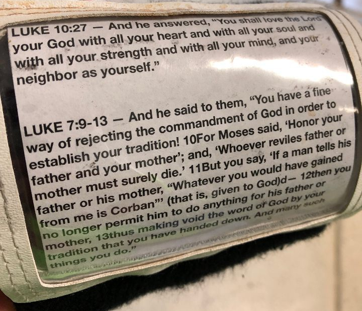

In an effort to add a few more Q’s to YHC's list before the end of the year, YHC locked in on Thanksgiving morning at Bradford’s Ordinary a few months ago, only to later find out that it would be a Carpex Convergence... and 60-minutes at that.

Have not fear PAX, YHC is up to the task and set forth to drop not only a beatdown on the you, but hopefully an impactful post, thus the theme of I am third.

But first…

Tclaps to Banjo and the traveling HIM for setting out at 0600 for EC. As YHC approached the gloom it was evident that these men were well warmed up and it helped light a fire in YHC’s belly, or maybe that was just the leftover whiskey from the night before, never-the-less…

PAX join at the AO, by YHC’s count we’re upwards of 45-50 (we’ll confirm later). With a Pilgrim hat on YHC and an Indian feather in the headband of young Ninjago, YHC delivered a few words before taking the PAX out. As we work this morning, through 3 separate beatdown stations be thinking about "I am third" and putting God first in our lives, putting our families and others second, and finally taking care of ourselves. A quick disclaimer and we’re off.

**Warm up:**

- Mosey to the bank and the Christmas balls for:
- Good Thanksgiving Mornings
- Turkey Walkers
- Side Salad Hops
- Cranberry pickers
- Turkins (Merkins)

**Thang 1:**

- It’s time for the #MeowMile and we split into 2 groups to run on both sides of Chatam street down to Havana’s
- From the lot it’s a partner combo for 100 Merkins, 200 Squats, 300 LBC while your partner runs forward and back weaves through the car wash
- Tclaps to Yoga Mat for working to recruit/EH the sad clown washing his car. Always be EH’ing.
- After our run back to the Christmas balls, Hi-Liter shared with the PAX a focus and a prayer on our first “I am third” this morning and putting God first in our lives.

**The official 3rd F Weinkie:**

**Thang 2:**

- Let’s get the second turkey leg of this journey complete with a run to the parking deck.
- With your partner grab a turkey drum/pain stick.
- Partner alternating for 25 curls (dang these are heavy) and 15 squats.
- Upon completion and after some freed-to-lead planks and stuff YHC was all set to take us out of there without any trips in the deck. But, for some reason Yogi was chirping YHC on something, so with that a penalty trip up and down the stairwell for the PAX. Thank you, Yogi.
- Back to the flag at the AO launch point for Hi-Liter’s second message of the day on putting others and our families before ourselves.

**Thang 3:**

- In a final push to ensure all PAX were properly smoked and yoked before their Thanksgiving gluttony would ensue we hit the lot for a big cirlcle of pain, c/o of good friend Ron “The Iron Stud” (not F3 approved… yet) Renzi a former D1 college wrestler. 3 HIM joined YHC in the middle and called our rapid fire exercises on a 10, 9, 8, 7… down to 1 count.
- Banjo on Burpees
- Merkin Bell on Merkins
- Yoga Mat on LBCs
- YHC on Squats
- The PAX crushed it and that was a wrap on the beatdown, and then final words from Hi-Liter to wrap up our theme. Again, Tclaps to Hi-Liter for the words and prayers along our journey this morning.

**COT:**

- 48 PAX including 3 FNG. Welcome Anchovy, Canadian Downhill and Black Water. YHC is missing a few on the tags... holler if you're not there or if you remember who is missing from our count.
- Announcements:
    - Toys for tots, bring them and connect with Ma Bell
    - Denali has a Haven House event/fundraiser going on, connect with him
    - The 22nd annual turkey bowl football game was to ensue post-post, and YHC can confirm it was EPIC. Tclaps to Burt for excellent 2nd F as always. YHC can also confirm that Natty Daddy at 8% and 25 oz was a wonderful recovery drink…
    - Join YHC for pumpkin pie at the Kitty car after we wrap up. Boom!
- Prayers:
    - Our brother Wilbur
    - Our brother Grease Monkey and his mother
    - All of our other prayers spoken we ask God to lift them up
    - Instead of your traditional BOM, YHC asked the PAX to lock arms (thank you Pet Sounds for the idea) and take a look around. What was once 8-9 on a Thanksgiving morning in Carpex is now 48 strong. Together the Lord’s Prayer to take us out.

**NMS:** Often times the word brother is thrown around in conversations, “hey bro,” or “nice work brother,” and it’s quick and we move on. I use that word with you men very intentionally and it has meaning for me, and I know for you too. You are my brothers, and I count myself very thankful, grateful, and honored to call you brothers and to have lead you on what was a meaningful Thanksgiving morning work for me (and I hope for you too).

It’s one thing to log a 5k or a Turkey Trot or get into some kind of physical fitness on a Holiday like this (and Tclaps to our brothers not in the Gloom who did). It’s another level to do it way we did it this morning and to focus on what we did. Tclaps to you all, have a wonderful and safe thanksgiving morning, and until next time, MIAGD and SYITG.

– Brian Jodice, 36, Hello Kitty
