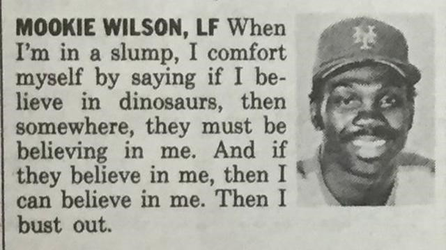

YHC knew that after last Friday’s inauguration of V-AO #SLIPPERYWHENWET, complete with breakfast buffet, espresso-wielding baristas, and custom-initialed bathrobes for all attendees, the expectations of the PAX would be high.  Like sky-high.  Like towering moonshot, fly-ball-to-the-warning-track high.  And I’ll be honest, YHC was nervous to be the Q shouldering this burden.  Had a little self-doubt.  A little lack of self-belief.  But then YHC remembered the wise words that may or may not have been famously uttered by Mr. Mookie Wilson of the New York Metropolitans baseball club, and things brightened up a bit.  And if the PAX can believe in YHC, and if dinosaurs can believe in YHC, then by golly YHC can believe in YHC, and we can escalate this new AO right out of the minor leagues and into The Show where it belongs.

**The Warm-Up**

8 PAX and no benchwarmers rolled into Slippery When Wet right on schedule in the gloom.  Mosey ‘round the main parking lot and circle up.  Player-manager Term Paper wasn’t having any of this loosy-goosy warming up wherever we liked, and promptly directed the PAX to a more suitable warmup location near the shovel flag (which still bears that wonderful new-flag smell).

10x Good Morning IC, 10x Merkin IC, 10x SSH IC, 10x Cotton Picker IC, 10 Diamond Grip Merkin IC…that’s \*baseball diamond\*-grip by the way…the Hollywood crowd calls this “foreshadowing”…

**The Thang**

Mosey to the playground-side baseball field, but before you can get in the game you’ve got to know what it’s like to ride the (aluminum) pine.  Grab some bleacher for:

OYO: 10x derkins, 15x hop-ups, 20x dips, 15x irkins, 10x Russian dips.  Rinse and repeato.

Time to take the field.  Mosey through the dugout and gather at home plate for a review of the game plan:

9 innings of fall baseball…F3-style, with no bats or gloves, but lots of running.  Starting at home plate, run to right field foul pole for 5x of selected exercise OYO, then run to center field wall for 10x exercise, then run to left field foul pole for 10x exercise, then run to home plate for 5x exercise.  Manager YHC called each exercise on the approach to first base.  Exercises by inning: 1st – burpees; 2nd – jump squats; 3rd – wide-grip merkins; 4th – WWIIs; 5th – mountain climbers; 6th – Freddie Mercuries ; 7th - Australian mountain climbers; 8th – LBCs; 9th – Catalina wine mixer

As often happens in high-pressure playoff baseball, there was some confusion among the PAX regarding the third base coach signs, who was ordering all PAX to "get down" going into home at the end of each inning.  It could be that the PAX didn’t wish to get those clean white baseball pants and freshly-pressed jerseys dirty doing on-your-six exercises in the muddy confines of home plate, especially since all PAX were soaked after absorbing the early-morning dew on the outfield grass in the 4th inning.  Luckily the coaching staff got its act together in the bottom of the 9th, conservatively giving the "hold" sign just short of 3rd base for final exercise, followed by an all-you-got, Jackie Robinson-inspired stealing of home to finish out.

Quick mosey back to the flag for

**Mary**

10x box cutter IC, 10x homer to marge IC, 20x outlaws (10 each direction), and time to hit the showers.

**COT**

Mildly tardy count-o-rama.  8 PAX name-o-rama.  Announcements: 9/11 stair climb; new AO coming in Sept by McCants and Shank.  YHC took us out.

**NMS**

An honor to lead you men on Friday.  Tclaps and gratitude for supporting the new AO.  I am fortunate to get to be a part of this group.
