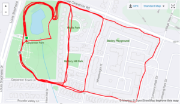

YHC has made posting at Measure Twice a priority. I mean one 30 minute stretch session should fix me for the whole week, right?

Every time I've been I've been impressed by the Q. And everytime I've been I've thought I'm MONTHS away from EVER Qing this site!

Fast forward (or rewind I guess) to Sunday night. The empty Q slot was just calling my name and saying, _"Do it. Doesn't matter if you don't think you can. Do it **because** you don't think you can! Get uncomfortable. Get better!"_

So I popped on Youtube, searched "Yoga runner stretch" and sure enough Yoga With Adrienne led me right through a 20 minute sesh that I rigorously took notes on. Notes like:

- Squat thigh push out look away
- Side to side runner stretch TALL body (face forward)
- Leg out glute pulse

So what I'm saying is...you can Q it! Even if it's not this AO, take an uncomfortable step forward and Q something that's going to push you forward. **[DO IT](http://f3carpex.com/q)** (Q sheet link)

* * *

### THANG 1: THE RUN

YHC 's run route this week was increasing circles. We ran the lake one lap, then ran up the far side sidewalk and took the first right that led us around and back to the park. Next loop was to take the 2nd right. 3rd loop...3rd right.

YHC was asked the distance. YHC had zero clues but guessed 2.75. It was 2.9 so in Price is Right that probably gets me to the spin for the Showcase Showdown!

### THANG 2: THE BROGA

I won't bore you with the details. We stretched standing up. We stretched facing the ground, then we ended stretching on our backs and for a final Have a Nice Day as the clock expired.
