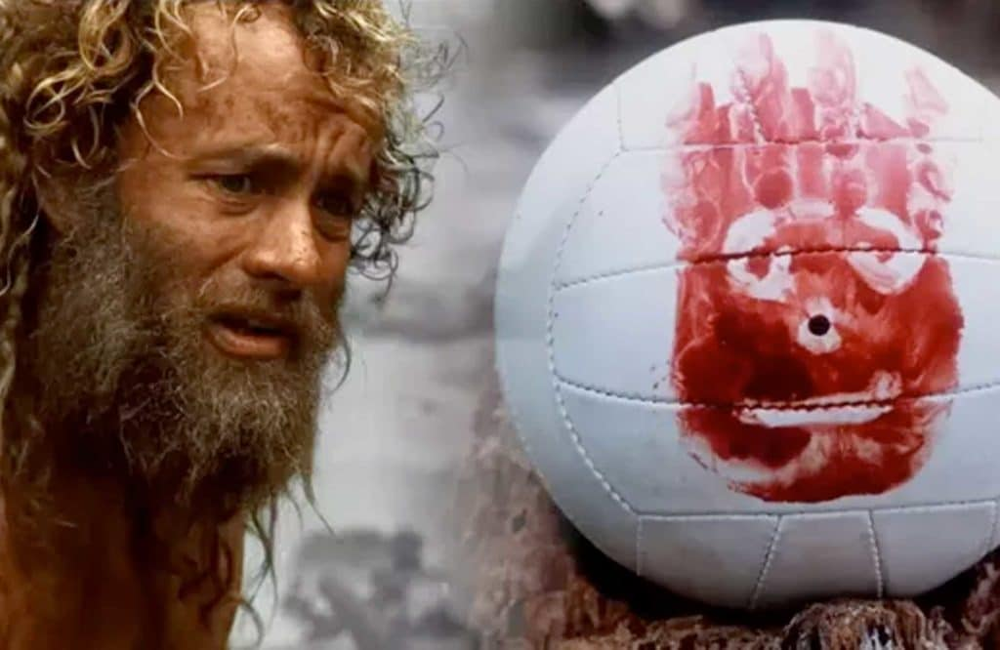

It has been a..I think, month, maybe a year.

As far as I can tell today is Satmontuesday, the 13th17th of Maypril.  I can't tell you the exact year, but by the stockpiles of cans and toilet paper in the coat closet I am guessing circa-1998/pre-Y2K. If that is the accurate however someone needs to answer for how they trashed my 23 year old body.

This morning I Q-ed a core crushing workout with my friend and shield lock brother Two Factor. In our two man COT, I was reminded that I am only renting this body and it can be called back to the Manufacturer at any time. What’s left of it may be needed by someone else.

Two Factor’s childhood friend’s lung transplant was successful and tonight they wake her. She will find both that she lived and that she can continue to live. She can see the people she loves, be able to set old wrongs right and make the world a little bit better place.

Being a HIM is tough. We give a lot of ourselves, we lead by example and we get to see the results of our successes and failures in real time in the actions of those we love and lead (or fail to). But what's the alternative? Better to struggle trying to be a HIM then succeed at living as a Sad Clown.

The pull of the FS is strong, brothers. The lock down exhaustion is grinding. Don’t let it win. Rage against it. Do whatever it takes but fight it.

I don't believe in a vindictive God and as I've gotten older I find I don't believe in the fire-and-brimstone version of Hell. Pain sucks but it can be endured--regret is a good man's Hell. At the end of our life we get to see all the impacts we've had--positive and negative. We get to see our lost opportunities, we get to see what people do with what we've left behind. Regret is a good man's Hell.

God, Sky Q, Allah, Jesus, Vishnu, whatever name You go by or don't go by to this person or that, give me and my brothers the strength to live a life with no regrets at the end. Give us the strength to stand up and be counted among those who made an impact for good. Give us the strength to get up and go out into the gloom, the physical one where we meet our brothers, the daily one where we walk. Let our work and our struggles and our successes be a light for others walking in their own gloom, in their own darkness.

Give us the strength to not let the bastards grind us down.

MIAGD, gentlemen.
