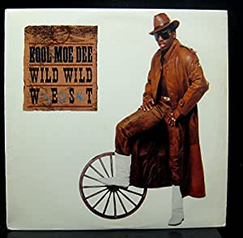

YHC legitimately can't think about this AO and not start singing Kool Moe Dee's masterpiece in my head.  And now you won't be able to either.  You're welcome.   

A great crew out for a Monday.  Duck arrives in his silent earth-mobile.  Mandolin is there without Banjo.  Tramp Stamp is back, which makes YHC happy.  Hamm is there on the Rehab tour.  Shlitz is even there after a 20 miler the previous day.  But only because his fellow Site Q is a derelict who just wants to play golf all day.

No FNGs.  Pledge.  Mosey towards the roundabout to nowhere and circle up.      

- 5 GM IC
- 15 IW IC
- 10 Sir Fazio IC
- Calf Stretch with 15 Merkins x 2
- Runners Stretch

Since this campus is roughly the size of Rhode Island, we should take a tour of it.  Line up for Indian Runs.  Every time Shlitz makes it back to the front he stops the group and calls Merkins with an ascending rep count.  There is an overpowering smell of sewage at one point during the run, but YHC won't judge the POGL.  It takes some time to run across Rhode Island, but we eventually make it back to the flag.

15 LSF IC and 15 WW2 to catch our breath.

A parking lot this beautiful deserves the Pain Train.

- 5 Merkins
- 10 LBCs IC
- 15 CDDs
- 20 WW2s
- 25 Jump Squats

Circle up for some LSF IC, Heels to Heaven, Supermen, Freddy Mercs, LBCs and Chilcutt. 

Freed to Bleed this weekend. 

Praises for healing.  YHC took us out.
