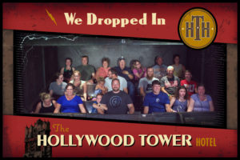

So a little less than 5 Months ago in May, an overweight, really out of shape FNG wandered up to Rush Hour. I was welcomed warmly by Old Maid and Disco Duck, and Riptide showed up to lead the Pax at 17:45. We went to the parking deck and ran the stairs with pain sticks and baked on the top deck of the parking deck.  Now I am less overweight and less out of shape so in honor of that work out we would not be going to the parking deck or getting close to pain sticks...

Warm-Up

Short Mosey to the top of the parking lot the circle up for

15 ssh

10 merkin

15 imperial walkers

10 Sir Fazio forward

10 Sir Fazio backward

15 good morning (afternoon)

The Thang 1

Short run back to the flags

Dora 123 time

8 pax mad it easy to Partner up for some Dora 123 with running the pickle

100 Australian pull ups

200 lbcs’s

300 squats

Couple of 10 counts, then Run to the Large Fountain for some more Partner work

The Thang 2

Partner 1 does dips other bear crawls back and forth over grass switch

Repeato with Lunges

Partner 1 does Irkin (incline merkin) does lunges over grass and back switch

Repeato

Partner 1 does Stepups, other does lunges over grass and back switch

Repeato

 

Mosey to the Small Fountain for some Mary

Mary 15 Dying Cockroach

15 Freddy mercuries

15 American Hammer

Asked the Pax for some help

Disco Duck called 20 box cutter

Ollie Called something I can't remember..

Aristocrat Called 15 WW2

Riptide Called 20 Low Slow Flutter

YHC Closed it out with 15 Homer to Marge

And of course, Have a nice day.

COT

**Count-O-Rama:** 8

**Name-O-Rama:** 3 hates, 4 meh 1 Respect

**Announcements:** Odyssey 10/20; F3 family picnic this Sunday at 4pm at Harold Ritter Park, home of Friday’s SWW ($10/family bring a side dish). Crispy Cream Challange coming up.

**Prayers and Praises:** Aristocrats recovery from labor last week. Continued prayers for the People Down east.  YHC took us out.

**NMS:** As I said above, and continuing the trend of VQ'ing at your first workout. Almost 5 months ago I walked up to Rush Hour, and F3 has done exactly what Is says, never left me behind, and has not left me the same. I still have a ways to go to get into shape both physically and mentally. I am proud to be part of F3 I even wore my F3 Carpex Shirt when we where in Disney World Last week. YHC made a few mistakes here and there but I knew that I would be picked up by the pax, so that made this a lot easier. Of course, I am sure you all were being a little easy on me... YHC will expect more ribbing for those mistakes next time I Q for sure. I has been an honor to work out with you, and an Honor to lead you today.

