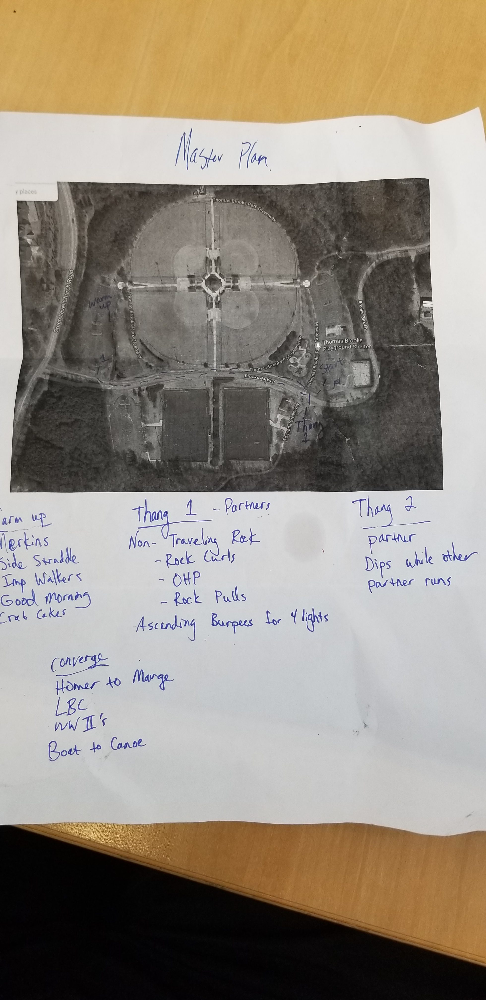

There is something interesting, something magical, that happens when you lead a group of men in the Gloom, but more on that later.

My oh my, what an honor to VQ today. After a pledge of allegiance, 18 PAX moseyed up to the large pickle. Nature Boy, my trusty fall back in case I faltered in my inaugural Q, reminded me of the definition of Mosey. It is indeed not a saunter, and most definitely not a sprint. I re-calibrated my Mosey-tron and set a pace.

Upon arriving at the Pickle-O-The-The-Top-Of-The-Hill, we had a great warm up consisting of Good Mornings, Imperial Walkers, Calf Stretches, Those shoulder circles (I'll learn the names, I swear), and slowly sped up body squats. I skipped a few things on my To-Do list but overall, solid warm-up.

Thang 1: We then Moseyed back from whence we came and picked up a Rock and a partner. Partner 1 ran up the hill and did ascending burpees at each street lamp until the 4th and then came back to relieve his second partner and rock.

After the first round, Bedpan asked if it looked like this on paper. I have the proof that it did not. Second partner and rock started with the world's longest Rock Rows, Rock Curls, and Rock Triceps. 3 sets were done and with Six picked up, we then did another Mosey over to the shelter, replete with picnic benches.

Thang 2: Partner 1 performed lunges across the parking lot while Partner 2 performed alternating Derkins and Dips until relieved. 3 Sets, no problem.

Bedpan and Ezekiel were my watch-men since I can't remember the last time I wore one. There were about 8 minutes left to head back to the flag for some Homer to Marges, LBCs, Boat/Canoes, and low slow flutter kicks which I demonstrated were all fluttery and no slow. We finished up with Have a Good Day and that was that.

Back to my original statement about magical happenings. During this entire 45 minute process, I felt an interesting surge of energy and responsibility that pushed me to get a lot further than I ever have in a workout. Maybe it is the importance I saw of not messing this up or it was the feeling of belonging somewhere. Either way, I think that magic is something worth harnessing and tapping into in every day life. How can I leverage my discomfort into something that creates a more driven man both at work and at home? How do I summon this power that exists in the pain? This was the question in my mind and it is a new goal in my life.

We closed out with announcements of The Odyssey, The BBQ, Golf Day, and a Trivia event next Wednesday at a local brewery (please update in the comments, I apologize for forgetting the details.)

Swag closed us out in prayer with the main request being for myself as I conquered a heavy depression over the last few weeks and build and brace for the next one, by the grace of God. I am always here to talk if you have the same struggles.

Thank you, gentlemen. I couldn't express how honored I was to lead you today and I look forward to growing with you.
