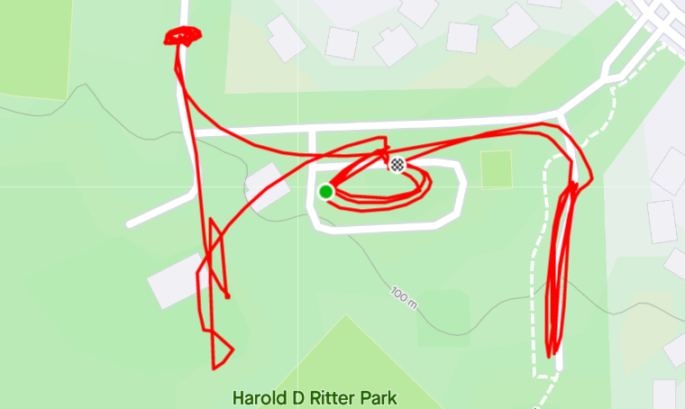
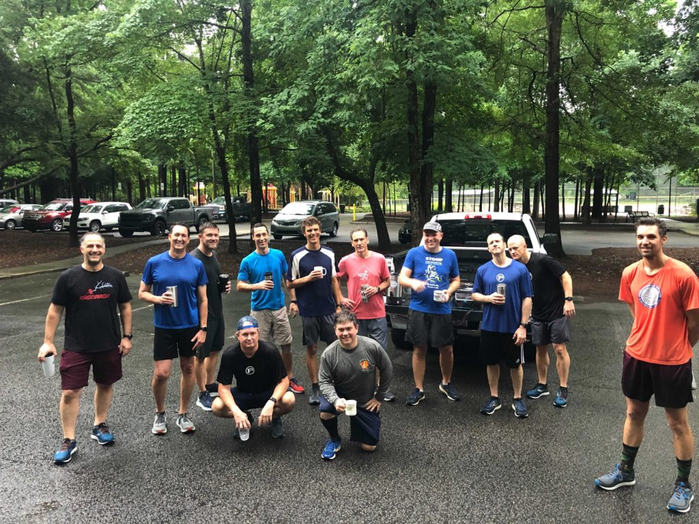

**AO:** Slippery When Wet  
**Workout Date:** 06/04/21  
I really prefer to post a new AO before Qing, but it doesn't always happen. In these cases I perform due diligence, verifying the workout format and scoping out the AO on Google Maps. According to the F3 Carpex website, Slippery When Wet is a standard boot camp.

**Warm Up:**  
Give the mission statement, check for FNGs (1), give the disclaimer, and warm up:  
So I guess we were supposed to start with a run, since half the PAX started to take off as I called SSH.  
Side Straddle Hop x20 In Cadence (IC)  
Crowd wants to move, so I cut warm ups here and we mosey to the first thang.

**Main Event**  
**1)** Mosey to the front parking lot and partner up for **BALLS**. I explain the exercises, nobody's listening, it's a mess. After a few back and forths, we establish that one partner runs to the end of the lot (the greenway entrance) and back while the other partner works through Burpees x10, American Hammers x20, Lunges x30, LBCs x40, Squats x50. Flapjack when partner returns and continue your own count when you get back from running. We went until most everyone had made it through the full set one time.  
**2)** Mosey to the back parking lot for **Bear Crawl/Lunge Walk 7s** across the width of the lot. Exercises were Star Jumps and Carolina Dry Docks.  
**3)** Mosey to shelter for the standard **Left Right Step Ups, Irkins, Dips, Little Gyno Crunches, and Derkins**. x10 reps each. Repeato with x20 reps and move on.  
**4)** Mosey back to start/center lot for a quick **1/2 Dora** with your original partner. 50 Merkins, 100 LBCs, 150 Squats.

<figure>

<figcaption>

[https://www.strava.com/activities/5411099310](https://www.strava.com/activities/5411099310)

</figcaption>

</figure>

**Mary:**  
Various Mary.

**COT:**  
15 PAX  
Welcome FNG Pineapple, who lives in Lochmere, but can just tell his kids that he's a huge Sponge Bob fan.  
  
Announcements:  
TPC help needed Sunday with regulars out on the dads' camping trip  
Axe Throwing CSAUP in Eastern NC on 6/5 (this Saturday)  
El Duce’s Recovery on the Run 6/12 at Dorothea Dix  
F3 Raleigh Day of Service 6/19 starting at Vatican City  
  
Prayers for the four teenagers killed yesterday and for the driver of the box truck that hit them. Other prayers I can't remember. Prayers unspoken.  
Chipper took us out.

**Naked Moleskin:**  
I expected us to get drenched, but it didn't start raining until the workout was over.  
Cobains for the misunderstanding. Sometimes you just gotta post. Also, a website update would probably be good.  
This was my fifty-sixth #F3Q21 #2021Challenge Q (fifty-eighth overall). Next Q is Monday at A-Team.  
\-Pigpen

**QIC:** Pigpen  
**PAX:** Chipper, Chops, Francois, Garbage Plate, Hermes, Joe Smith, Mayflower, Meat Loaf, Netscape, Oofta, Pigpen, Pineapple (FNG), Riptide, Shipyard, Trickle  
**Workout Date:** 06/04/21

<figure>

<figcaption>

Photo credit: François

</figcaption>

</figure>
