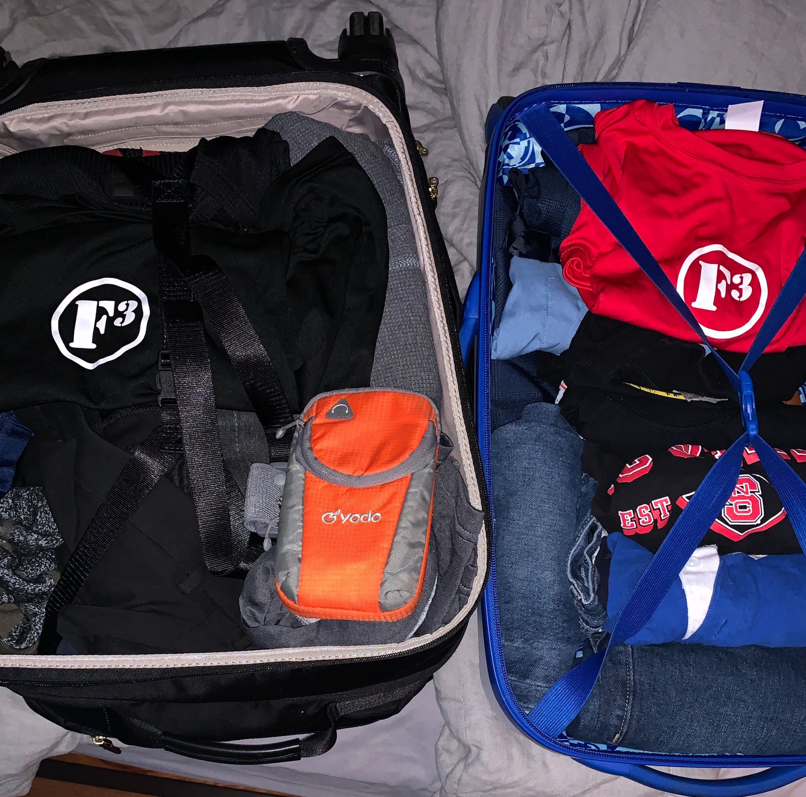
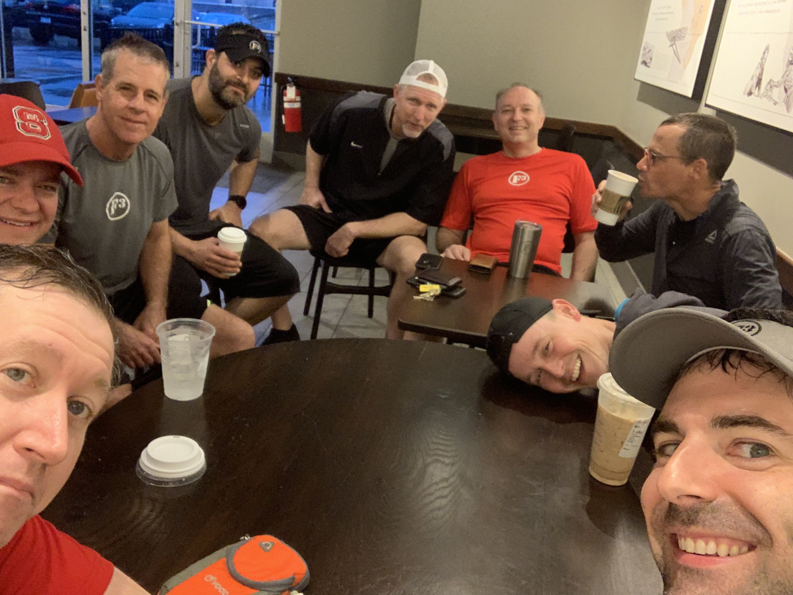
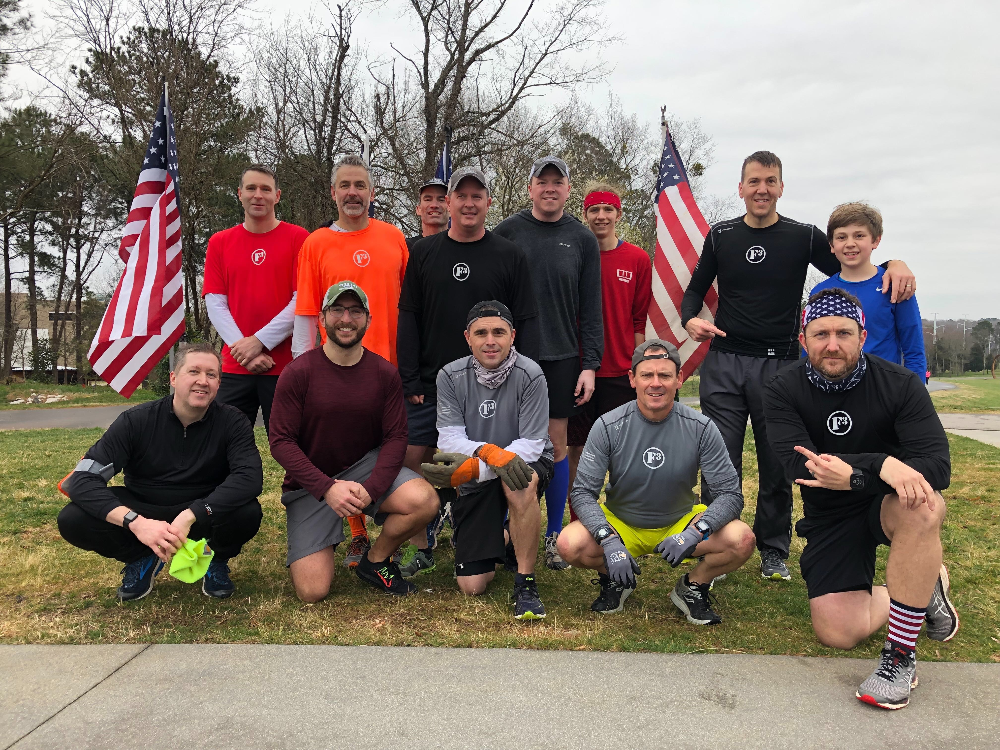
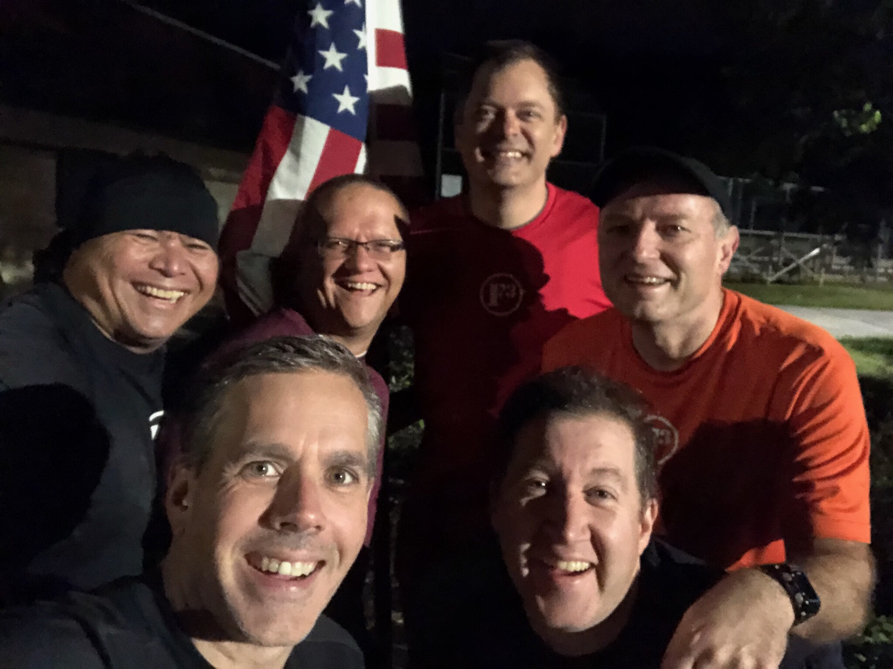
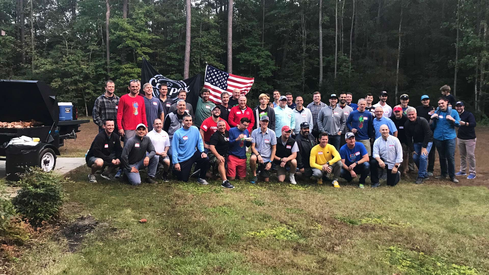
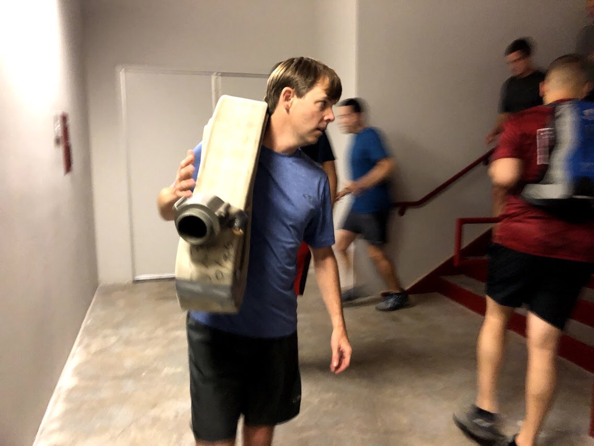
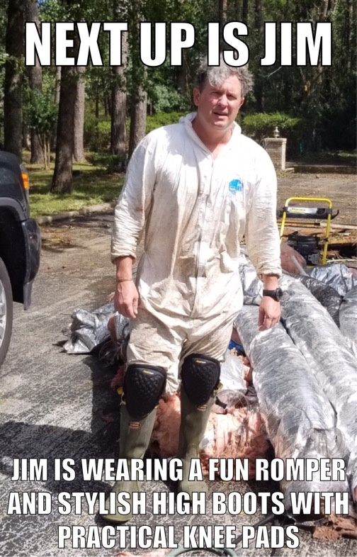

There is an inherent need in a HIM to protect the M and 2.xs from pain and sadness. Some of it is selfish, if we are being honest. No one likes to feel powerless especially not types who are crazy enough to get up in the wee hours of the morning and try to get just a little bit stronger every day. Why be strong if you cannot protect those you love?

But strength comes in many forms and that's why F3 has 3 F's not 1. The art of shutting up is a 3rd F trait. It takes way way more strength than anything we do in 1st F.

When your M is crying while you hold her because one of the three people that were her anchors in life has just died there is an overwhelming temptation--visceral need, really--to "make it all right". To offer up worthless platitudes that will make the pain go away--the M's and also the pain of your own powerlessness.

For me, it has been a gargantuan effort to just hold her and let her say it's not okay and ask how it ever will be again. She isn't asking really just expressing the pain of loss. She doesn't want me to "make it better".

I have spent a lot of years trying to say the right words in those situations and luckily after 15 years--just in time for the really tough one--learned to shut my mouth and say nothing. I have learned that being a man means not "making it okay" but rather giving a safe quiet space for the people I care about to have their grief without judgement or worthless cooing and empty platitudes.

A lot of that is COT. Men share things that hurt to hear and sometimes reflect what you yourself are going through or fear. Silence or sometimes a quiet Aye or other affirmation that "I am here with you" is all that you hear. It shows how just being present to hear can be enough to start healing or provide the strength to endure.

What is this F3 fad that is silently popping up around the nation? This "cult"?

For me it is a place where I can be mumble chattering with abandon one minute and then be silent with purpose the next. It is where I pay a daily cover charge for some grueling 1st F to get into the company of a bunch of HIMs and HIDAs.

Is F3 a cult? No. When you talk to people in cults or that have escaped them you hear about a sense of trained joy that does not allow life's trials to touch them and indoctrinated confidence that everything they are doing is right.

F3 sure ain't that. We don't subscribe to that. Pain happens. Life happens. I said to Disco Duck once during a really tough series of months that a ton of bad stuff was happening to Carpex guys lately. He responded that stuff was always happening which is why we all showed up everyday--to get stronger and stand together (okay, okay, so maybe the Russians didn't influence the HIM of the Year results last year).

The M will wake up soon and continue on with her grief and making the hard decisions left over after someone dies. I will be there for her, silent and in the wings with arms open when she needs me. I have a shield lock sending me DMs and texts of strength and support. And I have examples like McCants and Sooey and Ausfahrt who show you can battle back from pain. And guys like Liverpool and Chinese Downhill who show that as Liverpool said in COT on his anniversary you can "have the Best Year and Worst Year of your life at the same time".

I've got a job to do up here right now but I didn't come alone.

