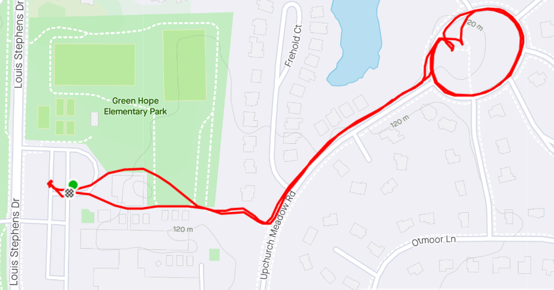

**AO:** Rolling Stone  
**Workout Date:** 05/28/21  
After Qing Quickhatch, YHC wondered how much PT was expected at a Ruck workout. The Quickatch guys were happy to just ruck a couple of miles and my called exercises seemed like an awkward novelty. I reached out to site Q Bartman to get an idea for Rolling Stone and found PT would be preferred.  
  
With a big demand for PT, I opted for the weinke and did some internet searches for good ruck exercises. I actually found a Ruck workout generator and plugged in our workout specifics. I moved some things around and swapped out some exercises that I didn't know or didn't want to bother with.

**Warm Up:**  
YHC quickly learned Rolling Stone and high tempo Gran Torino start and stop at the same time. Red Ryder was Qing Gran Torino and started us off with the mission, disclaimer (no FNGs), and pledge. Once GT took off, we decided to hang in the lot for any stragglers, so I started my Weinke with Merkins x10. Once we finished I decided to do my normal warmup instead:  
  
Side Straddle Hop x20 In Cadence (IC)  
Good Morning x10 IC  
Imperial Walker x20 IC  
Sir Fazio Arm Circles forward x10 IC, reverse x10 IC  
(Skip the Standard Merkins x10 On My Down (OMD) since we already did them)  
Mountain Climbers x10 IC  
Downward Dog with calf isolation stretches  
World’s Greatest Stretch

**Main Event**

- **Ruck to Circle on the Green**
- 10 x Mountain Climbers (4 Count)
- 10 x Ruck/Sandbag Curls
- 10 x Bent Over Rows
- 10 x Overhead Presses
- 20 x Crunches (4 Count)
- **Ruck One Lap Around Circle on the Green, ending under the Gazebo**
- 10 x Merkins
- 20 x Mountain Climbers (4 Count)
- 10 x Ruck/Sandbag Overhead Squats
- 10 x Plank Pull Throughs
- 20 x 4-Count Flutter Kicks
- 20 x Chest Press
- 10 x Ruck/Sandbag Clean and Press
- **Ruck One Lap Around Circle on the Green, head back to Start For Mary**

<figure>

<figcaption>

[https://www.strava.com/activities/5371406035](https://www.strava.com/activities/5371406035)

</figcaption>

</figure>

**Mary:**  
Red Ryder led Mary  
LBCs x30 IC  
CF Merkin x10 IC (I don't remember what "CF Merkins" were, I copied it off of Red Ryder's Backblast haha)  
Have A Nice Day

**COT:**  
2 PAX Ruckers, 5 PAX Gran Torino.  
Announcements: Memorial Day Murph at Hot For Teacher.  
Raleigh official Memorial Day Convergence 5/31 0530 Garner Station.  
Axe Throwing CSAUP in Eastern NC on 6/5  
El Duce’s Recovery on the Run 6/12 at Dorothea Dix  
F3 Raleigh Day of Service 6/19 starting at Vatican City  
Prayers I don't remember. Cobains.  
Red Ryder took us out

**Naked Moleskin:**  
Great fellowship with Bartman while I worked my way through my Weinke.  
Build your own Ruck Q Weinke here: [https://alldayruckoff.com/event-training/crush-your-soul-workout-generator/](https://alldayruckoff.com/event-training/crush-your-soul-workout-generator/)  
Also for reference: [https://blog.goruck.com/rucking-training/5-ruck-pt-movements-anyone-can-do-at-home/](https://blog.goruck.com/rucking-training/5-ruck-pt-movements-anyone-can-do-at-home/)  
Four for Coffeeteria at Crema. Great fellowship. I unexpectedly earned my Black Creek Ruckers patch. Carpex Q swag is once again strong.  
This was my fifty-second #F3Q21 #2021Challenge Q (fifty-fourth overall). Next Q is this afternoon(!) at The Arena.  
\-Pigpen

**QIC:** Pigpen  
**PAX:** Bartman, Pigpen  
**Workout Date:** 05/28/21
