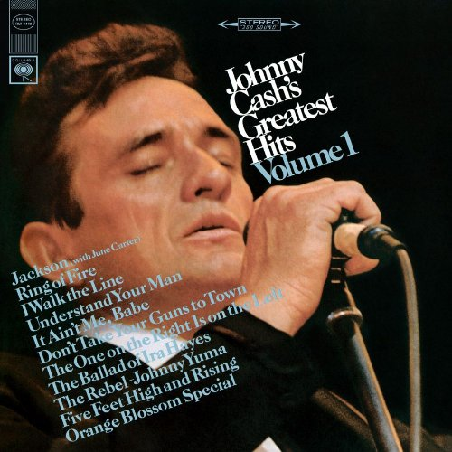

Being that it is YHC's birthday, and that birthday is shared with the Man in Black, himself; the late, great Johnny Cash, this was supposed to be a Q to honor the man and his music. Well, it started out that way, but slid off the rails just a bit. One should expect that anytime Frisco is present for a workout, but YHC can't really pin this one on him.

Ninjago came speeding in the parking lot from an EC run, distantly trailed by Earhardt and Frisco. Way to get after it guys!

**Warmup**  
Stay at the flag for:  

- Windmills x 15 IC
- Copperhead Merkins (slow on the 1-2 down count, fast on the 3 back up) x 10
- Mountaineer Motivators x 11, with each PAX counting down around the circle (we're getting close to having that one down, except YHC counted 11 PAX when there were 10)

Mosey over to the tennis courts Thang 1, Bear Crawl Ring of Fire. Johnny Cash plays faintly from my Steve, while this happens:

- Starting at the right baseline corner of the court, line up (I said LINE UP, men!) in plank position and bear crawl until the lead PAX reaches the net.
- Starting with the first PAX, each does 10 merkins down the line (of course, there would have to be a line for that to work) SMH
- Turn left and proceed around the perimeter of one side of the court, stopping for 10 merkins at each corner.

<figure>

<figcaption>

The Man in Black

</figcaption>

</figure>

Circle up for a round of Johnny Cash:

- All PAX hold American Hammer Position while each does 10 AH's around the circle.
- Repeat in plank position with merkins x 10
- Repeat in 6" hold position with Hello Dollies x 10
- Repeat in squat hold position for 5 burpees each around the circle

Not happy with the precision with which the Bear Crawl Ring of Fire was performed, YHC reminds the PAX that the line of bear crawlers should resemble a line, and around the perimeter of the court we go again.

Back for another round of Johnny Cash, only this time YHC's brain started mis-firing when I got to Hello Dollies and I called _American_ Dollies with PAX in the _Plank_ position. It's like I could no longer control the words coming from my mouth. The mumble chatter only made it worse, but we somehow made it through the second round.

Deciding that they didn't deserve to listen to Johnny Cash anymore, YHC audibles to lunge walks across the 6 tennis courts, with escalating burpees after each 5 steps. By the time we hit 7 burpees, the PAX seemed to be back in order.

Mosey back to the flag for Mary:

- Freddie Mercs x 15 IC
- Box Cutters x 15 IC (Saban noted that YHC does the leg motions in reverse, making the Q a bit self-conscious, but we press on.)
- Since it's my birthday, 10 Pickle Pounders IC
- Have a Nice Day... and we're done. Oh, wait...
- At some point in time YHC's watch died during the workout, and apparently we had a few minutes left. Frisco, being the reliable co-site Q that he is (cough, cough), jumps in with another 20 American Hammers. TYFYL.
- Apparently we're still not done, so Earhardt calls 15 Dying Cock-a-roaches.
- Since the fruit doesn't fall far from the tree, Ninjago finishes us off with 20 LBCs

Announcements

- The Mule (F3 Raleigh CSAUP) is coming up Saturday, March 9
- Soft Launch of Lion’s Den February 27, 5:30 @ St. Mary Magdalene; standard boot   
    camp

Prayers

- Crimson's family as his FIL deals with stage 4 brain cancer.
- Continued recovery for brothers Sooey and Ausfhart.
- YHC has a big project launch at the end of this week. Prayers that it goes smoothly and that those involved will be able to get back to a more normal pace at work.

NMS

- Always thought it was cool to have the same birthday as Johnny Cash. He's a great example of God's grace, as he faced many demons and trials during his life yet always came back to his faith. He also had a strong M, and that's something many of us can probably identify with.
- Johnny Cash's Greatest Hits Vol. 1 (pictured above) was my first album. I think I was 5 or 6 at the time.
- It was great having 2.0's Ninjago and Leprechaun in our midst this morning. Their energy helps keep me feeling young!
- Eventually, we're going to master the Mountaineer Motivators. We were very close this morning, and would have been closer had YHC not mis-counted the PAX. There's always next time.
- A bit of a milestone today as it was YHC's first back-to-back Qs, with Hell's Bells yesterday.
- As always, an honor and a privilege to lead you men!
