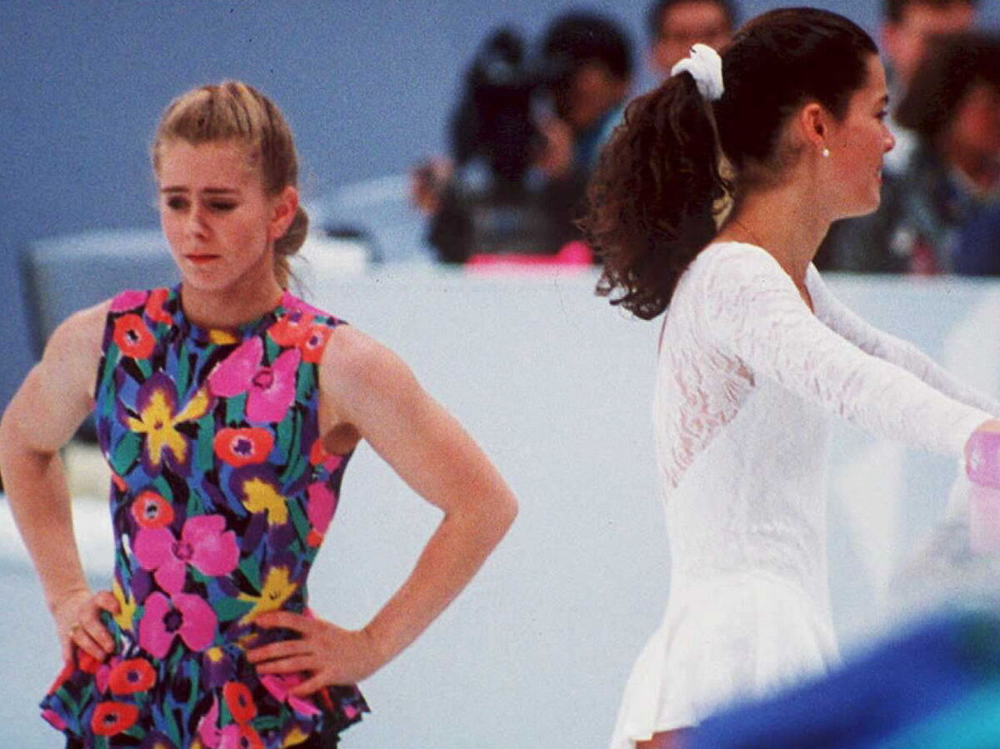

Anyone who as joined me on one of my Qs knows that if I do anything well it is that I expose the PAX to a few new exercises whether I make them up and tag them with a silly name (Drunken Snow-angel) or, as often is the case, dive deep into the Exicon to tap into the plethora of experience shared by F3 Nation. Today was no exception as I pulled out some of my favorites and added some of the lesser known as well. One of those being the Nancy Kerrigan. Most of us associate her with Tonya Harding whose body guard attacked Nancy injuring her knee badly. The humorous part of me calling that exercise is that I also bear the name of someone who is now known for a horrendous knee injury, Joe Theismann. I feel like I have to be careful on how much I call this one though. I'd hate to be renamed Tonya!

So with my winkie in hand off we went.

Disclaimer and Pledge

Mosey on over to behind Treasure Quest mining building, my 2.0's new favorite gem store, for the warm up to include:

Steve Earl, Annie, Nancy Kerrigan, Mountain Climbers, Row boats. Let me pause here and explain Row boats - Starting in the Canoe position come up to the boat position but draw your knees toward your right shoulder while pretending to row with an ore on the left side. Go back to canoe and alternate sides doing as before.

Mosey back to the parking lot and over to the pull-ups bars for:

Thang 1: DORA 1,2,3 100 Pull-ups, 200 Derkins, 300 Monkey Humpers. Partner 2 performs 10 x 4 count Fluttering Supermans and 10 dips

Thang 2: Tunnel of Love with Zombie Crawls

Thang 3: Ascending Burpo ladder- 2-4-6-8-6-4-2 with a little running between each rung.

Mary: From the Curb - with our feet on the curb perform: Curb Homer to Marge, Curb J-lo, Curb Shakira, Curb Shoulder Taps, Have a nice Day!

COT

Welcome FNG Dust Bowl!
