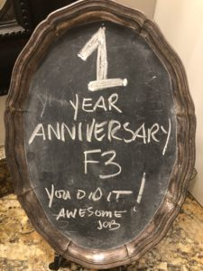

After some debate on which parking lot we should circle up in we stuck with the standard operating procedure for SWW.

After a delivery of the disclosures to our FNG we moseyed over to the back parking lot for some warm-up.

- SSH x 20
- Sir Fazio Forward x 11
- Sir Fazio Backward x 11
- Seal Clap x 11
- Merkins x 15
- Calf Stretch

**Thang 1**

Next, YHC had the PAX mosey to the Baseball Field and line up facing the outfield/infield from the 3rd base line. We then sprinted across the field and did 15 of each of the exercises and then sprinted back:

- Carolina Dry Docks
- Merkins
- LBC
- Squats
- Alternative Leg Lunges
- Box Cutters

To mix things up, after the first two rounds, YHC shared a special that the Cherokee region in GA did - every time the whistle blew, the PAX had to drop and do a burpee. We also had a few Hates blow through this new benefit so YHC made everyone do 5 penalty burpees and the issue of non-compliance faded. and the whistle brought everyone burpee joy.

YHC was also told by the HIM we all know as Red Ryder during one of the sprints that Sub’s beatdown the day before sucked and want to tip my hat to Sub delivering such a fine beatdown and am sad to have missed it.

**Thang 2**

Next we moseyed over to the front parking lot and partnered up. Visiting Churham recently YHC was reminded of the deck of pain from F3 and decided to mix it into the workout. Partner 1 would draw a card and do whatever exercise was on the card till partner 2 returned and then flip flop. What was partner 2 doing? Of Course he was running the pickle. Just to make sure everyone was able to try a different exercise, we repeated this for 5 rounds.

**Thang 3**

YHC had plans for some more fun but time was running short so we did a quick mosey over to the shelter and mixed in 2 rounds of dips, derkins, irkins, and step-ups before circling up for Mary with choices from a selection of the PAX present, including diamond pushups from Bluewater, a fine Mary exercise and should be leveraged more.

**TAP**

- Sooey’s and Ausfahrt’s Continued Recovery
- Crimson’s family and FIL
- Term Paper’s daughter's health, has had seizures since back from FL
- Snooze has a friend whose parents are struggling in their marriage

**NMS**

Wow, the difference 1 year can make! Lots has changed in our lives since Hunter went home to the Lord and without a doubt, God is using F3 as the catalyst for almost all of that change.

It is easy to point to losing 30 pounds or a shrinking waistline but the reality it is the stuff you cannot always see that F3 has truly blessed YHC. Deep friendships with men who will stand with me in any sifter life may stir up. A stronger marriage. Greater Connection with my 2.0. The challenge to serve. Better eating habits. Better work habits. An outlet for my mumble chatter. In addition, all the other places F3 has given me the opportunity to connect be it as a TRUEbadour, in QSource, Peru and with PAX in other regions.

Without a doubt, 1st F is the magnet, 2nd F is the glue and 3rd F is the dynamite! YHC is blessed to call you each brother and have to say has never been more excited to see what will happen in the next 12 months as right now. Thanks to each and everyone of you for letting YHC join you on this awesome ride!!!

YHC took us out.
